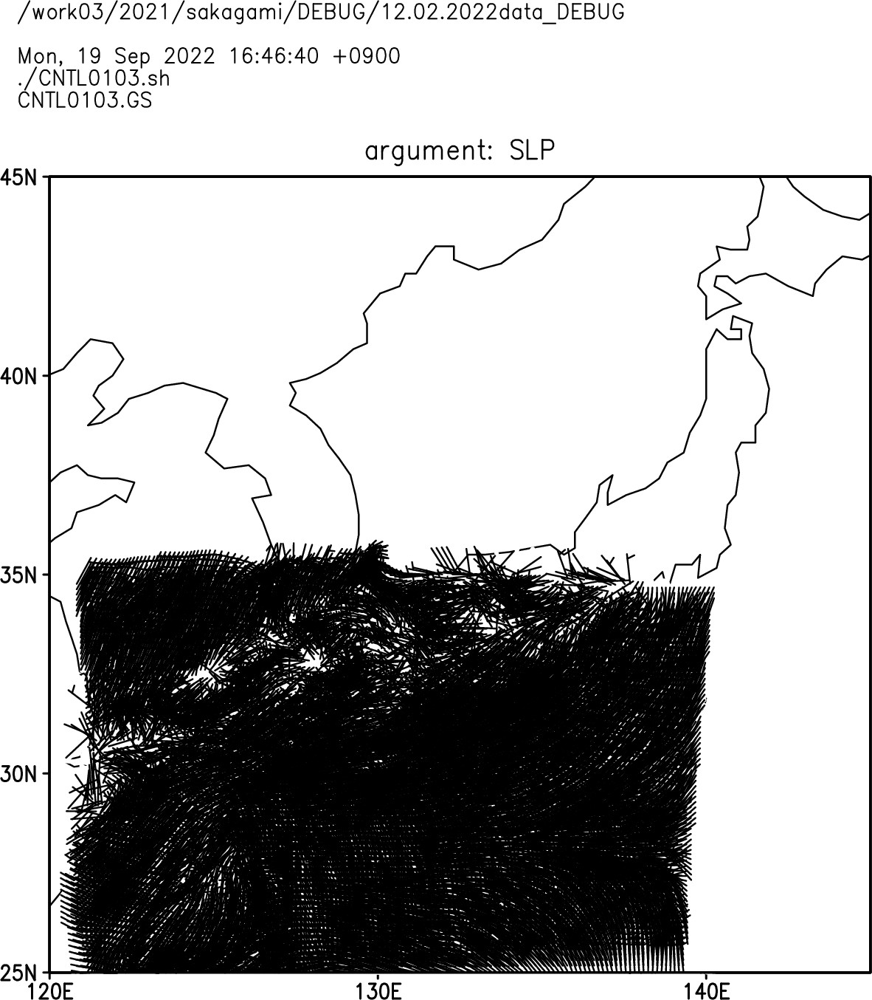

GrADSによる作図のデバッグ　2022-09-19_16
==================================

[[_TOC_]]

## GrADSの初歩

http://akyura.sakura.ne.jp/study/GrADS/kouza/grads.html


バグの内容  
---------------------

RW3A.00.03.05.05.0000.01.d01.basic_p.01HR.ctlを用いて、2021年8月14日3時JSTの上層トラフの高度、相当温位、気圧・風速に関する図を作成しようとしたのだが、上手くいかない

### スクリプトの所在

/work03/2021/sakagami/2022data

気圧・風に関するスクリプト  
CNTL0103.sh  

相当温位に関するスクリプト  
CNTL0103_ept.sh  

上層トラフに関するスクリプト  
CNTL0103_UL.sh  


デバッグの準備
---------------------
$ ls 2022data/
CNTL0103.eps
CNTL0103.sh*
CNTL0103_EPT.sh
CNTL0103_EPV.sh
CNTL0103_UL.sh*
CNTL0103_ept.eps
CNTL0103_ept.sh*
RW3A.00.03.05.05.0000.01.d01.basic_p.01HR.ctl*
RW3A.00.03.05.05.0000.01.d01.basic_p.01HR_2021-08-12_03:00.dat*
Z__C_RJTD_20210814060000_GSM_GPV_Rgl_FD0000_grib2.bin
gsm.ctl
gsm_CNTL0103.ctl
plot0.GS
plot0.eps
plot0.sh*
plot1.eps
plot1.sh*

$ mkd DEBUG
mkdir: ディレクトリ `DEBUG' を作成しました

$ cp -ar 2022data/ DEBUG/12.02.2022data_DEBUG

$ cd DEBUG/12.02.2022data_DEBUG/

$ org.sh CNTL0103.sh 
'CNTL0103.sh' -> 'CNTL0103_ORG_220919-1629.sh'

~~~~~~~~~~~~~~~~~~~~ SOURCE ~~~~~~~~~~~~~~~~~~~
-rwxr--r--. 1 sakagami oc 1.8K Sep 19 11:50 CNTL0103.sh
~~~~~~~~~~~~~~~~~~~~~~~~~~~~~~~~~~~~~~~~~~~~~~~

~~~~~~~~~~~~~~~~~~~~~ COPY ~~~~~~~~~~~~~~~~~~~~
-rwxr--r--. 1 sakagami oc 1.8K Sep 19 11:50 CNTL0103_ORG_220919-1629.sh
~~~~~~~~~~~~~~~~~~~~~~~~~~~~~~~~~~~~~~~~~~~~~~~


バグの特定  
---------------------

$ CNTL0103.sh 

Default file number is: 1 
X is varying   Lon = 120 to 145   X = -41.0816 to 1808.92
Y is varying   Lat = 25 to 45   Y = 477.543 to 1957.54
Z is fixed     Lev = 1000  Z = 1
T is fixed     Time = 18Z13AUG2021  T = 43
E is fixed     Ens = 1  E = 1

**Time = 18Z13AUG2021であるから，時刻2021-08-13_18:00のデータの作図をしようとしている。**

slp

**エラーメッセージ**

**Cannot contour grid - all undefined values** 

WIND

**エラーメッセージ**

**Cannot draw vectors/barbs -- U field all undefined**
**Cannot draw vectors/barbs -- U field all undefined**

**作図用シェルスクリプト (CNTL0103.sh)の中で，ctlファイルをしている箇所を特定**

```
$ grep ctl CNTL0103.sh

'open RW3A.00.03.05.05.0000.01.d01.basic_p.01HR.ctl'
'q ctlinfo'
```

**ctlファイルの中でデータファイルを指定している箇所を特定**

```
$ grep dat RW3A.00.03.05.05.0000.01.d01.basic_p.01HR.ctl
dset ^RW3A.00.03.05.05.0000.01.d01.basic_p.01HR_%y4-%m2-%d2_%h2:%n2.dat
```

**^はカレントディレクトリを示す記号**

```
$ ls *dat
RW3A.00.03.05.05.0000.01.d01.basic_p.01HR_2021-08-12_03:00.dat*
```

**カレントディレクトリには，時刻2021-08-12_03:00のデータしかない**


**デバッグ作業の前にバックアップをとっておく**

```
$ bak.sh CNTL0103.sh
'CNTL0103.sh' -> 'BAK_CNTL0103_220919-1638.sh'
```

~~~~~~~~~~~~~~~~~~~~~ ORG ~~~~~~~~~~~~~~~~~~~~~
-rwxr--r--. 1 sakagami oc 1.8K Sep 19 11:50 CNTL0103.sh
~~~~~~~~~~~~~~~~~~~~~~~~~~~~~~~~~~~~~~~~~~~~~~~

~~~~~~~~~~~~~~~~~~~~~ BAK ~~~~~~~~~~~~~~~~~~~~~
-rwxr--r--. 1 sakagami oc 1.8K Sep 19 11:50 BAK_CNTL0103_220919-1638.sh
~~~~~~~~~~~~~~~~~~~~~~~~~~~~~~~~~~~~~~~~~~~~~~~


**シェルスクリプト(CNTL0103.sh)の修正**

$ vi CNTL0103.sh

日付を直す

**シェルスクリプト(CNTL0103.sh)の変更箇所**

$ diff BAK_CNTL0103_220919-1638.sh CNTL0103.sh

```
12c12
< TIME0=18Z13AUG2021
> TIME0=03Z12AUG2021 ;#18Z13AUG2021
```

**修正したシェルスクリプト(CNTL0103.sh)を実行**

$ CNTL0103.sh

...
-rw-r--r--. 1 sakagami oc 1.6M  9月 19 16:46 CNTL0103.eps

**作図できた**




## 抜本的な改善

```
$ grep dat RW3A.00.03.05.05.0000.01.d01.basic_p.01HR.ctl
dset ^RW3A.00.03.05.05.0000.01.d01.basic_p.01HR_%y4-%m2-%d2_%h2:%n2.dat
```

ctlファイルで，カレントディレクトリではなく，すべてのデータが存在するディレクトリを指定する


### まずデータがあるディレクトリを探す

```
$ locate RW3A.00.03.05.05.0000.01.d01.basic_p.01HR
.....
/work04/work03/2021/sakagami/WRF.RW3A.00.03.05.05/ARWpost_RW3A.00.03.05.05.0000.01/RW3A.00.03.05.05.0000.01.d01.basic_p.01HR_2021-08-15_00:00.dat
```

データは

```
/work04/work03/2021/sakagami/WRF.RW3A.00.03.05.05/ARWpost_RW3A.00.03.05.05.0000.01
```

にある。

### ctlファイルを修正

修正前

```
dset ^RW3A.00.03.05.05.0000.01.d01.basic_p.01HR_%y4-%m2-%d2_%h2:%n2.dat
```

修正後

```
dset ^/WRF.RW3A.00.03.05.05/ARWpost_RW3A.00.03.05.05.0000.01/RW3A.00.03.05.05.0000.01.d01.basic_p.01HR_%y4-%m2-%d2_%h2:%n2.dat
```


```
$ vi RW3A.00.03.05.05.0000.01.d01.basic_p.01HR.ctl
```

```
$ CNTL0103.sh

-rw-r--r--. 1 sakagami oc 1.6M  9月 19 17:11 CNTL0103.eps
```


## 補足

```
### TITLE
Invalid QUERY argument: 03z12aug2021
Invalid QUERY argument: 03z12aug2021
```

上記のエラーに関する修正

```
$ diff BAK_CNTL0103_220919-1638.sh CNTL0103.sh
12c12
< TIME0=18Z13AUG2021
---
> TIME0=03Z12AUG2021 ;#18Z13AUG2021
75c75
< 'q $TIME0'
---
> 'q dims' ;#'q $TIME0'
77c77,78
< ctime1=subwrd(result,3)
---
> TMP=sublin(result,5)
> ctime1=subwrd(TMP,6)
```

`’q $TIME0'`を`'q dims'`に修正

