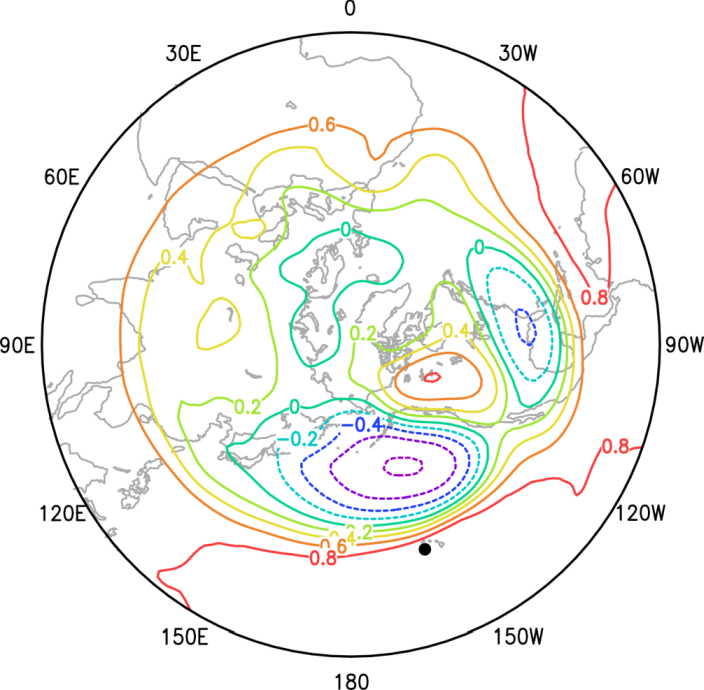

# プログラミング入門_00

[TOC]

## 成果品の例

### 1点相関解析 (テレコネクションの同定)



1958-2005年冬季 (12月～2月)の500hPa面高度の黒丸の点 (20N, 160W)と各地点の一点相関の図. 

熱帯太平洋から北米大陸を横断する波列 (PNAパターン)の存在が示唆される。


## 情報源

- http://www.jspf.or.jp/Journal/PDF_JSPF/jspf2005_05/jspf2005_05-398.pdf

- http://www.research.kobe-u.ac.jp/csi-viz/members/kageyama/lectures/H22_FY2010_former/ComputationalScience/2_1_f95a.html

- https://www.nag-j.co.jp/fortran/index.html

- http://www.hysk.sakura.ne.jp/Linux_tips/how2use_F90

- http://site.hpfpc.org/home/seminar/20161125fortran

- http://jjoo.sakura.ne.jp/tips/f90/

- https://amanotk.github.io/fortran-resume-public/

- https://sites.google.com/site/fcfortran/

- https://qiita.com/tags/fortran


## 本資料で使用している計算機環境

### Linuxのバージョン
```
$ cat /proc/cpuinfo|grep processor | tail -1; cat /proc/cpuinfo|grep "model name" |tail -1; cat /proc/meminfo|head -1; lsb_release -a |grep Description
```
processor       : 7
model name      : Intel(R) Xeon(R) W-2123 CPU @ 3.60GHz
MemTotal:       32445036 kB
Description:    CentOS Linux release 7.9.2009 (Core)


### Fortranコンパイラ

```
$ ifort -V
Intel(R) Fortran Intel(R) 64 Compiler Classic for applications running on Intel(R) 64, Version 2021.5.0 Build 20211109_000000
Copyright (C) 1985-2021 Intel Corporation.  All rights reserved.
```


