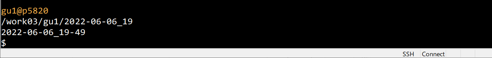
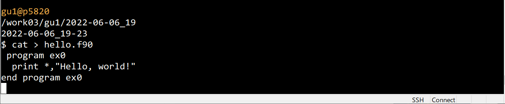
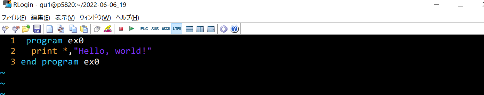
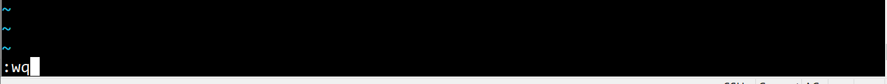
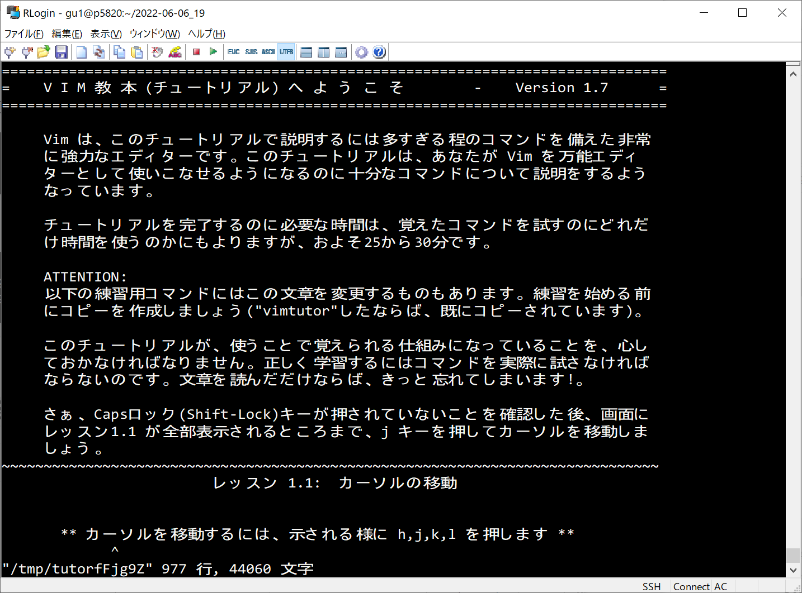

# プログラミング入門_02

[[_TOC_]]

## Linuxでのプログラミング

科学研究では，WindowsやMac OSだけでなく，Linux (リナックス)というオペレーティング・システム (OS)がよく用いられる。Mac OSはLinuxが背後で動作しており実質はLinuxである。また, WindowsもLinuxと非常に似通ったOSである。ここでは, Linuxを使ったプログラミング方法について学ぶ。

また，プログラミングに必要な最小限の予備知識についても折に触れて説明する。


### 参考資料

オペレーティング・システムについて

https://www.youtube.com/watch?v=lbvVe953q3s

Linuxについて

https://www.youtube.com/watch?v=cZmqjl7ENmA


## Linuxの初歩

https://www.youtube.com/watch?v=6vI3D62hDcA

https://gitlab.com/infoaofd/lab/-/blob/master/LINUX/01.BASH/0.LINUX_TUTORIAL_01.md


### シェル

Linuxでコマンドを打ち込む画面のことをシェルという



画面の左下に$と点滅したカーソルが表示されている場合，シェルが作動していることを意味している。

$は「ここにコマンド入力可」を意味する記号で，コマンドプロンプトと呼ばれる。


## 画面へ文字を書く (はじめの一歩)

手始めに最も単純な形のプログラムを作成してみる。

```FORTRAN
program ex0
  print *,"Hello, world!"
end program ex0
```

上記は，画面上に

```
Hello, world!
```

と表示させるプログラムである。


## Linuxの準備

### 作業用ディレクトリの作成

```
$ cd $HOME
```

cdはchange directoryの略で，ディレクトリ間の移動を行う。

$HOMEは各ユーザーのホームディレクトリを意味する。

以下で自分のホームディレクトリを確認できる。

```bash
$ echo $HOME
/work03/gu1
```


```bash
$ ls
LAB/  perl5/
```

lsはlistの略で，ファイルやディレクトリの情報を表示する


```bash
$ mkdir -vp 2022_PROGRAM/02
```

mkdirはmake directoryの略で，ディレクトリを新規作成する際に使用する


```bash
$ ls
2022_PROGRAM/02  LAB/  perl5/
```


### 作業用ディレクトリへ移動

```bash
$ cd 2022_PROGRAM/02
```

```bash
$ pwd
/work03/gu1/LAB/2022_PROGRAM/02
```


## プログラミング

### ソースファイルの作成

**ソースファイル** (source file) = プログラムが書いてあるテキストファイルのこと

**テキストファイル** (text file)=windowsのメモ帳などのアプリで読めるファイルのこと

```bash
$ cat > hello.f90
```

catはconcatenate（連結する）の略で，本来ファイルの連結を行うコマンドであるが，以下のようにファイルへの書き込みを行う際に使用される

以下の内容を画面にコピペする

```fortran
program ex0
  print *,"Hello, world!"
end program ex0
```

ブラウザ上の上記の個所をマウスでドラッグして右クリック→黒い画面上で左クリック

ペースト（貼り付け）した様子



**CtrlキーとDキーを同時に押す**と書き込み**終了** (以降 CTL+Dと表記する)

$ とカーソルが表示されたら成功


### 入力内容の確認

```bash
$ cat hello.f90 
 program ex0
  print *,"Hello, world!"
end program ex0
```

### ソースファイル

プログラムが記載されたファイル（上の例では，hello.f90）のことを**ソースファイル** (source file)という


### catコマンドについて

catはconcatenate（連結する）の略で，本来ファイルの連結を行うコマンドであるが，以下のようにファイルの内容を表示したり，ファイルへの書き込みを行う際に使用される

```
cat > FILE_NAME
```

FILE_NAMEというファイルに画面の表示内容を書き込む（CTL+Dで終了）

```
cat FILE_NAME
```

FILE_NAMEという名称のファイルの内容を画面に表示する。

`>`が有る場合とない場合で意味が異なることに注意する。


### コンパイラの設定

ソースファイルをコンピューターが直接理解できる表記方法に翻訳するためのソフトをコンパイラという。今回はインテルフォートラン (通称ifort)を用いる

以下のコマンドを使って，ifortを使用できるようにする

```bash
$ source  /opt/intel/oneapi/setvars.sh --force
```


### コンパイル

ソースファイルをコンピューターが直接理解できる表記方法に翻訳することをコンパイルという

```bash
$ ls
hello.f90
```

```bash
$ ifort hello.f90 -o hello.exe
```

hello.f90が翻訳され，hello.exeというファイルが作成される。作成されたhello.exeのことを実行ファイルと呼ぶことがある

### 実行ファイルの確認

```bash
$ ls -lh hello.exe
-rwxr-xr-x. 1 gu1 828K  6月  6 19:39 hello.exe*
```


### プログラムの実行

```
$ hello.exe
 Hello, world! 
```


## 簡単な計算を行うプログラム

### ソースファイルの作成

$ cat > calc.f90

```fortran
a=2.0; b=3.0

c1=a+b
c2=a-b
c3=a*b
c4=a/b
c5=a**b

print *,'a+b =',c1
print *,'a-b =',c2
print *,'a*b =',c3
print *,'a/b =',c4
print *,'a**b=',c5

end
```

CTL+D

### コンパイル

```bash
$ ifort calc.f90 -o calc.exe 
```

### 実行ファイルの確認

```bash
$ ls -lh calc.exe
-rwxr-xr-x. 1 gu1 829K  6月  6 20:56 calc.exe*
```

### プログラムの実行

```bash
$ calc.exe
 a+b =   5.000000    
 a-b =  -1.000000    
 a*b =   6.000000    
 a/b =  0.6666667    
 a**b=   8.000000   
```

## コラム　演算記号

`+`  : 和

`-` : 差

`*` : 積 ($\times$ではない)

`/` : 商 ($\div$ではない)

`**` : べき乗 (a**bは$a^b$の意味)

------


------

## コラム

### プログラムの構成要素

最も単純な形のプログラムの例を示した。以下徐々に複雑なプログラムに取り組んでいくが，その前にプログラムの基本構成要素について紹介しておく

・入力 (データをキーボード，ハードディスク，USBメモリ，マイク，カメラなどから読み込む)

・演算（データを計算する）

・出力（データを書き出す，画像を表示する，音声を出す）

・繰り返し (同じ動作を何度も繰り返す)

・条件分岐 (場合分けをして，必要な動作を選ぶ)

・副プログラム (決まった動作をする部分を下請けに出す)

予想以上に少ないことに驚かれるかもしれないが，基本的なものは以上で尽くされる

画像を表示する，音声を出す，といった機能は，画像を表示する部品や音声を出す部品の構造に依存するので，通常，

1. 部品に送る電子信号の数値データ作成までを行うソフト

2. 画像表示や音声を出す専用のソフト

に分離されていることが多い。

2.のプログラミングは1.の応用であるので，まず1．に精通していることが肝要である。

ここでは，研究のために用いる数値データ作成のソフトの作り方を主眼に解説する。

------


## エディタ

ソースファイルを作成する際，通常は上記のようなコピペを用いるのではなく，エディタ (editor)と呼ばれるソフト（アプリ）を使用する。

**vi** というソフトがよく使われる


### viの起動

```bash
$ vi hello.f90
```




### viの終了

Esc (エスケープ)キーを押してから，:wqと押す



viが終了して，シェルに戻る


## vi使用法

### 入門者向け教本

```BASH
$ vimtutor
```




### vi早見表

#### モードの切り替え

i 　編集モード  

ESC 　ノーマルモード  


#### 保存と終了　(ノーマルモード)  

保存　:w  

保存して終了　:wq  

保存せず終了　:q!  


#### 取り消し・やり直し・繰り返し　(ノーマルモード)  

U　アンドゥ（取り消し）  

Ctrl + r　アンドゥで戻した操作を、元に戻す。

.　直前の操作の繰り返し  

CTL+L 画面のリフレッシュ


#### 削除 (ノーマルモード)  

D　行末まで削除  
行数 dd　カーソル位置から指定した行分カット 

dw　 カーソル位置から空白を含む単語の末尾まで削除

de  カーソル位置から空白を含まない単語の末尾まで削除 

d0  行先頭からカーソル位置まで削除 

dG  カーソル行からファイル末尾まで削除 

dd  1行削除切り取り（カット）  


#### コピーとペースト　(ノーマルモード)  

yy	カーソル行をヤンク  (引っ張るの意味) = コピーと同じ 

y0　行頭からカーソルの直前まで のヤンク  
y$	カーソルの位置から行末まで のヤンク

p	ヤンクした文字列をカーソル位置後にペースト  


#### 複数行選択　(ノーマルモード)  

V (shift + v)　→　領域選択  

ブロック選択  

CTL + V　→　領域選択  

yで選択個所をヤンク, dで選択個所を削除  


#### 移動　(ノーマルモード)  

$	行の末尾へ  

0	行の先頭へ  

ctrl + u	半画面分 上へ  

ctrl + d	半画面分 下へ  

ctrl + b	一画面分 上へ  

ctrl + f	一画面分 下へ  

`.　最後の編集位置に戻る  

'.　 最後の編集位置の行頭にジャンプ  

gg	そのファイルの先頭へ  

G	そのファイルの末尾へ  


#### 検索　(ノーマルモード)  

/	後ろにむかって検索  

?	前にむかって検索  

n	順方向へ検索する  

N	逆方向へ検索する

noh ハイライト表示解除


#### 置換　(ノーマルモード)  

##### 一括置換(確認)  

:%s/検索文字列/置換文字列/gc  

##### 一括置換(確認しない)  

:%s/検索文字列/置換文字列/g  


#### 一行一文字検索 　(ノーマルモード)  

f	その行の順方向に一文字検索  

F	その行の逆方向に一文字検索  

t	その行の順方向に一文字検索(カーソルは文字の手前)  

T	その行の逆方向に一文字検索(カーソルは文字の手前)  


#### コマンドの実行　(ノーマルモード)  

:!コマンド  

コマンドの再実行　(ノーマルモード)  

q:でコマンド履歴を開く　→　実行したいコマンドに移動　→　Enterで選択  

(iでコマンド履歴の編集が可能）  


#### コマンド結果の挿入　(ノーマルモード)  

V（shift+v）→ :!コマンド  


#### マクロ　(ノーマルモード)  

**マクロ＝同じ動作を何度も繰り返し行う**

qa  マクロ「a」を記録開始  

q  マクロの記録を停止  

@a  マクロ「a」を実行  

@@  最後に実行したマクロを再実行  


#### バッファ操作　(ノーマルモード)  

**複数のファイルを同時に開いて作業する**

:e 開きたいファイル	別ファイルを開く   

:ls　→　:b N	N番目のバッファに移動  

:b ファイル名	ファイル名のバッファに移動

:bd バッファ番号 バッファを閉じる   


### 設定変更

ホームの下にある `~/.vim` ディレクトリと `~/.vimrc` ファイルを書き換えると設定が変更できる。

`~`はホームディレクトリを意味する（$HOMEと同じ意味）


#### 作業の前に, 必ずバックアップを取る

```bash
cp -ar ~/.vimrc  ~/vimrc_BAK_$(date "+%Y-%m-%d_%H")
```

#### .vimrcの変更

```
$ vi ~/.vimrc
```

#### .vimrcの変更箇所

　`jk`を挿入モード解除（`ESC`の代わり）にする

```vim
inoremap jk <ESC>
```


### 参考になるサイト

#### コーディングを3倍速くする！ Vim入門

https://vimeo.com/groups/179422/videos/22709519  
7:22から実演  

#### 今更聞けないvimの話

https://youtu.be/jJaQz7oZ8xc  
https://youtu.be/lB7MORIP9iI  

#### vim入門

https://dotinstall.com/lessons/basic_vim  

#### vim をおすすめする理由

https://qiita.com/mimimi-no-sesese/items/602973f644cfa56dccfb  

#### 研修で非常に有効だった内容

https://qiita.com/nyantera/items/4bf29ca6f11bc797a9cb 

#### もうこれでVIM学習は最後にしよう！ VIMチュートリアルと入門

https://qiita.com/baby-degu/items/9b6b275b72c37a02001c


### 練習用のサイト

VIM ADVENTURE  
https://qiita.com/arufa/items/1cac121ea73cebc421dc  
https://vim-adventures.com/  

vimの練習に最適！直感的に練習できるサイト作りました  
https://command-lab.com/vim-practice/    