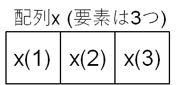

# プログラミング入門_04_SP

[TOC]

## 概要

配列はプログラミングの肝の部分である。配列を使うことで，大量データの処理を短い行数のプログラムで記述することができるようになる。

ここでは，

- 配列の構造

- 配列を使ったデータ処理法

について学ぶ


## Linuxの準備

```
$ cd $HOME
```

```
$ cd 2022_PROGRAM
```

```
$ mkdir -vp 04_SP
```

```
$ cd 04_SP
```

```
$ pwd
/work03/gu1/LAB/2022_PROGRAM/04_SP
```

```
$ ift
```

もしくは

```
$ source  /opt/intel/oneapi/setvars.sh --force
```


## 復習

------

### 配列

次のような数ベクトル$\boldsymbol{x}$をプログラムで表現することを考える
$$
\boldsymbol{x}=(1, 2, 3)
$$
$\boldsymbol{x}$の各成分を左からx(1), x(2), x(3)と書くことにする。このとき

x(1)=1, x(2)=2, x(3)=3と書くことができる。これをフォートランで表現するときは，次のようにする

```fortran
real,dimension(3)::x

x(1)=1
x(2)=2
x(3)=3
```


下記の行を宣言文という。

```fortran
real,dimension(3)::x
```

意味は，

- xという変数を新規に使用する

- xは複数の要素をもつ配列として使用する

- 要素の数は3とする

配列は，一つの変数をデータを入れる箱に例えると，箱の中をいくつか小分けに区切った小箱の集まりとして扱うことに相当する



宣言文の書き方にはいくつか種類があり，次のような書き方も使用できる

```
real x(3)
```

**注意**：宣言文は実行文(宣言文以外の文)より上に書く約束

（変数を宣言→変数を使用という順序を守るため）

#### 参考

```fortran
x(1)=1
x(2)=2
x(3)=3
```

上記は，次のように1行で書くことができる

```fortran
x(1)=1; x(2)=2; x(3)=3
```

(各行をセミコロン`;`で区切る）

------


## 2次元配列

- 緯度, 経度別に値があるデータ

- 地点,  時間別に値があるデータ

の収納に用いられる。


### 例

x(i,j)でiが経度, jが緯度を表す

x(i,j)でiが地点番号, jが時間を表す


#### プログラム例

```
$ vi A2D.F90
```

```FORTRAN
real,dimension(2,2)::x

x(1,1)=1; x(1,2)=2
x(2,1 )=3; x(2,2)=4

do i=1,2
print  '(2f5.1)', (x(i,j),j=1,2)
end do !i

end
```

```
$ ifort -traceback -CB A2D.F90 -o A2D.exe
```

`-traceback`と`-CB`については下記コラム参照

```
$ A2D.exe 
  1.0  2.0
  3.0  4.0
```


## コラム

### コンパイルオプション

```
$ ifort -traceback -CB A2D.F90 -o A2D.exe
```

上の例で示した, `-traceback` や`-CB`をコンパイルオプションと呼ぶ。コンパイルオプションを使うと、様々な機能を追加できる。

-traceback: プログラム実行時にエラーが発生した際に, ソースファイルのどこでエラーが発生したか, どのようなエラーか表示される。

-CB (=check bounds): 宣言した配列の要素数を上回る値の添え字を指定していないかチェックする。

例えば, `real,dimension(2):: x`とxの要素数は2であると宣言したにも関わらず, `x(3)=1`のように実際には存在しない要素にアクセスしようとした場合に、エラーであることを報告する。


### 実行エラーの読み方

一つの例として下記を示す。  

$ vi SEGF.F90

```
real,dimension(2)::x

i=3
x(i)=1.0

end
```

```
$ ifort -traceback -CB SEGF.F90 -o SEGF.exe
```

```
$ SEGF.exe
```

forrtl: severe (**408**): fort: (2): **Subscript #1 of the array X has value 3 which is greater than the upper bound** of 2    

Image              PC                Routine            Line        Source             
SEGF.exe           000000000040664F  Unknown               Unknown  Unknown  
SEGF.exe           0000000000403B1F  MAIN__                      **4**  **SEGF.F90 **   
SEGF.exe           0000000000403AA2  Unknown               Unknown  Unknown  
libc-2.17.so       00007F57776F7555  __libc_start_main     Unknown  Unknown  
SEGF.exe           00000000004039A9  Unknown               Unknown  Unknown  

**408**: エラー番号 (googleでifort ERROR 408で検索すると、エラーメッセージの詳細が分かる)

Subscript #1 of the array X has value 3 which is greater than the upper bound of 2:  
配列xの1番目の添え字(#1)に3が指定されているが，それは最大要素数の2を超えている

**4 SEGF.F90**: ソースファイルSEGF.F90の4行目で該当のエラーが発生した


#### 参考: segmentation fault

配列要素に関して誤った処理を行った場合,

```
segmentation fault
```

という実行時エラーが表示されることがしばしばある。

これはメモリの不正アクセスが行われたときにでるエラーで，存在しないメモリ番地を指定した際に発生することが多い。配列の番号指定を誤ると，メモリの不正アクセスとなることが多い。


## コロン(:) の活用

配列を表す括弧の中でコロン(**：**)を使用した場合，任意の要素番号を指定したことを意味する

### x(:,:)で配列のすべての要素を指定することができる

#### プログラム例

```
$ cp A2D.F90 A2D_COLON.F90
```

```
$ vi A2D_COLON.F90 
```

```fortran
real,dimension(2,2)::x

x(:,:)=1

do i=1,2
print  '(2f5.1)', (x(i,j),j=1,2)
end do !i

end
```

```
$ ifort -traceback -CB A2D_COLON.F90 -o A2D_COLON.exe
```

```
$ A2D_COLON.exe 
```

  1.0  1.0  
  1.0  1.0  


### x(1,:)でx(1,1)とx(1,2)を同時に指定できる

#### プログラム例

```
$ cp A2D_COLON.F90 A2D_COLON2.F90
```

```
vi A2D_COLON2.F90
```

```fortran
real,dimension(2,2)::x

x(1,:)=1; x(2,:)=2

do i=1,2
print  '(2f5.1)', (x(i,j),j=1,2)
end do !i

end
```

```
$ ifort -traceback -CB A2D_COLON2.F90 -o A2D_COLON2.exe
```

```
$ A2D_COLON2.exe
```

  1.0  1.0  
  2.0  2.0  

```
print  '(2f5.1)', (x(i,j),j=1,2)
```

`(x(i,j),j=1,2)`は, iは固定しておいて，jだけ変化させて，横並びに出力させたいときに使う

#### 練習1

コロン（：）を使って, 2次元配列

```
real,dimension :: x(2,2)
```

のx(:,1)に1, x(:,2)に2を代入し，その結果を画面に表示させよ。

##### 解答例

```
$ A2D_COLON3.exe 
```

  1.0  2.0  
  1.0  2.0  


### コロン (:)を使って配列の一部の要素を指定することができる

```
$ cp A2D_COLON3.F90 A2D_COLON4.F90
```

```
$ vi A2D_COLON4.F90 
```

```fortran
real,dimension(3,2)::x

x(:,:)=0

x(1:2,:)=1

do i=1,3
print  '(2f5.1)', (x(i,j),j=1,2)
end do !i

end
```

**x(1:2,:)=1によって，iに関しては1～2行まで，jに関してはすべての列に1が代入される**


```
$ ifort -traceback -CB A2D_COLON4.F90 -o A2D_COLON4.exe
```

```
$ A2D_COLON4.exe 
```

  1.0  1.0  
  1.0  1.0   
  0.0  0.0  


## 3次元配列

- 緯度, 経度, 高さ別に値があるデータ

- 緯度, 経度, 時間別に値があるデータ

の収納に用いられる。

### 例

x(i,j,k)でiが経度, jが緯度, kが時刻を表す

x(i,j)でiが経度, jが緯度, kが時刻を表す


#### プログラム例

```
$ cp A2D.F90 A3D.F90
```

```
$ vi A3D.F90
```

```fortran
real,dimension(2,2,2)::x

x(1,1,1)=1; x(1,2,1)=2
x(2,1,1)=3; x(2,2,1)=4

x(1,1,2)=5; x(1,2,2)=6
x(2,1,2)=7; x(2,2,2)=8

do k=1,2
print '(A,i5)','k=',k

do i=1,2
print  '(2f5.1)', (x(i,j,k),j=1,2)
end do !i

print *
end do !k

end
```

```
$ ifort -traceback -CB A3D.F90 -o A3D.exe
```

```
$ A3D.exe 
```

k=    1  
  1.0  2.0  
  3.0  4.0  

k=    2  
  5.0  6.0  
  7.0  8.0  


## 演算

### 加法と減法

```
$ cp A2D.F90 ADD_A2D.F90
```

```
$ vi ADD_A2D.F90
```

```fortran
real,dimension(2,2)::x,y,z1,z2

x(1,1)=1; x(1,2)=2
x(2,1)=3; x(2,2)=4

y(1,1)=4; y(1,2)=3
y(2,1)=2; y(2,2)=1

z1=x+y
z2=x-y

print '(A)','x'
do i=1,2
print  '(2f5.1)', (x(i,j),j=1,2)
end do !i
print *

print '(A)','y'
do i=1,2
print  '(2f5.1)', (y(i,j),j=1,2)
end do !i
print *

print '(A)','z1=x+y'
do i=1,2
print  '(2f5.1)', (z1(i,j),j=1,2)
end do !i
print *

print '(A)','z2=x-y'
do i=1,2
print  '(2f5.1)', (z2(i,j),j=1,2)
end do !i
print *

end
```

```
$ ifort -traceback -CB ADD_A2D.F90 -o ADD_A2D.exe
```

```
$ ADD_A2D.exe 
```

x  
  1.0  2.0  
  3.0  4.0  

y  
  4.0  3.0  
  2.0  1.0  

z1=x+y  
  5.0  5.0  
  5.0  5.0  

z2=x-y  
 -3.0 -1.0  
  1.0  3.0  

**各要素ごと**に足し算、引き算が行われる。


### 積・商

```
$ cp ADD_A2D.F90 MUL_A2D.F90
```

```
$ vi MUL_A2D.F90
```

```fortran
real,dimension(2,2)::x,y,z1,z2

x(1,1)=1; x(1,2)=2
x(2,1)=3; x(2,2)=4

y(1,1)=4; y(1,2)=3
y(2,1)=2; y(2,2)=1

z1=x*y
z2=x/y

print '(A)','x'
do i=1,2
print  '(2f5.1)', (x(i,j),j=1,2)
end do !i
print *

print '(A)','y'
do i=1,2
print  '(2f5.1)', (y(i,j),j=1,2)
end do !i
print *

print '(A)','z1=x*y'
do i=1,2
print  '(2f5.1)', (z1(i,j),j=1,2)
end do !i
print *

print '(A)','z2=x/y'
do i=1,2
print  '(2f5.1)', (z2(i,j),j=1,2)
end do !i
print *

end
```

```
$ ifort -traceback -CB MUL_A2D.F90 -o MUL_A2D.exe
```

```
$ MUL_A2D.exe 
```

x  
  1.0  2.0  
  3.0  4.0  

y  
  4.0  3.0  
  2.0  1.0  

z1=x*y  
  4.0  6.0  
  6.0  4.0  

z2=x/y  
  0.2  0.7  
  1.5  4.0  

**各要素ごと**に掛け算、割り算が行われる。


## よく使われる配列操作

### 2次元配列を3次元配列に変換する

#### プログラム例

```
$ cp A3D.F90 A2D_TO_A3D.F90
```

```
$ vi A2D_TO_A3D.F90
```

```fortran
real,dimension(2,2)::x1,x2
real,dimension(2,2,2)::y

x1(1,1)=1; x1(1,2)=2
x1(2,1)=3; x1(2,2)=4

x2(1,1)=5; x2(1,2)=6
x2(2,1)=7; x2(2,2)=8

k=1
y(:,:,k)=x1(:,:)

k=2
y(:,:,k)=x2(:,:)

print '(A)','x1(i,j)'
do i=1,2
print  '(2f5.1)', (x1(i,j),j=1,2)
end do !i
print *

print '(A)','x2(i,j)'
do i=1,2
print  '(2f5.1)', (x2(i,j),j=1,2)
end do !i
print *

print '(A)','y(i,j,k)'
do k=1,2
print '(A,i5)','k=',k

do i=1,2
print  '(2f5.1)', (y(i,j,k),j=1,2)
end do !i

print *
end do !k

end
```

```
$ ifort -traceback -CB A2D_TO_A3D.F90 -o A2D_TO_A3D.exe
```

```
$ A2D_TO_A3D.exe 
```

x1(i,j)  
  1.0  2.0  
  3.0  4.0  

x2(i,j)  
  5.0  6.0  
  7.0  8.0  

y(i,j,k)  
k=    1  
  1.0  2.0  
  3.0  4.0  

k=    2  
  5.0  6.0  
  7.0  8.0  

#### 練習2

3次元配列に収納されたデータ

```fortran
real,dimension(2,2,2)::x

x(1,1,1)=1; x(1,2,1)=2
x(2,1,1)=3; x(2,2,1)=4

x(1,1,2)=5; x(1,2,2)=6
x(2,1,2)=7; x(2,2,2)=8
```

を2次元配列

```fortran
real,dimension(2,2)::x1,x2
```

に分割して、結果を画面に表示させるプログラムを作成せよ。


### 2次元配列を1次元配列に変換する

```
$ cp A2D.F90 A2D_TO_A1D.F90
```

```
$ vi A2D_TO_A1D.F90
```

```fortran
real,dimension(2,2)::x
real,dimension(4)::y

x(1,1)=1; x(1,2)=2
x(2,1 )=3; x(2,2)=4

k=0
do j=1,2
do i=1,2
k=k+1
y(k)=x(i,j)
end do !i
end do !j

k=0
do i=1,2
do j=1,2
k=k+1
print  '(A,i3,A,i3,A,f5.1,A,i3,A,f5.1)',&
'i=',i,' j=',j,' x(i,j)=',x(i,j),' k=',k,' y(k)=',y(k)
end do !i
end do !j
print *

end
```

```
$ ifort -traceback -CB A2D_TO_A1D.F90 -o A2D_TO_A1D.exe
```

```
$ A2D_TO_A1D.exe 
```

i=  1 j=  1 x(i,j)=  1.0 k=  1 y(k)=  1.0  
i=  1 j=  2 x(i,j)=  2.0 k=  2 y(k)=  3.0  
i=  2 j=  1 x(i,j)=  3.0 k=  3 y(k)=  2.0  
i=  2 j=  2 x(i,j)=  4.0 k=  4 y(k)=  4.0  


#### 練習3

1次元配列

```fortran
real,dimension(4)::y
y(1)=1; y(2)=2; y(3)=3; y(4)=4
```

に収納されたデータを, 2次元配列

```fortran
real,dimension(2,2)::x
```

に収納し、結果を画面に表示させるプログラムを作成せよ。


### 時間平均

```
real,dimension(3,2,10)::T
```

という配列に気温のデータが記録されているとする。T (i, j, k)に対し, 

- iは経度方向の測点番号  

- jが緯度方向の測点番号

- kが時間方向の測定番号

を示す添え字と定義されている。

このとき各測点の時間平均値を求めるプログラムは次のようになる。ここで、T (i, j, k)は, 組み込み関数random_numberを使って作成した乱数を使った疑似データを与えている。

```
$ vi TAV.F90
```

```fortran
integer,parameter::im=2,jm=2,km=5
real,dimension(im,jm,km)::T
real,dimension(im,jm)::TA

print '(A)','CREATE INPUT DATA'
T0=10.0; TAMP=2.0
do i=1,im
do j=1,jm
do k=1,km
call random_number(tmp)
T(i,j,k)=T0+tmp*TAMP
end do !k
end do !j
end do !i

print '(A)','AVERAGE'
do i=1,im
do j=1,jm
TA(i,j)=0.0
do k=1,km
TA(i,j)=TA(i,j)+T(i,j,k)
end do !K
TA(i,j)=TA(i,j)/float(km)
end do !j
end do !i

print '(A)','OUTPUT'
do i=1,im
do j=1,jm
print '(A,i3,A,i3)','i=',i,' j=',j
do k=1,km
print '(A,i3,A,f8.3)','k=',k,' k(i,j,k)=',T(i,j,k)
end do !k
print '(A,f8.3)','TA(i,j)=',TA(i,j)
print *
end do !j
end do !i

end
```


`float`は整数型の変数を**実数型に変換する**ための組み込み関数である。`float(km)`でkmが実数型に変換される。


```
$ ifort -traceback -CB TAV.F90 -o TAV.exe
```

```
$ TAV.exe
```


#### 練習4

上記のプログラムTAV.F90をコピーして, TSD.F90というファイルを作成せよ。

TSD.F90を書き換えて, 各地点におけるTの時間平均からの標準偏差を計算し、画面に表示させるプログラムを作成せよ。

変数xの平方根は組み込み関数`SQRT(x)`で計算することができる。

##### ヒント

T(k)を入力データ, TAをT(k)の平均, TSDをT(k)のTAからの標準偏差とすると、標準偏差は下記で計算することができる。

```fortran
TSD=0.0
do k=1,km
TSD=TSD+(T(k)-TA)**2
end do !k
TSD=SQRT(TSD/float(km-1))
```


1次元配列に記憶されたデータの平均と標準偏差を求めるプログラム例を下記に示す。

```
$ vi TSD.F90
```

```fortran
integer,parameter::km=10
real,dimension(km)::T

T0=10.0; TAMP=2.0
call random_number(T)
T(:)=T0+T(:)*TAMP

print '(A)','INPUT DATA'
do k=1,km
print '(i,f7.3)',k,T(k)
end do !k

TA=0.0
do k=1,km
TA=TA+T(k)
end do !k
TA=TA/float(km)
print '(A,f7.3)','AVERAGE=',TA

TSD=0.0
do k=1,km
TSD=TSD+(T(k)-TA)**2
end do !k
TSD=SQRT(TSD/float(km-1))
print '(A,f7.3)','STANDARD DEVIATION=',TSD

end
```

```
$ ifort -traceback -CB TSD1.F90 -o TSD1.exe
```

```
$ TSD1.exe
```

INPUT DATA  
           1 10.000  
           2 10.051  
           3 10.705  
           4 11.334  
           5 11.926  
           6 11.677  
           7 10.671  
           8 11.831  
           9 11.592  
          10 11.665  
AVERAGE= 11.145  
STANDARD DEVIATION=  0.730  


### コラム

#### 多重ループの順序と処理速度

**FORTRANの場合**、

```
do i=1,im
do j=1,jm
do k=1,km
...
end do !k
end do !j
end do !

```

よりも、

```
do k=1,km
do j=1,jm
do i=1,im
...
end do !i
end do !j
end do !k
```

の方が処理が**早い**。

im, jm, kmの数が大きい場合は順番に注意する。im=jm=km=100程度でも, これら3つの積は100万程度の非常に大きい数になるので、注意を要する。

#### 理由

次のプログラムについて考える。

```
REAL A(100,100,100)
DO K=1,100
  DO J=1,100
    DO I=1,100
      A(I,J,K)=0.0
    END DO
  END DO
END DO
```

このとき, 上のプログラムのように，**外側からk, j, iの順にループさせる**と，コンピューターはメモリ番地順の, A( 1, 1, 1)，A( 2, 1, 1), ...という順番でデータを読みにいくため，処理速度が上がる。

**メモリ上でのデータの配置**  

```Fortran
メモリ番地
1			A( 1, 1, 1)  
2			A( 2, 1, 1)  
3			A( 3, 1, 1)  
...  
...  
100			A(100, 1, 1)  
101			A( 1, 2, 1)  
102			A( 2, 2, 1)  
...  
...  
			A(100, 2, 1)  
...  
...  
			A( 1, 1, 2)  
...
```

#### 注

FORTRANの場合, 外側からk, j, iの順にループさせると処理速度が上がるが，**C言語**の場合は逆に**外側から順にi, j, kの順にループさせると処理速度が上がる**。メモリ上へのデータの配置順序がFORTRANとCで異なることがその理由。

詳細は, チューニング技法入門

https://i.riken.jp/wp-content/uploads/2015/06/secure_4467_tuning-technique_main.pdf

のp.1, p. 31-を参照。


### 空間平均

```
real,dimension(3,2)::T
```

という配列に気温のデータが記録されているとする。T (i, j)に対し, 

- iは経度方向の測点番号
- jが緯度方向の測点番号

を示す添え字と定義されている。

このときTの空間平均値 (すべてのiとjに関する平均値)を求めるプログラムは次のようになる。ここで、T (i, j)は, 組み込み関数random_numberを使って作成した乱数を使った疑似データを与えている。

```
$ vi AAV.F90
```

```
integer,parameter::im=2,jm=2
real,dimension(im,jm)::T

print '(A)','CREATE INPUT DATA'
T0=10.0; TAMP=2.0
do i=1,im
do j=1,jm
call random_number(tmp)
T(i,j)=T0+tmp*TAMP
end do !k
end do !j

print '(A)','AVERAGE'
TA=0.0
do i=1,im
do j=1,jm
TA=TA+T(i,j)
end do !j
end do !i

TA=TA/float(im*jm)

print '(A)','INPUT DATA'
do i=1,im
do j=1,jm
print '(A,i3,A,i3,A,f8.3)','i=',i,' j=',j, ' k(i,j)=',T(i,j)
end do !j
end do !i
print '(A)','AREA AVERAGE:'
print '(A,f8.3)','TA=',TA
print *

end
```

```
$ ifort -traceback -CB AAV.F90 -o AAV.exe
```

```
$ AAV.exe
```

CREATE INPUT DATA  
AVERAGE  
INPUT DATA  
i=  1 j=  1 k(i,j)=  10.000  
i=  1 j=  2 k(i,j)=  10.051  
i=  2 j=  1 k(i,j)=  10.705  
i=  2 j=  2 k(i,j)=  11.334  
AREA AVERAGE:  
TA=  10.522  

#### 練習5

上記のプログラムAAV.F90をコピーして, ASD.F90というファイルを作成せよ。

ASD.F90を書き換えて, Tの空間平均からの標準偏差を計算し、画面に表示させるプログラムを作成せよ。

変数xの平方根は組み込み関数`SQRT(x)`で計算することができる。


### 移動平均

データに含まれる細かいノイズを取り除きたいときに用いる平均方法である

概念的な点については下記URLを参照のこと

https://bellcurve.jp/statistics/course/12933.html


#### プログラム例

```
$ vi RUNMEAN.F90
```

```
integer,parameter::im=20
real,dimension(im)::x,xm
real,parameter::pi=3.141592653589793
iw=3

print '(A)','CREATE INPUT DATA'
x0=10.0
do i=1,im
x(i)=x0+0.5*sin(2.0*pi*float(i-1)/float(iw*2+1)) &
       +0.1*sin(2.0*pi*float(i-1)/float(iw*4+1))
end do !i

print '(A)','RUNNING MEAN'

xm(:)=0.0

do i=1+iw,im-iw

do n=-iw,iw
xm(i)=xm(i)+x(i+n)
end do !n

xm(i)=xm(i)/float(2*iw+1)

end do !i

print '(A)','PRINT RESULT'
print '(A)','i     x(i)       xm(i)'
do i=1,im
print '(i3,2f10.4)',i,x(i),xm(i)
end do !i

end
```

#### 練習

(1) RUNMEAN.F90をコンパイル，実行させて,計算結果をファイルに書き出し, i=3から17までのデータに対して, 横軸をiとして，x(i)とxm(i)の折れ線グラフを作成せよ。

(2)プログラムの移動平均を計算している箇所を下記のように変更して，計算過程を確認し，i=17のケースについて, 手で計算した結果と比較せよ (計算には電卓，スマホ等使用可)。

```
do i=1+iw,im-iw

print '(A,i3)','i=',i
do n=-iw,iw
xm(i)=xm(i)+x(i+n)
print '(2i3,2f8.3)',i,n,x(i+n),xm(i)
end do !n

xm(i)=xm(i)/float(2*iw+1)
print '(A,i3,f8.3)','i,xm(i)=',i,xm(i)
print *

end do !i
```


## 上達のためのポイント

**エラーが出た時の対応の仕方でプログラミングの上達の速度が大幅に変わる**。

ポイントは次の3つである

1. エラーメッセージをよく読む
2. エラーメッセージを検索し，ヒットしたサイトをよく読む
3. 変数に関する情報を書き出して確認する

エラーメッセージは，プログラムが不正終了した直接の原因とその考えられる理由が書いてあるので，よく読むことが必要不可欠である。

記述が簡潔なため，内容が十分に理解できないことも多いが，その場合**エラーメッセージをブラウザで検索**してヒットした記事をいくつか読んでみる。

エラーの原因だけでなく，**考えうる解決策**が記載されていることも良くある。

エラーを引き起こしていると思われる箇所の**変数の情報**や**変数の値そのものを書き出して**，**期待した通りにプログラムが動作しているか確認する**ことも重要である。

エラーの場所が特定できれば，エラーの修正の大部分は完了したと考えてもよいほどである。

エラーメッセージや検索してヒットするウェブサイトは英語で記載されていることも多いが，**重要な情報は英語で記載されていることが多い**ので，よく読むようにする。

重要そうに思われるが，一回で理解できないものは，PDFなどに書き出して後で繰り返し読んでみる。どうしても**内容が頭に入らないものは印刷してから読む**。
