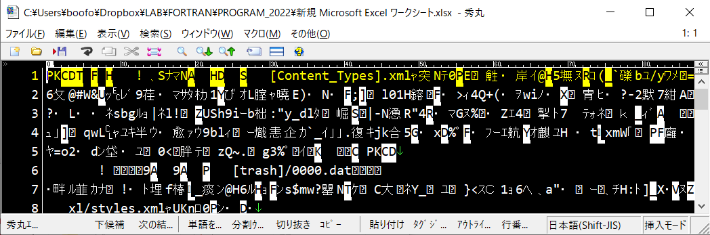

# プログラミング入門_05

[[_TOC_]]

## 準備

```
$ cd $HOME
```

```
$ cd 2022_PROGRAM
```

```
$ mkdir -vp 05
```

```
$ cd 05
```

```
$ pwd
/work03/gu1/LAB/2022_PROGRAM/05
```

```
$ source  /opt/intel/oneapi/setvars.sh --force
```


## 復習 (テキストファイルの書き出しと読み込み)

### テキストファイルへの書き出し

#### プログラムの作成

viの起動

`$ vi textout.f90`

`i`でviの挿入モードに移る

ブラウザ上で下記のプログラムをコピー

```fortran
program textout

real,allocatable::a(:)
character(len=100):: ofle

n=10
allocate(a(n))

ofle="random_number.txt"

call random_number(a)

open(21,file=ofle)
write(21,'(i5)')n
do i=1,n
write(21,'(f10.5)')a(i)
end do
close(21)

do i=1,n
print '(f10.5)', a(i)
end do

print *
print '(A,A)','OUTPUT FILE = ',trim(ofle)
print *

! https://www.nag-j.co.jp/fortran/tips/tips_RandomNumberInFortran.html
end program textout
```

viの画面にペースト（貼り付け）

`Esc`でノーマルモードに移る

`:wq`でviを終了して，シェルに戻る


### コンパイル

`$ ifort textout.f90 -o textout.exe`


### 実行ファイルの確認

`$ ll`
-rwxrwxr-x 1 am am  14K  8月 20 20:00 textout.exe


### 実行

`$ textout.exe`
   0.95483
   0.15289
   0.49678
   0.69831
   0.07452
   0.78291
   0.90688
   0.96399
   0.81216
   0.70186

OUTPUT FILE = random_number.txt


### 出力ファイルの確認

`$ cat random_number.txt` 
   10
   0.95483
   0.15289
   0.49678
   0.69831
   0.07452
   0.78291
   0.90688
   0.96399
   0.81216
   0.70186

### テキストファイルへの書きこみ方法

```
open(21,file=ofle)
write(21,'(i5)')n
do i=1,n
write(21,'(f10.5)')a(i)
end do
close(21)
```

`open`でファイルを開く

21はファイル番号であり，5, 6以外の任意の番号を使ってよい (5はキーボード, 6はモニター画面に予約されている)

`file=`の後にファイル名を書く。上の例では，ofleという変数の中身 (random_number.txt)がファイル名になる

`write(21,'(i5)')n`で変数nに記憶されている数値(上の例では10)がファイルに書き出される

`'(i5)'`は出力を行う際の書式を意味しており，この場合は5文字分を用意し，整数として書き出す (ので，実数が保存されている変数をこの書式で書き出すと値がおかしくなる)

`do`と`end do`で囲まれた部分は繰り返される（後述）

`write(21,'(f10.5)')a(i)`でa(i)に記憶されている数値(random_numberで作成された数値)がファイルに書き出される。

a(i)のことを**配列**と呼ぶ（後述）

open文の詳細は下記参照

https://www.nag-j.co.jp/fortran/FI_15.html#_15

write文の詳細は下記参照

https://www.nag-j.co.jp/fortran/FI_14.html#_14

書式指定の詳細は下記参照

https://www.nag-j.co.jp/fortran/FI_14.html

do文の詳細は下記参照

https://www.nag-j.co.jp/fortran/FI_9.html#_9

配列の詳細は下記参照（この資料の後ろにも解説有）

https://eng-entrance.com/java-array-whatis

https://www.nag-j.co.jp/fortran/FI_12.html#_12


### テキストファイルの読み込み

#### プログラムの作成

viの起動

`$ vi textread.f90`

`i`でviの挿入モードに移る

ブラウザ上で下記のプログラムをコピー

```fortran
program textread

real,allocatable::a(:)
character(len=100):: infle

infle="random_number.txt"

print *
print '(A,A)','INPUT FILE = ',trim(infle)
print *

open(21,file=infle,action="read")
read(21,'(i5)')n
allocate(a(n))

do i=1,n
read(21,*)a(i)
end do
close(21)

do i=1,n
print '(f10.5)', a(i)
end do

end program textread
```
viの画面にペースト（貼り付け）

`Esc`でノーマルモードに移る

`:wq`でviを終了して，シェルに戻る


#### コンパイル

`$ ifort textread.f90 -o textread.exe`

#### 実行ファイルの確認

`$ ll textread.exe`
-rwxrwxr-x 1 am am 14K  8月 20 20:08 textread.exe

#### 実行

`$ textread.exe`

INPUT FILE = random_number.txt

   0.95483
   0.15289
   0.49678
   0.69831
   0.07452
   0.78291
   0.90688
   0.96399
   0.81216
   0.70186

## テキストファイルの読み込み方法

```fortran
open(11,file=infle,action="read")
read(11,'(i5)')n
allocate(a(n))

do i=1,n
read(11,*)a(i)
end do
close(11)
```

open文で読み込みたいファイルを開く

11はファイル番号であり，5, 6以外の任意の番号を使ってよい (5はキーボード, 6はモニター画面に予約されている)。書き出し用のプログラムで使った番号 (21)と一致してなくてよい。

file=の後に開きたいファイルの名前を入れる。ここでは，infleという変数の中身（random_number.txt）がファイルの名前になる

`action="read"`で開いたファイルを読み込み専用に指定している（**誤って上書きしないようにできる**）

`read(11,'(i5)')n`で，ファイル(random_number.txt)の1行目に書き込まれている数値（ここでは10）がnという変数に読み込まれる。

`allocate(a(n))`は配列のサイズを決めるための文（後述）

`do`と`end do`で囲まれた部分は繰り返される（後述）

`read(11,'(f10.5)')a(i)`でrandom_number.txtに書き込まれている数値が，a(i)に読み込まれる

`close(11)`で開いたファイルを閉じる


## バイナリファイルの書き出しと読み込み
### バイナリファイルとは

Wordやエクセル，画像，音声ファイルの多くは人間が文字として認識できない形で保存されている。

例えば，エクセルのワークシートをテキストファイルとして開くと下図のようになる





テキストファイル以外のファイルのことを**バイナリファイル** (binary file)ということがある。

バイナリファイルを使用する目的は，ファイルの容量を小さくすることと，ファイルの読み書きのスピードを上げることである。binary とは ，2進数で書き表された，という意味である。

科学的なデータも容量が大きいものについては，バイナリファイルで保存されていることが多い。

詳細は下記参照

- https://wa3.i-3-i.info/word1147.html
- http://e-words.jp/w/%E3%83%90%E3%82%A4%E3%83%8A%E3%83%AA%E3%83%95%E3%82%A1%E3%82%A4%E3%83%AB.html

- https://www.sci.hokudai.ac.jp/~inaz/doc/B/Education/node10.html
- https://docs.oracle.com/cd/E19205-01/820-1203/aeubl/index.html

  

### バイナリファイルの種類

大気海洋の分野では，下記のバイナリファイルがよく用いられる

1. プレーンバイナリ (plain binary)

2. netCDF (ネットシーディーエフ)

3. grib (グリブ)

4. HDF

今回は1の取り扱いについて学ぶ。

1は使用する計算機の種類に依存する（読める計算機と読めない計算機がある）ため，2-4の形式のファイルも広く用いられている。2-4には

- ファイル自体にファイルに関連する様々な情報を記録させる (そもそも何のデータなのか，データの単位，データ作成者，データ取り扱い上の注意など)

- ファイル容量の圧縮

- 読み書きのスピードの高速化

などの工夫が凝らされている


### プレーンバイナリの種類


#### シーケンシャル・アクセスとダイレクト・アクセス

##### シーケンシャル・アクセス 

- 磁気テープのイメージ

- データの先頭から順番にアクセスしていく


##### ダイレクト・アクセス

- 円盤型のレコードのイメージ

- データの任意の場所に直接アクセスする


**ダイレクトアクセスの方が読み書きのスピードが速い**


###  シーケンシャル・アクセス (Sequential access)

#### 書き出し

##### プログラム作成

viの起動

`$ vi binseqout.f90`

`i`でviの挿入モードに移る

下記のプログラムを打ち込む

```fortran
program binseqout

real,allocatable::a(:)
character(len=100):: ofle

n=10
allocate(a(n))

ofle="random_number_binseq.bin"

call random_number(a)

open(21,file=ofle,form="unformatted",access="sequential")

write(21)n
write(21)a
close(21)

do i=1,n
print '(f10.5)', a(i)
end do

print *
print '(A,A)','OUTPUT FILE = ',trim(ofle)
print *

end program binseqout
```

`Esc`でノーマルモードに移る

`:wq`でviを終了して，シェルに戻る

##### コンパイル

```bash
$ ift
```

```bash
$ ifort binseqout.f90 -o binseqout.exe
```

##### 実行ファイルの確認

`$ ll binseqout.exe`
-rwxrwxr-x 1 am am 14K  8月 20 20:48 binseqout.exe

##### 実行

`$ binseqout.exe`  

.....    

OUTPUT FILE = random_number_binseq.bin   

 出力ファイル (random_number_binseq.bin)はプレーンバイナリファイルであり, テキストファイルの内容を画面に書き出すcatコマンドでは読めない。

```bash
$ cat random_number_binseq.bin
(4\<|>*?Ίv?Ö¿¾Òê¿Ë¿à«Õ¿¨
áíÀìïãáìèïóô
²°²³­±±­²¹ß±¸­±¸
¯÷ïòë°¹¯áí¯²°²³ßÐÒÏÇÒÁͯ°µßÂÉÎÁÒÙßÆÉÌÅ
¤ 
```

**上記のようになったら, いったんRloginの接続を閉じて, もう一度接続し直す**こと。


odコマンドを使うと, バイナリファイルの内容を表示することができる。ここで-xオプションは16進法を用いていることを意味する。

https://atmarkit.itmedia.co.jp/ait/articles/1703/10/news027.html

```bash
$ od -x random_number_binseq.bin
0000000 0004 0000 000a 0000 0004 0000 0028 0000
0000020 8000 34d2 bc5c 3cd0 7cff 3eb4 bae8 3f2a
0000040 8ace 3f76 9a0e 3f56 b3a8 3eab 52e2 3f6a
0000060 bdb8 3f4b 2b60 3f55 0028 0000
0000074
```


#### バイナリファイルへの書きこみ方 (シーケンシャル・アクセス)

```Fortran
open(21,file=ofle,form="unformatted",access="sequential")

write(21)n
write(21)a
close(21)
```

`open`でファイルを開く

21はファイル番号であり，5, 6以外の任意の番号を使ってよい (5はキーボード, 6はモニター画面に予約されている)

`file=`の後にファイル名を書く。上の例では，ofleという変数の中身 (random_number.txt)がファイル名になる

`form="unformatted"`を指定すると**バイナリファイル**として出力される（何も指定しないとテキストファイルになる）

`access="sequential"`を指定すると**シーケンシャル**・**アクセス**として出力される

`write(21) n`で変数nに記憶されている数値(上の例では10)がファイルに書き出される。テキストファイルの時と違い，書式指定は不要。


#### 読み込み

##### プログラム作成

viの起動

`$ vi binseqread.f90`

`i`でviの挿入モードに移る

下記のプログラムを打ち込む。

```fortran
program binseqread

real,allocatable::a(:)
character(len=100):: infle

infle="random_number_binseq.bin"

print *
print '(A,A)','INPUT FILE = ',trim(infle)
print *

call random_number(a)

open(11,file=infle,form="unformatted",access="sequential",&
action="read")

read(11)n
print *,n
allocate(a(n))
read(11)a
close(11)

do i=1,n
print '(f10.5)', a(i)
end do

end program binseqread
```

`Esc`でノーマルモードに移る

`:wq`でviを終了して，シェルに戻る

##### コンパイル

`$ ifort binseqread.f90 -o binseqread.exe`

##### 実行

`$ binseqread.exe`

INPUT FILE = random_number_binseq.bin  

10  
   0.23569  
   0.06269  
   0.36733  
   0.42103  
   0.37129  
   0.49209  
   0.28768  
   0.70523  
   0.54634  
   0.49775  

`binseqout.exe`が作成したファイル (random_number_binseq.bin)が，`binseqread.exe`によって**確かに読み込まれている**ことが確認できた。


### バイナリファイルの読み込み方 (シーケンシャルアクセス)

```fortran
open(11,file=infle,form="unformatted",access="sequential",&
action="read")

read(11)n
print *,n
allocate(a(n))
read(11)a
close(11)
```

open文で読み込みたいファイルを開く

11はファイル番号であり，5, 6以外の任意の番号を使ってよい (5はキーボード, 6はモニター画面に予約されている)。書き出し用のプログラムで使った番号 (21)と一致してなくてよい。

file=の後に開きたいファイルの名前を入れる。ここでは，infleという変数の中身（random_number_binseq.bin）がファイルの名前になる

`action="read"`で開いたファイルを読み込み専用に指定している（**誤って上書きしないようにできる**）

`read(11) n`で，ファイル(random_number_binseq.bin)の最初に書き込まれている数値（ここでは10）がnという変数に読み込まれる。書式指定は不要。

`allocate(a(n))`は配列のサイズを決めるための文（後述）

`read(11)a`でrandom_number_binseq.binに書き込まれている数値がaに読み込まれる。

**バイナリファイルの場合**，配列名を指定するだけで**自動的に配列の要素数分のデータが読み込まれる**。

`close(11)`で開いたファイルを閉じる


### ダイレクト・アクセス (Direct access)

#### 書き出し

##### プログラム作成

viの起動

`$ vi bin_dir_out.f90`

`i`でviの挿入モードに移る

下記のプログラムを打ち込む

```fortran
program bindirout

real,allocatable::a(:)
character(len=100):: ofle

nx=3
allocate(a(nx))

nt=4

ofle="random_number_bindir.bin"

isize=4*nx

open(21,file=ofle,form="unformatted",&
access="direct",recl=isize)

irec=0
do j=1,nt
call random_number(a)

irec=irec+1
write(21,rec=irec)a

print '(3f10.5)', (a(i),i=1,nx)

end do
close(21)

print *
print '(A,A)','OUTPUT FILE = ',trim(ofle)
print *

end program bindirout
```

`Esc`でノーマルモードに移る

`:wq`でviを終了して，シェルに戻る

##### コンパイル

`$ ifort bin_dir_out.f90 -o bin_dir_out.exe`

##### 実行

`$ bin_dir_out.exe`
   0.46782   0.40748   0.18025  
   0.43576   0.42854   0.98227  
   0.57114   0.04906   0.42965  
   0.46356   0.57005   0.69911      

OUTPUT FILE = random_number_bindir.bin


#### バイナリファイルへの書きこみ方 (ダイレクト・アクセス)

```
open(21,file=ofle,form="unformatted",&
access="direct",recl=isize)

irec=0
do j=1,nt
call random_number(a)

irec=irec+1
write(21,rec=irec)a
```

`open`でファイルを開く

21はファイル番号であり，5, 6以外の任意の番号を使ってよい (5はキーボード, 6はモニター画面に予約されている)

`file=`の後にファイル名を書く。上の例では，ofleという変数の中身 (random_number_bindir.bin)がファイル名になる

`form="unformatted"`を指定するとバイナリファイルとして出力される（何も指定しないとテキストファイルになる）

`access="direct"`を指定するとダイレクト・アクセスとして出力される

ダイレクト・アクセスの場合`recl=isize`でレコード長（後述）を指定する。

**レコード長**とは，**ひと固まりとして出力するデータの容量**を意味する。Fortranでは単精度実数型のデータ一つの容量は4バイトとなっている。

そのため，単精度実数型のデータを出力する場合，**レコード長**は，**4×データ数**となる。

ここでは，要素数nxが3のaという配列をひと固まりとするため，

```
isize=4*nx
```

```
recl=isize
```

と設定している。

`write(21) n`で変数nに記憶されている数値(上の例では10)がファイルに書き出される。テキストファイルの時と違い，書式指定は不要。

##### [プログラムの模式図](./DIRECT_ACCESS.pdf)


------

### コラム レコード長の取得

READ, WRITE文のRECLで指定する数値のことをレコード長という。レコード長とは，ダイレクトアクセスでデータの読み書きをする場合，一回の操作で読み込む（書き込む）データの量を表している。

手計算ではミスが起こることもあるので，**レコード長の計算を自動化する関数**(`INQUIRE`)**が用意されている**。

**INQUIRE.F90**

```FORTRAN
REAL(KIND=4),DIMENSION(10) :: a = 3.141
INTEGER                    :: reclen

INQUIRE(iolength=reclen)a

PRINT *;PRINT *,'RECORD LENGTH OF a = ',reclen;PRINT *

OPEN(UNIT=10,FILE='INQUIRE.TEST.BIN',FORM='UNFORMATTED',&
     ACCESS='DIRECT',RECL=reclen)
WRITE(UNIT=10,REC=1)a
CLOSE(UNIT=10)
END
```

####　実行例
##### 準備
```
$ ift
```
もしくは,
```
source /opt/intel/oneapi/setvars.sh
```

##### コンパイルと実行

`-assume byterecl`オプションを付けた場合

```
$ ifort -assume byterecl -o INQUIRE.EXE INQUIRE.F90 
```

```
$ INQUIRE.EXE 

 RECORD LENGTH OF a =           40
```

Intel Fortran コンパイラのダイレクトアクセスのレコード長 (open文の RECL= で設定する値) の単位は, デフォルトでは「ワード(4バイト)」である. 

一般的な「バイト」単位でレコード長を指定するには, コンパイルオプション `-assume byterecl` を指定する必要がある.  

```bash
$ ls -lh INQUIRE.TEST.BIN 
-rw-r--r--. 1 am 40 11月 19 09:14 INQUIRE.TEST.BIN
```

出力ファイルのINQUIRE.TEST.BINのファイル容量が40 (バイト)になっていることに注意


オプション無しの場合

```
$ ifort -o INQUIRE.EXE INQUIRE.F90 
```

```
$ INQUIRE.EXE 

 RECORD LENGTH OF a =           10
```


#### プログラム解説

例えば，上のプログラムでは，

```FORTRAN
REAL(KIND=4),DIMENSION(5) :: a
```

で，4バイト実数で配列要素数が5の配列a(5)を用意し，

```FORTRAN
a(:)=1.0
```

で，aの全ての要素の値を1.0に設定する。`a(:)`は，すべての配列要素を意味する。

このaという配列要素のレコード長を取得するためには，

```FORTRAN
INQUIRE(iolength=reclen)a
```

とすればよい。

(コラム終わり)

------


#### 読み込み

##### プログラム作成

viの起動

`$ vi bin_dir_read.f90`

`i`でviの挿入モードに移る

下記のプログラムを打ち込む

```fortran
program bindirread

real,allocatable::a(:)
character(len=100):: infle

nx=3
allocate(a(nx))

nt=4
isize=4*nx

infle="random_number_bindir.bin"

print *
print '(A,A)','INPUT FILE = ',trim(infle)
print *

open(21,file=infle,form="unformatted",&
access="direct",recl=isize)

irec=0
do j=1,nt

irec=irec+1
read(21,rec=irec)a

print '(3f10.5)', (a(i),i=1,nx)

end do
close(21)

end program bindirread
```

`Esc`でノーマルモードに移る

`:wq`でviを終了して，シェルに戻る

##### コンパイル  

`$ ifort bin_dir_read.f90 -o bin_dir_read.exe`

##### 実行  

`$　bin_dir_read.exe  `　  

INPUT FILE = random_number_bindir.bin  

   0.46782   0.40748   0.18025  
   0.43576   0.42854   0.98227  
   0.57114   0.04906   0.42965  
   0.46356   0.57005   0.69911  

`bin_dir_out.exe`が作成したファイル (random_number_bindir.bin)が，`bin_dir_read.exe`によって**確かに読み込まれている**ことが確認できた。


### Endian (エンディアン)
コンピューターの種類によって，数値を保存するときの各桁のデータの並べ方に違いがある。

並べ方のことをエンディアン (endian)といい，ビッグ・エンディアンとリトル・エンディアンの2種類ある。

**下記の資料を読んで理解しておくこと**。

#### 情報源

[BINARY_DATA_GRADS.pdf](./BINARY_DATA_GRADS.pdf)

https://rainbow-engine.com/little-endian-big-endian/

https://uquest.tktk.co.jp/embedded/learning/lecture05.html

#### 書き出しプログラム

##### プログラムの作成

viの起動  

`$ vi endian_out.f90`

`i`でviの挿入モードに移る  

下記のプログラムを打ち込む  

```fortran
program endian_out

a=1234.56

open(21,file="endian_out.bin",form="unformatted")
write(21)a

print '(A,f11.2)','a=',a

end program endian_out
```

`Esc`でノーマルモードに移る

`:wq`でviを終了して，シェルに戻る

##### コンパイル

`$ ifort endian_out.f90 -o endian_out.exe`

##### 実行

`$ endian_out.exe`
a=    1234.56      


#### 読み込みプログラムの作成

##### プログラムの作成

viの起動

`$ vi endian_read.f90`

下記のプログラムを打ち込む

```fortran
program endian_read

open(21,file="endian_out.bin",form="unformatted",action="read")
read(21)a

print '(A)','endian_read'

print '(A,f11.2)','a=',a

end program endian_read
```

`Esc`でノーマルモードに移る

`:wq`でviを終了して，シェルに戻る

##### コンパイル

`$ ifort endian_read.f90 -o endian_read.exe`

##### 実行

`$ endian_read.exe`
endian_read
a=    1234.56


#### littleで書き込み・bigで読み込み (だめなケース)

書き込みプログラム (endian_out.f90) をlittle endianでコンパイル

`$  ifort -convert little_endian endian_out.f90 -o endian_out.exe`

`$ endian_out.exe`
a=    1234.56

読み込みプログラム (endian_read.f90) をbig endianでコンパイル

`$ ifort -convert big_endian endian_read.f90 -o endian_read.exe`

`$ endian_read.exe`
endian_read

```
a=***********
```


#### bigで書き込み・littleで読み込み (だめなケース)

書き込みプログラム (endian_out.f90) をbig endianでコンパイル

`$  ifort -convert big_endian endian_out.f90 -o endian_out.exe`

`$ endian_out.exe`
a=    1234.56

読み込みプログラム (endian_read.f90) をlittle endianでコンパイル

`$ ifort -convert little_endian endian_read.f90 -o endian_read.exe`

`$ endian_read.exe`
endian_read

```
a=***********
```


#### 鉄則

**littleで作成したデータ→littleで読む**

**bigで作成したデータ→bigで読む**


#### データが読めない？おかしい？

**エンディアンが間違っていないかチェック**

多くのスーパーコンピューターはビッグエンディアンを使っている

一方，研究室や自宅のコンピューターはリトル・エンディアンを使っている


## 上達のためのポイント

**エラーが出た時の対応の仕方でプログラミングの上達の速度が大幅に変わる**。

ポイントは次の3つである

1. エラーメッセージをよく読む
2. エラーメッセージを検索し，ヒットしたサイトをよく読む
3. 変数に関する情報を書き出して確認する

エラーメッセージは，プログラムが不正終了した直接の原因とその考えられる理由が書いてあるので，よく読むことが必要不可欠である。

記述が簡潔なため，内容が十分に理解できないことも多いが，その場合**エラーメッセージをブラウザで検索**してヒットした記事をいくつか読んでみる。

エラーの原因だけでなく，**考えうる解決策**が記載されていることも良くある。

エラーを引き起こしていると思われる箇所の**変数の情報**や**変数の値そのものを書き出して**，**期待した通りにプログラムが動作しているか確認する**ことも重要である。

エラーの場所が特定できれば，エラーの修正の大部分は完了したと考えてもよいほどである。

エラーメッセージや検索してヒットするウェブサイトは英語で記載されていることも多いが，**重要な情報は英語で記載されていることが多い**ので，よく読むようにする。

重要そうに思われるが，一回で理解できないものは，PDFなどに書き出して後で繰り返し読んでみる。どうしても**内容が頭に入らないものは印刷してから読む**。


## エラーの対処法

- https://gitlab.com/infoaofd/lab/-/tree/master/DEGBUG
- https://macoblog.com/programming-debug-kotsu/
- http://wise9.jp/archives/7986

