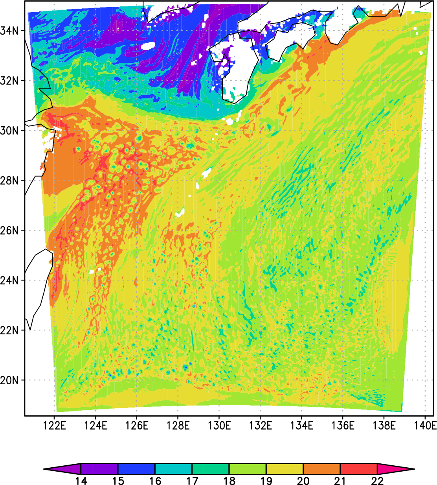
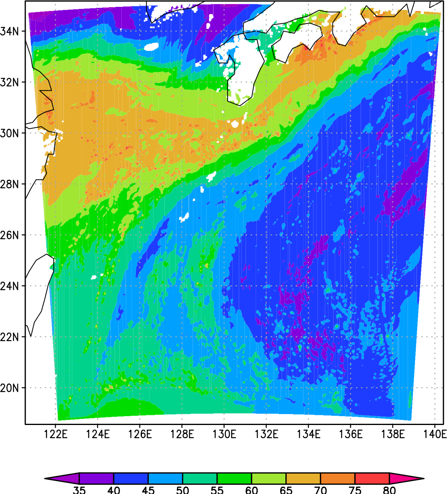

# 09.PW_WRF_ARWPOST

[[_TOC_]]

WRF/ARWpostのデータ（プレーンバイナリ形式）から可降水量を計算する。


## データの所在

```
$ ls /work00/DATA/WRF.RW3A/HD01/RW3A.ARWpost.DAT/basic_p/ARWpost_RW3A.00.03.05.05.0000.01/
```


## CTLファイル

```
$ ls /work00/DATA/WRF.RW3A/HD01/RW3A.ARWpost.DAT/basic_p/ARWpost_RW3A.00.03.05.05.0000.01/*ctl

/work00/DATA/WRF.RW3A/HD01/RW3A.ARWpost.DAT/basic_p/ARWpost_RW3A.00.03.05.05.0000.01/RW3A.00.03.05.05.0000.01.d01.basic_p.01HR.ctl
```


CTLファイルの内容

```
$ cat /work00/DATA/WRF.RW3A/HD01/RW3A.ARWpost.DAT/basic_p/ARWpost_RW3A.0
0.03.05.05.0000.01/*ctl
dset ^RW3A.00.03.05.05.0000.01.d01.basic_p.01HR_%y4-%m2-%d2_%h2:%n2.dat
options  byteswapped template
undef 1.e30
title  OUTPUT FROM WRF V4.1.5 MODEL
pdef  599 599 lcc  27.000  130.500  300.000  300.000  32.00000  27.00000  130.50000   3000.000   3000.000
xdef 1469 linear  120.56867   0.01351351
ydef 1231 linear   18.56023   0.01351351
zdef   30 levels  
1000.00000
 990.00000
 980.00000
 970.00000
 960.00000
 950.00000
 940.00000
 930.00000
 920.00000
 910.00000
 900.00000
 880.00000
 860.00000
 840.00000
 820.00000
 800.00000
 750.00000
 700.00000
 650.00000
 600.00000
 550.00000
 500.00000
 450.00000
 400.00000
 350.00000
 300.00000
 250.00000
 200.00000
 150.00000
 100.00000
tdef   73 linear 00Z12AUG2021      60MN      
VARS   30
U             30  0  x-wind component (m s-1)
V             30  0  y-wind component (m s-1)
W             30  0  z-wind component (m s-1)
Q2             1  0  QV at 2 M (kg kg-1)
T2             1  0  TEMP at 2 M (K)
U10            1  0  U at 10 M (m s-1)
V10            1  0  V at 10 M (m s-1)
QVAPOR        30  0  Water vapor mixing ratio (kg kg-1)
QCLOUD        30  0  Cloud water mixing ratio (kg kg-1)
QRAIN         30  0  Rain water mixing ratio (kg kg-1)
HGT            1  0  Terrain Height (m)
RAINC          1  0  ACCUMULATED TOTAL CUMULUS PRECIPITATION (mm)
RAINRC         1  0  RAIN RATE CONV (mm per output interval)
RAINNC         1  0  ACCUMULATED TOTAL GRID SCALE PRECIPITATION (mm)
RAINRNC        1  0  RAIN RATE NON-CONV (mm per output interval)
XLAND          1  0  LAND MASK (1 FOR LAND, 2 FOR WATER) (-)
PBLH           1  0  PBL HEIGHT (m)
HFX            1  0  UPWARD HEAT FLUX AT THE SURFACE (W m-2)
QFX            1  0  UPWARD MOISTURE FLUX AT THE SURFACE (kg m-2 s-1)
LH             1  0  LATENT HEAT FLUX AT THE SURFACE (W m-2)
SST            1  0  SEA SURFACE TEMPERATURE (K)
ept           30  0  Equivalent Potential Temperature (K)
sept          30  0  Saturated Equivalent Potential Temperature (K)
pressure      30  0  Model pressure (hPa)
height        30  0  Model height (km)
tk            30  0  Temperature (K)
theta         30  0  Potential Temperature (K)
rh            30  0  Relative Humidity (%)
slp            1  0  Sea Levelp Pressure (hPa)
dbz           30  0  Reflectivity (-)
ENDVARS
```


## CTLファイルから読み取ったレコード番号

左端の数値が, 3列目の鉛直層数を積算することで求めた，各変数が収録されているレコード番号

```
01-30 U        30  0  x-wind component (m s-1)
31-60          30  0  y-wind component (m s-1)
61-90 W        30  0  z-wind component (m s-1)
91 Q2           1  0  QV at 2 M (kg kg-1)
92 T2           1  0  TEMP at 2 M (K)
93 U10          1  0  U at 10 M (m s-1)
94 V10          1  0  V at 10 M (m s-1)
95-124 QVAPOR  30  0  Water vapor mixing ratio (kg kg-1)
125-154 QCLOUD 30  0  Cloud water mixing ratio (kg kg-1)
.....
```


## 最初の時刻だけ読む

### 必要な変数（QVAPOR）だけ読む（最初の時刻）

```
$ vi READ_WRF_2.1.F90 
```

```FORTRAN
PROGRAM READ_WRF
CHARACTER(LEN=1000):: INDIR, INFLE
CHARACTER(LEN=2000):: IN
REAL,DIMENSION(:,:,:),ALLOCATABLE::QV

INDIR="/work00/DATA/WRF.RW3A/HD01/RW3A.ARWpost.DAT/basic_p/ARWpost_RW3A.00.03.05.05.0000.01/"
INFLE="RW3A.00.03.05.05.0000.01.d01.basic_p.01HR_2021-08-15_00:00.dat"


IM=599; JM=599; KM=30
ALLOCATE(QV(IM,JM,KM))

IN=TRIM(INDIR)//TRIM(INFLE)

PRINT *,"INPUT: ",TRIM(IN)

OPEN(11,FILE=IN,ACTION="READ",form="unformatted",access="direct",recl=IM*JM*4)

IREC=94
DO K=1,KM
IREC=IREC+1
READ(11,rec=IREC)QV(:,:,K)
END DO !K

WRITE(6,*)
WRITE(6,*)'IM/2=',IM/2, 'JM/2=',JM/2
WRITE(6,*)'QV(IM/2,JM/2,1)=',QV(IM/2,JM/2,1)

CLOSE(11)
END PROGRAM READ_WRF
```

```bash
$ ift
```

```bash
$ ifort -convert big_endian -traceback -CB -assume byterecl READ_WRF_02.F90 -o READ_WRF_02.EXE
```

```bash
$ READ_WRF_2.1.EXE 
 INPUT: 
 /work00/DATA/WRF.RW3A/HD01/RW3A.ARWpost.DAT/basic_p/ARWpost_RW3A.00.03.05.05.00
 00.01/RW3A.00.03.05.05.0000.01.d01.basic_p.01HR_2021-08-15_00:00.dat
 
 IM/2=         299 JM/2=         299
 QV(IM/2,JM/2,1)=  1.8941429E-02
```


## テスト：正しくデータが読み込まれているか確認

READ_WREITE_WRF.F90

```FORTRAN
PROGRAM READ_WRITE_WRF
CHARACTER(LEN=1000):: INDIR, INFLE, ODIR, OFLE
CHARACTER(LEN=2000):: IN, OUT
REAL,DIMENSION(:,:,:),ALLOCATABLE::QV

INDIR="/work00/DATA/WRF.RW3A/HD01/RW3A.ARWpost.DAT/basic_p/ARWpost_RW3A.00.03.05.05.0000.01/"
INFLE="RW3A.00.03.05.05.0000.01.d01.basic_p.01HR_2021-08-15_00:00.dat"

ODIR="./"
OFLE="QV_2021-08-15_00:00.dat"

IM=599; JM=599; KM=30
ALLOCATE(QV(IM,JM,KM))

IN=TRIM(INDIR)//TRIM(INFLE)
PRINT *,"INPUT: ",TRIM(IN)
OPEN(11,FILE=IN,ACTION="READ",form="unformatted",access="direct",recl=IM*JM*4)
IREC=94
DO K=1,KM
IREC=IREC+1
READ(11,rec=IREC)QV(:,:,K)
END DO !K
CLOSE(11)

OUT=TRIM(ODIR)//TRIM(OFLE)
PRINT *,"OUTPUT: ",TRIM(OUT)
OPEN(21,FILE=OUT,form="unformatted",access="direct",recl=IM*JM*4)
IREC=0
DO K=1,KM
IREC=IREC+1
WRITE(21,rec=IREC)QV(:,:,K)
END DO !K
CLOSE(21)

END PROGRAM READ_WRITE_WRF
```

```fortran
$ ifort -convert big_endian -traceback -CB -assume byterecl READ_WRITE_WRF.F90 -o READ_WRI
TE_WRF.EXE
```

```bash
$ READ_WRITE_WRF.EXE 
 INPUT: 
 /work00/DATA/WRF.RW3A/HD01/RW3A.ARWpost.DAT/basic_p/ARWpost_RW3A.00.03.05.05.00
 00.01/RW3A.00.03.05.05.0000.01.d01.basic_p.01HR_2021-08-15_00:00.dat
 OUTPUT: ./QV_2021-08-15_00:00.dat
```


### GrADSで作図して確認

#### CTLファイル：QV.CTL

```fortran
dset ^QV_%y4-%m2-%d2_%h2:%n2.dat
options  byteswapped template
undef 1.e30
title  OUTPUT FROM WRF V4.1.5 MODEL
pdef  599 599 lcc  27.000  130.500  300.000  300.000  32.00000  27.00000  130.50000   3000.000   3000.000
xdef 1469 linear  120.56867   0.01351351
ydef 1231 linear   18.56023   0.01351351
zdef   30 levels  
1000.00000
 990.00000
 980.00000
 970.00000
 960.00000
 950.00000
 940.00000
 930.00000
 920.00000
 910.00000
 900.00000
 880.00000
 860.00000
 840.00000
 820.00000
 800.00000
 750.00000
 700.00000
 650.00000
 600.00000
 550.00000
 500.00000
 450.00000
 400.00000
 350.00000
 300.00000
 250.00000
 200.00000
 150.00000
 100.00000
tdef   1 linear 00Z15AUG2021      60MN      
VARS  1 
QVAPOR        30  0  Water vapor mixing ratio (kg kg-1)
ENDVARS
```

#### 描画スクリプト：CHECK.QV.GS

```bash
'open QV.CTL'
'set t 1'
'q dims'
date=sublin(result,5)
say date

'cc'
'set gxout shaded'
'd QVAPOR*1000'
'cbarn'

FIG='QV_CHECK.PDF'
'gxprint 'FIG
say 'OUTPUT: 'FIG
```

### GrADSで作図

```bash
$ grads -bpc
```

```
ga-> CHECK.QV.GS 
Notice: Implied interpolation for file QV.CTL
 Interpolation will be performed on any data displayed from this file
T is fixed     Time = 00Z15AUG2021  T = 1
OUTPUT: QV_CHECK.PDF
ga-> quit
```




## 気圧の指定

CTLファイルから読み取った気圧の値をプログラムに書き込む

ここではdata文を用いる

https://www.nag-j.co.jp/fortran/FI_4.html#InitialisingWithDataStmt

TEST_SET_P.F90

```fortran
INTEGER,PARAMETER::KM=30

REAL  P(KM)

DATA P/1000.00000,990.00000,980.00000,970.00000,960.00000,950.00000,&
940.00000,930.00000,920.00000,910.00000,900.00000,880.00000,860.00000,&
840.00000,820.00000,800.00000, 750.00000, 700.00000, 650.00000, &
600.00000, 550.00000,500.00000,450.00000,400.00000,350.00000,300.00000,&
250.00000,200.00000,150.00000,100.00000/
 
DO K=1,KM
PRINT *,K,P(K)
END DO !K

stop
end
```

```bash
$ ifort TEST_SET_P.F90 -o TEST_SET_P.EXE
```

```bash
$ TEST_SET_P.EXE 
           1   1000.000    
           2   990.0000    
           3   980.0000    
           4   970.0000    
           5   960.0000    
           6   950.0000    
           7   940.0000    
           8   930.0000    
           9   920.0000    
          10   910.0000    
          11   900.0000    
          12   880.0000    
          13   860.0000    
          14   840.0000    
          15   820.0000    
          16   800.0000    
          17   750.0000    
          18   700.0000    
          19   650.0000    
          20   600.0000    
          21   550.0000    
          22   500.0000    
          23   450.0000    
          24   400.0000    
          25   350.0000    
          26   300.0000    
          27   250.0000    
          28   200.0000    
          29   150.0000    
          30   100.0000 
```


## 可降水量の計算方法の復習

### 水蒸気混合比を鉛直方向に積分する

https://gitlab.com/infoaofd/lab/-/blob/master/FORTRAN/PROGRAM_2023/03.VINT_PRESSURE/03.VINT_PRESSURE.md

integ_p.f90

```fortran
real,allocatable,dimension(:)::q,p

p0=1000.0; pup=100.0; dp=100.0
km=int((p0-pup)/dp)+1
allocate(q(km), p(km))

do k=1,km
p(k)=pup+float(k-1)*dp !hPa
end do!k

q0=20.0 !g/kg
do k=km,1,-1
q(k)=q0*exp( (p(k) - p0)/100)
end do

do k=1,km
print *,p(k),q(k)
end do !k

do k=1,km
q(k)=q(k)/1000.0 !g/kg->kg/kg
p(k)=p(k)*100.0  !hPa -> Pa
end do

sum=0.0
do k=1,km-1
sum=sum+(q(k)+q(k+1))*(p(k+1)-p(k))/2.0
end do

sum=sum/9.8

print *,'sum=',sum
end
```

```bash
$ ifort integ_p.f90 -o integ_p.exe
```

```bash
$ integ_p.exe 
   100.0000      2.4681960E-03
   200.0000      6.7092529E-03
   300.0000      1.8237639E-02
   400.0000      4.9575046E-02
   500.0000      0.1347589    
   600.0000      0.3663127    
   700.0000      0.9957414    
   800.0000       2.706706    
   900.0000       7.357590    
   1000.000       20.00000    
 sum=   22.07843   
```


## WRFデータを用いた可降水量の計算

### FORTRANプログラム

PW_WRF.F90

```FORTRAN
PROGRAM PW_WRF
CHARACTER(LEN=1000):: INDIR, INFLE, ODIR, OFLE
CHARACTER(LEN=2000):: IN, OUT
INTEGER,PARAMETER::KM=30
REAL P(KM)
REAL,ALLOCATABLE::QV(:,:,:),PW(:,:)
REAL,PARAMETER::UNDEF=1.E30

DATA P/1000.00000,990.00000,980.00000,970.00000,960.00000,950.00000,&
940.00000,930.00000,920.00000,910.00000,900.00000,880.00000,860.00000,&
840.00000,820.00000,800.00000, 750.00000, 700.00000, 650.00000, &
600.00000, 550.00000,500.00000,450.00000,400.00000,350.00000,300.00000,&
250.00000,200.00000,150.00000,100.00000/

INDIR="/work00/DATA/WRF.RW3A/HD01/RW3A.ARWpost.DAT/basic_p/ARWpost_RW3A.00.03.05.05.0000.01/"
INFLE="RW3A.00.03.05.05.0000.01.d01.basic_p.01HR_2021-08-15_00:00.dat"

ODIR="./"
OFLE="PW_2021-08-15_00:00.dat"

IM=599; JM=599
ALLOCATE(QV(IM,JM,KM), PW(IM,JM))


IN=TRIM(INDIR)//TRIM(INFLE)
PRINT *,"INPUT: ",TRIM(IN)
OPEN(11,FILE=IN,ACTION="READ",form="unformatted",access="direct",&
recl=IM*JM*4)
IREC=94
DO K=1,KM
IREC=IREC+1
READ(11,rec=IREC)QV(:,:,K)
END DO !K
CLOSE(11)


do k=1,km
p(k)=p(k)*100.0  !hPa -> Pa
end do

PW=0.0
do k=1,km-1
PW(:,:)=PW(:,:)+(QV(:,:,k)+QV(:,:,k+1))*(p(k)-p(k+1))/2.0
end do

WHERE(PW<UNDEF)
PW=PW/9.8
ELSEWHERE
PW=UNDEF
ENDWHERE

PRINT *,PW(IM/2,JM/2)

OUT=TRIM(ODIR)//TRIM(OFLE)
PRINT *,"OUTPUT: ",TRIM(OUT)
OPEN(21,FILE=OUT,form="unformatted",access="direct",recl=IM*JM*4)
IREC=1
WRITE(21,rec=IREC)PW(:,:)
CLOSE(21)

END PROGRAM PW_WRF
```

#### WHERE文について

```fortran
integer a(10),b(10)
data a /1,2,3,4,5,6,7,8,9,10/

where (a > 5)
b = a * 2
! aの要素のうち5より大きいものについては対応するbの要素をaの2倍の値とする
else where
b = a
! 該当しない要素については対応するbの要素はaの要素の値と同じとする
end where
```

詳細：https://life-is-command.com/fortran90-where/


```bash
$ ifort -convert big_endian -traceback -CB -assume byterecl PW_WRF.F90 -o PW_WRF.EXE
```

```bash
$ PW_WRF.EXE 
 INPUT: 
 /work00/DATA/WRF.RW3A/HD01/RW3A.ARWpost.DAT/basic_p/ARWpost_RW3A.00.03.05.05.00
 00.01/RW3A.00.03.05.05.0000.01.d01.basic_p.01HR_2021-08-15_00:00.dat
   47.97544    
 OUTPUT: ./PW_2021-08-15_00:00.dat
```


### GrADSで作図して確認

#### CTLファイル：PW.CTL

```bash
dset ^PW_%y4-%m2-%d2_%h2:%n2.dat
options  byteswapped template
undef 1.e30
title  OUTPUT FROM WRF V4.1.5 MODEL
pdef  599 599 lcc  27.000  130.500  300.000  300.000  32.00000  27.00000  130.50000   3000.000   3000.000
xdef 1469 linear  120.56867   0.01351351
ydef 1231 linear   18.56023   0.01351351
zdef   1 levels  10000.0
tdef   1 linear 00Z15AUG2021      60MN      
VARS  1 
PW        1  0  PRECIPITABLE WATER (mm)
ENDVARS
```


#### 描画スクリプト：CHECK.PW.GS

```bash
'open PW.CTL'
'set t 1'
'q dims'
date=sublin(result,5)
say date

'cc'
'set gxout shaded'
'd PW'
'cbarn'

FIG='PW_CHECK.PDF'
'gxprint 'FIG
say 'OUTPUT: 'FIG
```


#### GrADSで作図

```
$ grads -bcp
```

```
ga-> CHECK.PW.GS 
Notice: Implied interpolation for file PW.CTL
 Interpolation will be performed on any data displayed from this file
T is fixed     Time = 00Z15AUG2021  T = 1
OUTPUT: PW_CHECK.PDF
ga-> quit
```




## 演習

1. 上記のプログラムをすべて自分で打ち込んでみて、実行結果を確認する。

2. 不明の個所はPRINT文（FORTRAN）, SAY文（Ｇrads）を使って変数の値を書き出してみる。

3. 不明の点をノートにまとめておき、次回質問する。

   

## 参考：GrADSのgexファイルについて

上で使用したGrADSスクリプトCHECK.PW.GS（下記に再掲）は、引用符 (`'`)を使用しない形式で書くこともできる (CHECK.PW.gex)

**CHECK.PW.GS**

```
'open PW.CTL'
'set t 1'
'q dims'
date=sublin(result,5)
say date

'cc'
'set gxout shaded'
'd PW'
'cbarn'

FIG='PW_CHECK.PDF'
'gxprint 'FIG
say 'OUTPUT: 'FIG
```

**CHECK.PW.gex** (引用符を使わない)

```
open PW.CTL
set t 1
q dims

cc
set gxout shaded
d PW
cbarn

gxprint PW_CHECK_gex.PDF
```

実行

```
$ grads -bcp
ga-> exec CHECK.PW.gex 
.....

gxprint PW_CHECK_gex.PDF 
Created PDF file PW_CHECK_gex.PDF
ga-> quit
```

ただし,　**引用符を使わない場合** (ここではCHECK.PW.gex)，while, if, sayなど**スクリプト用の命令文がすべて使えなくなる**ので、主にチェック用の作図のときに使う。


## 上達のためのポイント

**エラーが出た時の対応の仕方でプログラミングの上達の速度が大幅に変わる**。

ポイントは次の3つである。

1. エラーメッセージをよく読む
2. エラーメッセージを検索し，ヒットしたサイトをよく読む
3. 変数に関する情報を書き出して確認する

エラーメッセージは，プログラムが不正終了した直接の原因とその考えられる理由が書いてあるので，よく読むことが必要不可欠である。

記述が簡潔なため，内容が十分に理解できないことも多いが，その場合**エラーメッセージをブラウザで検索**してヒットした記事をいくつか読んでみる。

エラーの原因だけでなく，**考えうる解決策**が記載されていることも良くある。

エラーを引き起こしていると思われる箇所の**変数の情報**や**変数の値そのものを書き出して**，**期待した通りにプログラムが動作しているか確認する**ことも重要である。

エラーの場所が特定できれば，エラーの修正の大部分は完了したと考えてもよいほどである。

エラーメッセージや検索してヒットするウェブサイトは英語で記載されていることも多いが，**重要な情報は英語で記載されていることが多い**ので，よく読むようにする。

重要そうに思われるが，一回で理解できないものは，PDFなどに書き出して後で繰り返し読んでみる。どうしても**内容が頭に入らないものは印刷してから読む**。


## 参考

### CTLファイルの概要

別途資料 (BINARY_DATA.pptx)も参照のこと

https://gitlab.com/infoaofd/lab/-/blob/master/FORTRAN/PROGRAM_2022/BINARY_DATA_GRADS.pdf

- `^`: カレント・ディレクトリ，自分が現在いるディレクトリ）を意味する記号 この場合したがって，ctlファイルとデータファイルが同じ場所に保存されていることを仮定している (^を実際にデータがあるディレクトリに書き換えることで変更可能)

- `template`: ファイル名の指定にひな型 (template)を使う

- `byteswapped`: バイナリデータはビッグエンディアンである。

  https://gitlab.com/infoaofd/lab/-/blob/master/FORTRAN/PROGRAM_2022/BINARY_DATA_GRADS.pdf

- `undef 1.e30`: 値が存在しない場所には，ダミーの値として10の30乗が入っている。

- `pdef`: (GrADSでのみ使用される)不等間隔の格子データを，緯度・経度上のデータに変換するための情報

- `xdef`: 東西方向のデータ並びに関する情報※

- `ydef`: 南北方向のデータ並びに関する情報※

- `tdef`: 時間方向のデータ並びに関する情報

- `zdef`: 鉛直方向のデータ数

- `VARS`: 保存されている変数の数

※ここでのxdef, ydefに記載されているデータ数はGrADSで描画するときのみ使用される値で，**実際にはpdefに記載されている数のデータがファイルに保存されている**。

#### templateの書式

- %y4 : 年 (4桁の整数)
- %m2: 月 (2桁の整数)
- ％d2: 日 (2桁の整数)
- %h2: 時 (2桁の整数)
- %n2: 分 (2桁の整数)

例えば%y4-%m2-%d2_%h2:%n2だと，データファイルの名前の中で

2021-08-15_00:00

のような形式で，日時がしていされていることを意味する。

```plaintext
RW3A.00.03.05.05.0000.01.d01.basic_p.01HR_%y4-%m2-%d2_%h2:%n2.dat
```


であれば，RW3A.00.03.05.05.0000.01.d01.basic_p.01HR2021-08-15_00:00.datのようなデータファイルが存在しているはずである。

今回の例では，下記を実行して確かめることができる。

```plaintext
$ ls /work03/2021/sakagami/WRF.RW3A.00.03.05.05/ARWpost_RW3A
.00.03.05.05.0000.01
```


#### pdefの書式

```plaintext
pdef XSIZE YSIZE LCCR(LCC) YLAT XLON X Y SLAT1 SLAT2 SLON DIS_X DIS_Y
```


`XSIZE`, `YSIZE`: X, Y方向のデータ数

(詳しくは本資料末尾参照)

#### xdef (ydef)の書式

```plaintext
xdef データ数 データの並べ方 西の端のデータの経度  東西方向の格子間隔(単位は度)
```


- linear＝データの並びは等間隔である

#### zdefの書式

```plaintext
zdef データ数 データの並べ方 下端のデータの座標  上端のデータの座標 (この場合の単位は気圧)
```


- levels = データの間隔は不等間隔なので，このすぐ下に座標一覧を示す

#### tdefの書式

```plaintext
tdef データ数  データの並べ方 最初のデータの時刻 時間間隔
```


#### 変数一覧の書式

`U`: 変数の名前

```plaintext
U             30  0  x-wind component (m s-1)
```

- 鉛直方向に30個データ有
- 変数の名前はx-wind componentで，単位は(m s-1)である。

### 要点

- ビッグエンディアンで記録されている
- 東西方向に599個，南北方向に599個のデータがある※
- 鉛直方向には30個のデータがある。
- 欠損値は1e30（10の30乗）としている

※**pdefに記載されいている数値が実際のデータ数**で，xdef, ydefの値はGrADSで描画するときのみ使用される。


