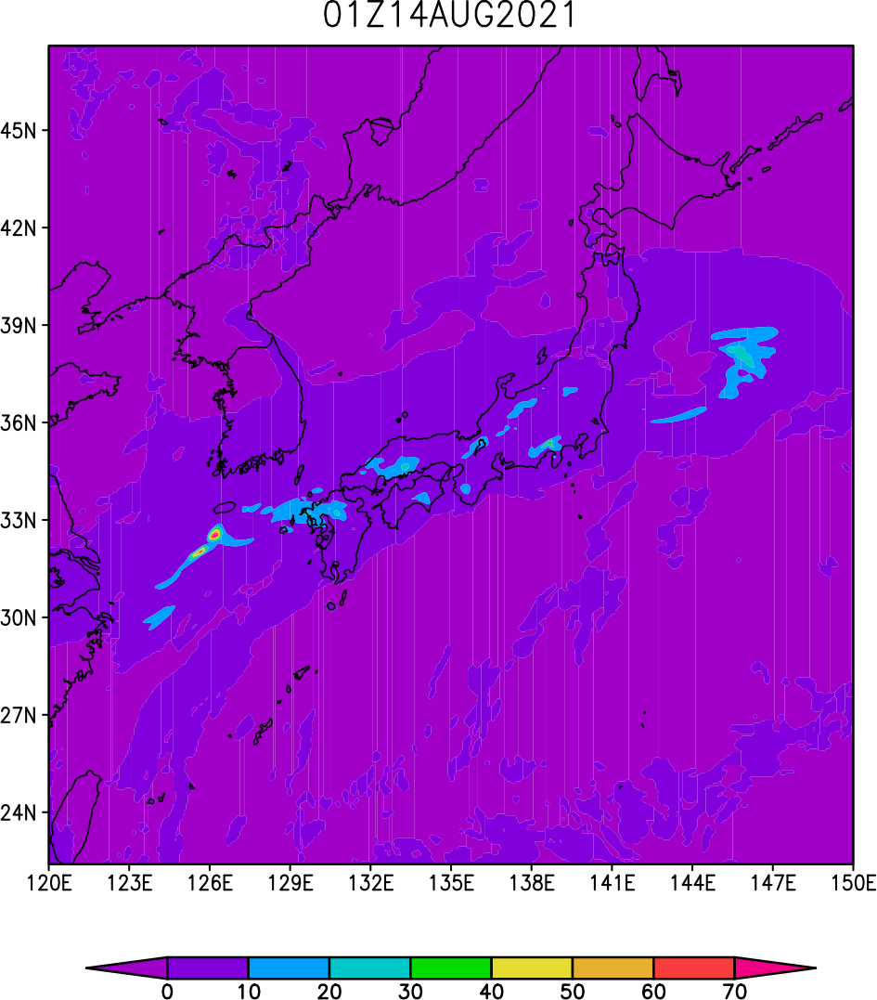
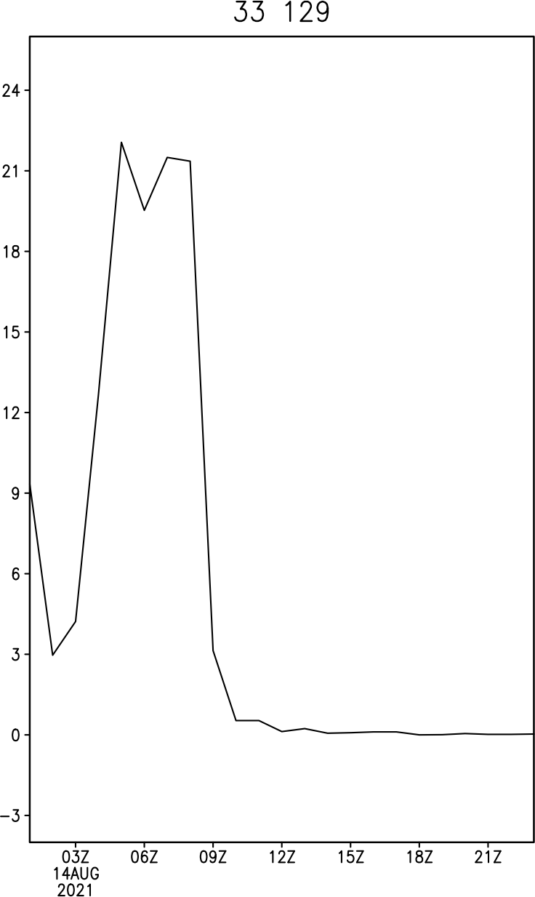
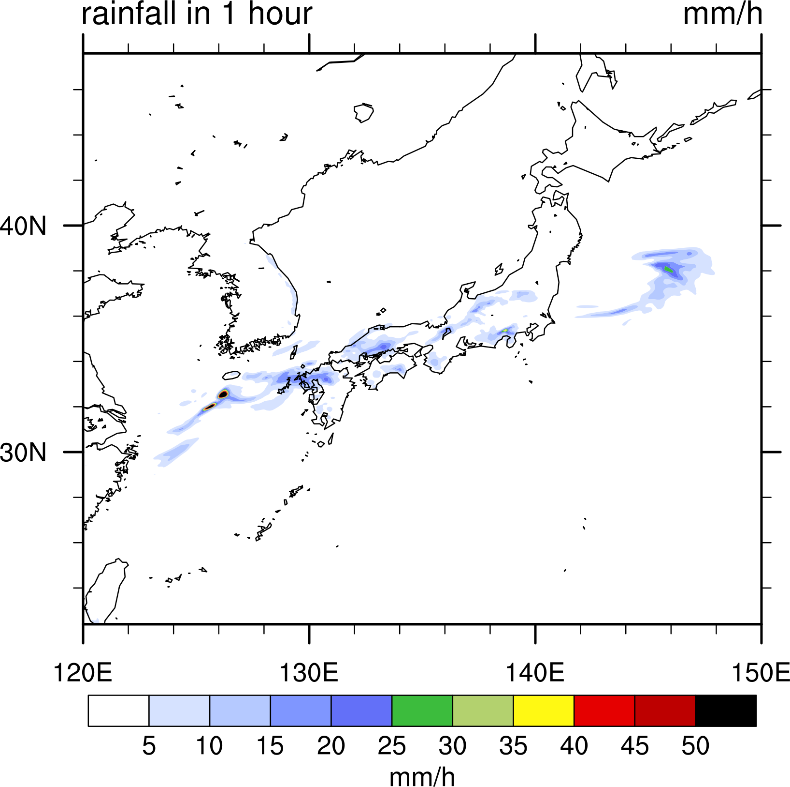
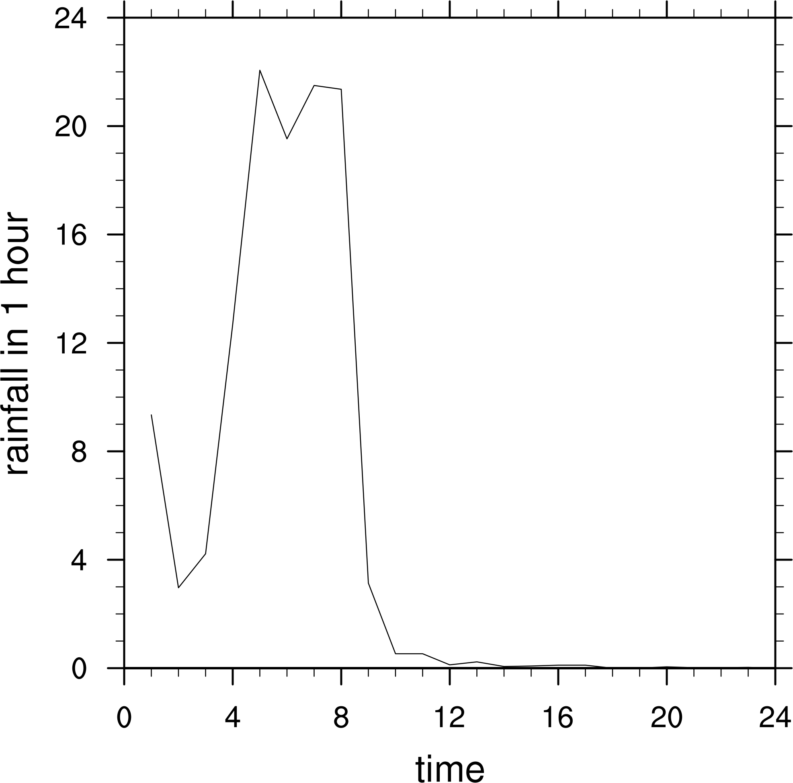

# NetCDFに慣れる

NetCDFというファイル形式で作成された，気象庁メソスケールモデル（MSM）の時間雨量のデータを使用して

- データの内容の確認
- データの読み込み
- 作図

を行い，NetCDFの取り扱いに慣れる

[[_TOC_]]

## NetCDFとは

### 概要

- 気象・海洋のデータを保存するためのデータ形式

- 静止画でpngや，動画でmp4などファイルにはいろいろな形式があるが，それと同様に気象・海洋のデータを保存するためのデータ形式にもいくつか種類がある。代表的なものとして，netCDFとgrib (ぐりぶ)があるが，ここでは, netCDFについて学ぶ。


### 特徴

- データ自体にデータに関する情報が記述されている（<u>どのようなデータか，分かるようになっている</u>）

- <u>データのサイズを小さくしたり</u>，<u>高速でファイルを読み書きできる</u>ような工夫がなされている

- netCDFライブラリと呼ばれる<u>ライブラリを使用して読み書きを行う</u>


## ダウンロード

### ダウンロードスクリプトの実行

```bash
$ GET.MSM.R1H.sh 20210814 20210814
```

```bash
$ ls -lh MSM-S/r1h/2021/0814.nc 
-rw-r--r--. 1 am 23M  9月  2  2021 MSM-S/r1h/2021/0814.nc
```


### スクリプト

#### GET.MSM.R1H.sh

```bash
#!/bin/bash

usage(){
  echo
  echo "Usage $0 [-t]"
  echo "-t : test mode (do NOT download files)"
  echo
}

OPT="-nv" # -nc"

export LANG=C

flagt="false"
while getopts t OPT; do
  case $OPT in
    "t" ) flagt="true" ;  ;;
     * ) usage; exit 1
  esac
done

shift $(expr $OPTIND - 1)

if [ $# -lt 2 ];then
  echo "Error : Wrong number of arguments."
  echo "Usage: $0 start end directory"
  echo "start : start day (YYYYMMDD)"
  echo "end   : end day   (YYYYMMDD)"
  echo "directry"
  exit 1
fi

start=$1; end=$2

if [ $# -le 2 ]; then
  homedir=$(pwd)
else
  homedir=$3
fi

if [ ! -d ${homedir} ]; then
  mkdir -p $homedir
fi

URL=http://database.rish.kyoto-u.ac.jp/arch/jmadata/data/gpv/netcdf

starts=$(date -d "${start}" '+%s')
ends=$(date -d "${end}" '+%s')

times=$(expr $ends - $starts)

days=$(expr $times / 86400 )

sdate=${start:0:4}/${start:4:2}/${start:6:2}
#echo $sdate

yesterday=$(date -d"$sdate"-1days '+%Y/%m/%d')
#echo $yesterday

n=0
while [ $n -le $days ]; do

  today=$(date -d"$yesterday"+1days '+%Y/%m/%d')

  yyyy=${today:0:4}; mm=${today:5:2}; dd=${today:8:2}

  echo
  rdir=MSM-S/r1h
  lrdir=${rdir}/${yyyy}

  mkdir -vp ${lrdir}
  if [ $? -ne 0 ]; then
    echo ERROR in $0 : Cannot create directory, ${lrdir}.
    exit 1
  fi

  echo
  echo Going down to directory, ${lrdir}.
  cd ${lrdir}
  if [ $? -ne 0 ]; then
    echo Error in $0 : Cannot go to directory, ${lrdir}
    exit 1
  fi

  cwd=$(pwd)
  echo "Current directory, ${cwd}."
  rfile=${URL}/${lrdir}/${mm}${dd}.nc
  echo
  if [ $flagt = "true" ]; then
    echo "Testing: target file = ${rfile}"
  else
    rm -vf ./${mm}${dd}.nc* 
    wget $OPT ${rfile}
  fi

  echo
  echo Going up to parent directory.
  cd $homedir
  pwd

  n=$(expr $n + 1)
  yesterday=$today

  echo
  echo Going up to parent directory, ${homedir}.
  cd ${homedir}
  pwd
  echo

done

exit 0
```


## データ内容の確認

いくつかのソフトウェアを使って，データ内容を確認してみる。

### ncdump

netCDFライブラリに付属のncdumpコマンドを使用してデータ内容を確認する

##### ncdumpの所在

```bash
$ which ncdump
~/anaconda3/bin/ncdump
```

#### ncdumpの実行例

```bash
$ ncdump -h MSM-S/r1h/2021/0814.nc
```

```bash
netcdf \0814 {
dimensions:
        lon = 481 ;
        lat = 505 ;
        time = 24 ;
variables:
        float lon(lon) ;
                lon:long_name = "longitude" ;
                lon:units = "degrees_east" ;
                lon:standard_name = "longitude" ;
        float lat(lat) ;
                lat:long_name = "latitude" ;
                lat:units = "degrees_north" ;
                lat:standard_name = "latitude" ;
        float time(time) ;
                time:long_name = "time" ;
                time:standard_name = "time" ;
                time:units = "hours since 2021-08-14 00:00:00+00:00" ;
        short r1h(time, lat, lon) ;
                r1h:scale_factor = 0.006116208155 ;
                r1h:add_offset = 200. ;
                r1h:long_name = "rainfall in 1 hour" ;
                r1h:units = "mm/h" ;
                r1h:standard_name = "rainfall_rate" ;
        short dswrf(time, lat, lon) ;
                dswrf:scale_factor = 0.0205 ;
                dswrf:add_offset = 665. ;
                dswrf:long_name = "Downward Short-Wave Radiation Flux" ;
                dswrf:units = "W/m^2" ;
                dswrf:standard_name = "surface_net_downward_shortwave_flux" ;

// global attributes:
                :Conventions = "CF-1.0" ;
                :history = "created by create_1daync_msm_r1h_dswrf.rb  2020-09-02" ;
}
```

#### データ内容

```
dimensions:
        lon = 481 ;
        lat = 505 ;
        time = 24 ;
```

データのもつ次元に関する記述

**データは配列として保存**されている。

経度方向のデータ数は481, 緯度方向のデータ数は505, 時間方向のデータ数は24個。


```bash
variables:
```

変数の内容に関する記述

```bash
        float lon(lon) ;
                lon:long_name = "longitude" ;
                lon:units = "degrees_east" ;
                lon:standard_name = "longitude" ;
```

`float`: 4バイト実数型の配列

`lon(lon)`: 配列名はlonで配列の要素数はlon個 (481個)

`lon:long_name = "longitude" ;`以降は**アトリビューション**と呼ばれ，**変数に関する付加情報**を記述する。


```bash
        float time(time) ;
                time:long_name = "time" ;
                time:standard_name = "time" ;
                time:units = "hours since 2021-08-14 00:00:00+00:00" ;
```

timeは`float`型なので，4バイト実数型の配列であり，配列要素数は`time`個。

```bash
time:units = "hours since 2021-08-14 00:00:00+00:00" ;
```

timeの単位 (`units`)は時間 (`hours`)で，timeの基点となる時刻は`2020-08-14 00:00:00`である。世界標準時を使用している (`+00:00`)。

```bash
    short r1h(time, lat, lon) ;
            r1h:scale_factor = 0.006116208155 ;
            r1h:add_offset = 200. ;
            r1h:long_name = "rainfall in 1 hour" ;
            r1h:units = "mm/h" ;
            r1h:standard_name = "rainfall_rate" ;
```

r1hは2バイト整数 (`short`)で，(time, lat, lon) の3つの次元をもつ配列である（3次元配列）。

```bash
            r1h:scale_factor = 0.006116208155 ;
            r1h:add_offset = 200. ;
```

ファイルに保存されている2バイト整数の数値 (ここではr1hとする)から，実際の値 (ここではr1h_actualとする)に換算するためには，`scale_factor`と`add_offset`を使って，次のように計算する

```bash
r1h_actual = r1h*scale_factor+add_offset
```


#### ncdumpのオプション

`ncdump -h`でデータの概要のみ表示する (hはヘッダーの意味)   

`ncdump -c`で，データの座標（緯度，経度，高度，時間など）を表示  

`ncdump`で，データの情報をすべて表示。表示が多すぎるときは, `CTL`+`C`で表示を停止させる


### NCL

アメリカ大気研究センター (NCAR)で作成しているソフト, NCAR Command language (NCL)を使用してファイルの情報を書き出してみる

nclは起動時にnetCDFライブラリを自動的に読み込むので，ユーザーがライブラリをリンクする必要はない。

#### スクリプト

##### CHK.R1H.ncl

```bash
INDIR="/work01/DATA/MSM/MSM-S/r1h/2021/"
INFLE="0814.nc"
IN=INDIR+INFLE

a=addfile(IN,"r")
print(a)
```

#### 実行例

```bash
$ ncl CHK.R1H.ncl 
```

```bash
Variable: a
Type: file
filename:       0814
path:   /work01/DATA/MSM/MSM-S/r1h/2021/0814.nc
   file global attributes:
      Conventions : CF-1.0
      history : created by create_1daync_msm_r1h_dswrf.rb  2021-08-14
   dimensions:
      lon = 481
      lat = 505
      time = 24
   variables:
      float lon ( lon )
         long_name :    longitude
         units :        degrees_east
         standard_name :        longitude

      float lat ( lat )
         long_name :    latitude
         units :        degrees_north
         standard_name :        latitude

      float time ( time )
         long_name :    time
         standard_name :        time
         units :        hours since 2020-08-14 00:00:00+00:00

      short r1h ( time, lat, lon )
         scale_factor : 0.006116208155
         add_offset :    200
         long_name :    rainfall in 1 hour
         units :        mm/h
         standard_name :        rainfall_rate

      short dswrf ( time, lat, lon )
         scale_factor : 0.0205
         add_offset :    665
         long_name :    Downward Short-Wave Radiation Flux
         units :        W/m^2
         standard_name :        surface_net_downward_shortwave_flux
```


### GrADS

GrADSは起動時にnetCDFライブラリを読み込むので，ユーザーがライブラリをリンクする必要はない。

以下の起動時のメッセージを参照:

Config: v2.2.1 little-endian readline grib2 **netcdf** hdf4-sds hdf5 opendap-grids geotiff shapefile  

GrADSが使用しているnetCDFライブラリの所在は以下の通り:

```
$ ls -lh /usr/local/grads-2.2.1/lib/libnetcdf.a /usr/local/grads-2.2.1/lib/libnetcdf.so
```

```
-rw-r--r--. 1 am 5.5M  4月 25  2018 /usr/local/grads-2.2.1/lib/libnetcdf.a
lrwxrwxrwx. 1 am   18  4月 25  2018 /usr/local/grads-2.2.1/lib/libnetcdf.so -> libnetcdf.so.7.2.0*
```


#### スクリプト

##### CHK.R1H.GS

```bash
INDIR='/work01/DATA/MSM/MSM-S/r1h/2021/'
INFLE='0814.nc'
IN=INDIR'/'INFLE

'sdfopen 'IN
'q ctlinfo'; say result

'quit'
```

#### 実行例

```bash
$ grads -bcp CHK.R1H.GS
```

```bash
dset /work01/DATA/MSM/MSM-S/r1h/2021/0814.nc
title 
undef 9.96921e+36
dtype netcdf
xdef 481 linear 120 0.0625
ydef 505 levels 22.4 22.45 22.5 22.55 22.6 22.65 22.7 22.75
 22.8 22.85 22.9 22.95 23 23.05 23.1 23.15 23.2 23.25
 23.3 23.35 23.4 23.45 23.5 23.55 23.6 23.65 23.7 23.75
 23.8 23.85 23.9 23.95 24 24.05 24.1 24.15 24.2 24.25
 24.3 24.35 24.4 24.45 24.5 24.55 24.6 24.65 24.7 24.75
 24.8 24.85 24.9 24.95 25 25.05 25.1 25.15 25.2 25.25
 25.3 25.35 25.4 25.45 25.5 25.55 25.6 25.65 25.7 25.75
 25.8 25.85 25.9 25.95 26 26.05 26.1 26.15 26.2 26.25
 26.3 26.35 26.4 26.45 26.5 26.55 26.6 26.65 26.7 26.75
 26.8 26.85 26.9 26.95 27 27.05 27.1 27.15 27.2 27.25
 27.3 27.35 27.4 27.45 27.5 27.55 27.6 27.65 27.7 27.75
 27.8 27.85 27.9 27.95 28 28.05 28.1 28.15 28.2 28.25
 28.3 28.35 28.4 28.45 28.5 28.55 28.6 28.65 28.7 28.75
 28.8 28.85 28.9 28.95 29 29.05 29.1 29.15 29.2 29.25
 29.3 29.35 29.4 29.45 29.5 29.55 29.6 29.65 29.7 29.75
 29.8 29.85 29.9 29.95 30 30.05 30.1 30.15 30.2 30.25
 30.3 30.35 30.4 30.45 30.5 30.55 30.6 30.65 30.7 30.75
 30.8 30.85 30.9 30.95 31 31.05 31.1 31.15 31.2 31.25
 31.3 31.35 31.4 31.45 31.5 31.55 31.6 31.65 31.7 31.75
 31.8 31.85 31.9 31.95 32 32.05 32.1 32.15 32.2 32.25
 32.3 32.35 32.4 32.45 32.5 32.55 32.6 32.65 32.7 32.75
 32.8 32.85 32.9 32.95 33 33.05 33.1 33.15 33.2 33.25
 33.3 33.35 33.4 33.45 33.5 33.55 33.6 33.65 33.7 33.75
 33.8 33.85 33.9 33.95 34 34.05 34.1 34.15 34.2 34.25
 34.3 34.35 34.4 34.45 34.5 34.55 34.6 34.65 34.7 34.75
 34.8 34.85 34.9 34.95 35 35.05 35.1 35.15 35.2 35.25
 35.3 35.35 35.4 35.45 35.5 35.55 35.6 35.65 35.7 35.75
 35.8 35.85 35.9 35.95 36 36.05 36.1 36.15 36.2 36.25
 36.3 36.35 36.4 36.45 36.5 36.55 36.6 36.65 36.7 36.75
 36.8 36.85 36.9 36.95 37 37.05 37.1 37.15 37.2 37.25
 37.3 37.35 37.4 37.45 37.5 37.55 37.6 37.65 37.7 37.75
 37.8 37.85 37.9 37.95 38 38.05 38.1 38.15 38.2 38.25
 38.3 38.35 38.4 38.45 38.5 38.55 38.6 38.65 38.7 38.75
 38.8 38.85 38.9 38.95 39 39.05 39.1 39.15 39.2 39.25
 39.3 39.35 39.4 39.45 39.5 39.55 39.6 39.65 39.7 39.75
 39.8 39.85 39.9 39.95 40 40.05 40.1 40.15 40.2 40.25
 40.3 40.35 40.4 40.45 40.5 40.55 40.6 40.65 40.7 40.75
 40.8 40.85 40.9 40.95 41 41.05 41.1 41.15 41.2 41.25
 41.3 41.35 41.4 41.45 41.5 41.55 41.6 41.65 41.7 41.75
 41.8 41.85 41.9 41.95 42 42.05 42.1 42.15 42.2 42.25
 42.3 42.35 42.4 42.45 42.5 42.55 42.6 42.65 42.7 42.75
 42.8 42.85 42.9 42.95 43 43.05 43.1 43.15 43.2 43.25
 43.3 43.35 43.4 43.45 43.5 43.55 43.6 43.65 43.7 43.75
 43.8 43.85 43.9 43.95 44 44.05 44.1 44.15 44.2 44.25
 44.3 44.35 44.4 44.45 44.5 44.55 44.6 44.65 44.7 44.75
 44.8 44.85 44.9 44.95 45 45.05 45.1 45.15 45.2 45.25
 45.3 45.35 45.4 45.45 45.5 45.55 45.6 45.65 45.7 45.75
 45.8 45.85 45.9 45.95 46 46.05 46.1 46.15 46.2 46.25
 46.3 46.35 46.4 46.45 46.5 46.55 46.6 46.65 46.7 46.75
 46.8 46.85 46.9 46.95 47 47.05 47.1 47.15 47.2 47.25
 47.3 47.35 47.4 47.45 47.5 47.55 47.6
zdef 1 linear 0 1
tdef 24 linear 01Z14AUG2021 60mn
vars 2
r1h=>r1h  0  t,y,x  rainfall in 1 hour
dswrf=>dswrf  0  t,y,x  Downward Short-Wave Radiation Flux
endvars
```

**undef**はundefinedの略で，欠損値（データが無い点に入れるダミーの値）のことを意味する

##### 注: 

sdfopenでは開けないnetCDFが時々あるので注意。

##### 対応策

`ncdump -h`や他のソフトの出力結果からCTLファイルを自作する。CTLファイルの作成に手間がかかる場合，他のソフトで作業を行う。


### cdo

ドイツのmax plank研究所で作成しているclimate data operatorを使用してデータ内容を確認してみる。

```bash
$ cdo showname MSM-S/2021/0814.nc
```

 **psea sp u v temp rh r1h ncld_upper ncld_mid ncld_low ncld dswrf**  
cdo    showname: Processed 12 variables [0.00s 9220KB].   

`showname`で変数名を表示する    


```bash
$ cdo showtime MSM-S/2021/0814.nc 
```

```bash
 00:00:00 01:00:00 02:00:00 03:00:00 04:00:00 05:00:00 06:00:00 07:00:00 08:00:00 09:00:00 10:00:00 11:00:00 12:00:00 13:00:00 14:00:00 15:00:00 16:00:00 17:00:00 18:00:00 19:00:00 20:00:00 21:00:00 22:00:00 23:00:00
cdo    showtime: Processed 12 variables over 24 timesteps [0.00s 9252KB].
```

`showtime`で時刻を表示する

```bash
$ cdo sinfo MSM-S/2021/0814.nc
```

```bash
   File format : NetCDF
    -1 : Institut Source   T Steptype Levels Num    Points Num Dtype : Parameter ID
     1 : unknown  unknown  v instant       1   1    242905   1  I16  : -1            
     2 : unknown  unknown  v instant       1   1    242905   1  I16  : -2            
     3 : unknown  unknown  v instant       1   1    242905   1  I16  : -3            
     4 : unknown  unknown  v instant       1   1    242905   1  I16  : -4            
     5 : unknown  unknown  v instant       1   1    242905   1  I16  : -5            
     6 : unknown  unknown  v instant       1   1    242905   1  I16  : -6            
     7 : unknown  unknown  v instant       1   1    242905   1  I16  : -7            
     8 : unknown  unknown  v instant       1   1    242905   1  I16  : -8            
     9 : unknown  unknown  v instant       1   1    242905   1  I16  : -9            
    10 : unknown  unknown  v instant       1   1    242905   1  I16  : -10           
    11 : unknown  unknown  v instant       1   1    242905   1  I16  : -11           
    12 : unknown  unknown  v instant       1   1    242905   1  I16  : -12           
   Grid coordinates :
     1 : lonlat                   : points=242905 (481x505)
                              lon : 120 to 150 by 0.0625 degrees_east
                              lat : 47.6 to 22.4 by -0.05 degrees_north
   Vertical coordinates :
     1 : surface                  : levels=1
   Time coordinate :  24 steps
     RefTime =  2021-08-14 00:00:00  Units = hours  Calendar = standard
  YYYY-MM-DD hh:mm:ss  YYYY-MM-DD hh:mm:ss  YYYY-MM-DD hh:mm:ss  YYYY-MM-DD hh:mm:ss
  2021-08-14 00:00:00  2021-08-14 01:00:00  2021-08-14 02:00:00  2021-08-14 03:00:00
  2021-08-14 04:00:00  2021-08-14 05:00:00  2021-08-14 06:00:00  2021-08-14 07:00:00
  2021-08-14 08:00:00  2021-08-14 09:00:00  2021-08-14 10:00:00  2021-08-14 11:00:00
  2021-08-14 12:00:00  2021-08-14 13:00:00  2021-08-14 14:00:00  2021-08-14 15:00:00
  2021-08-14 16:00:00  2021-08-14 17:00:00  2021-08-14 18:00:00  2021-08-14 19:00:00
  2021-08-14 20:00:00  2021-08-14 21:00:00  2021-08-14 22:00:00  2021-08-14 23:00:00
cdo    sinfo: Processed 12 variables over 24 timesteps [0.05s 9348KB].
```

`sinfo`で座標，時刻ほか，詳しい情報を表示する


### python

#### スクリプト

##### CHK.R1H.PY

```python
import netCDF4

INDIR="/work01/DATA/MSM/MSM-S/r1h/2021"
INFLE="0813.nc"
IN=INDIR+"/"+INFLE

nc = netCDF4.Dataset(IN,'r')

print (nc.dimensions) 
print (nc.variables)
```


#### 実行例

```bash
$ conda activate
```

`conda activate`でpythonのライブラリ（今の場合 netCDF4）を使用できるようにする

```bash
$ python3 CHK.R1H.PY
```

```bash
{'lon': <class 'netCDF4._netCDF4.Dimension'>: name = 'lon', size = 481, 'lat': <class 'netCDF4._netCDF4.Dimension'>: name = 'lat', size = 505, 'time': <class 'netCDF4._netCDF4.Dimension'>: name = 'time', size = 24}
{'lon': <class 'netCDF4._netCDF4.Variable'>
float32 lon(lon)
    long_name: longitude
    units: degrees_east
    standard_name: longitude
unlimited dimensions: 
current shape = (481,)
filling on, default _FillValue of 9.969209968386869e+36 used, 'lat': <class 'netCDF4._netCDF4.Variable'>
float32 lat(lat)
    long_name: latitude
    units: degrees_north
    standard_name: latitude
unlimited dimensions: 
current shape = (505,)
filling on, default _FillValue of 9.969209968386869e+36 used, 'time': <class 'netCDF4._netCDF4.Variable'>
float32 time(time)
    long_name: time
    standard_name: time
    units: hours since 2020-09-01 00:00:00+00:00
unlimited dimensions: 
current shape = (24,)
filling on, default _FillValue of 9.969209968386869e+36 used, 'r1h': <class 'netCDF4._netCDF4.Variable'>
int16 r1h(time, lat, lon)
    scale_factor: 0.006116208155
    add_offset: 200.0
    long_name: rainfall in 1 hour
    units: mm/h
    standard_name: rainfall_rate
unlimited dimensions: 
current shape = (24, 505, 481)
filling on, default _FillValue of -32767 used, 'dswrf': <class 'netCDF4._netCDF4.Variable'>
int16 dswrf(time, lat, lon)
    scale_factor: 0.0205
    add_offset: 665.0
    long_name: Downward Short-Wave Radiation Flux
    units: W/m^2
    standard_name: surface_net_downward_shortwave_flux
unlimited dimensions: 
current shape = (24, 505, 481)
filling on, default _FillValue of -32767 used}
```

**FillValue**はundefと同じ意味で，欠損値（データが無い点に入れるダミーの値）のことを意味する


pythonの使用をやめる場合には，

```bash
$ conda deactivate
```

とする。


## 作図

大容量のデータが保存されていることが多いNetCDFファイルの内容を確認するためには，上記の方法で文字情報を得る以外に，図を描いてみることが重要である。

### GrADS

#### 平面図

##### MAP.R1H.GS

```bash
INDIR='/work01/DATA/MSM/MSM-S/r1h/2021/'
INFLE='0814.nc'
IN=INDIR'/'INFLE

'sdfopen 'IN

'set time 01Z14AUG2021'

'cc'
'set grads off';'set grid off'

'set gxout shaded'
'set mpdset hires'

'd r1h'

'cbarn'

'q dims'; STR=sublin(result,5); TIME=subwrd(STR,6)
'draw title 'TIME

'gxprint R1h.2021-08-14_01.pdf'

'quit'
```

`'set time 01Z14AUG2021'`で時刻を指定する。

`'set gxout shaded'`で図の種類を指定する

`'set mpdset hires'`で地図の種類を高解像度のものに変更する

`'d r1h'`でr1hを平面図を作図する

`'cbarn'`で色見本を追加する

`'q dims'`; `STR=sublin(result,5)`; `TIME=subwrd(STR,6)`で作図対象としている時刻の情報を取得する

`'draw title 'TIME`で図の上に時刻を表示する

`'gxprint R1h.2021-08-14_01.pdf'`で図をファイルに書き出す


##### 実行例

```bash
$ grads -bcp MAP.R1H.GS 
```

##### 作図例



#### 時系列

##### TSR.R1H.GS

```bash
INDIR='/work01/DATA/MSM/MSM-S/r1h/2021/'
INFLE='0814.nc'
IN=INDIR'/'INFLE

'sdfopen 'IN

'set time 01Z14AUG2021 23Z14AUG2021'
'set lon 129'; 'set lat 33'

'cc'
'set grads off'; 'set grid off'

'set gxout line'
'set cmark 0'

'd r1h'

'cbarn'

'q dims'
STR=sublin(result,2); say STR; LON=subwrd(STR,6)
STR=sublin(result,3); say STR; LAT=subwrd(STR,6)

'draw title 'LAT' 'LON

'gxprint TSR.R1H.2021-08-14.pdf'

'quit'
```

##### 作図例



より詳しい手法については，

https://gitlab.com/infoaofd/lab/-/tree/master/GRADS

を参照のこと


### NCL

#### 平面図

##### MAP.R1H.NCL

```bash
INDIR="/work01/DATA/MSM/MSM-S/r1h/2021/"
INFLE="0814.nc"
IN=INDIR+"/"+INFLE

a=addfile(IN,"r")

lon = a->lon
lat = a->lat
r1h = short2flt( a->r1h(0,:,:) )  

TYP="pdf"
FIG="MAP.R1H.2021-08-14_01_NCL"

wks = gsn_open_wks(TYP,FIG)

res = True
res@gsnAddCyclic = False
res@gsnDraw          = False                ; turn off draw and frame
res@gsnFrame         = False                ; b/c this is an overlay plot

opts = res

opts@mpMinLonF            = min(lon)               ; select a subregion
opts@mpMaxLonF            = max(lon)
opts@mpMinLatF            = min(lat)
opts@mpMaxLatF            = max(lat)

opts@mpDataBaseVersion    = "HighRes" ;"MediumRes" ; fill land in gray and ocean in transparent
opts@mpFillOn = False; True
opts@mpFillColors = (/"background","transparent","gray","transparent"/)
opts@mpFillDrawOrder = "PreDraw"

opts@cnFillOn = True
opts@cnLinesOn            = False            ; turn off contour lines

opts@lbTitleString = "mm/h"
opts@lbTitlePosition = "bottom"
opts@lbTitleFontHeightF = 0.015

opts@pmLabelBarOrthogonalPosF = 0.1
opts@pmLabelBarHeightF = 0.08

COLORMAP="precip2_17lev"
gsn_define_colormap(wks,COLORMAP)

opts@cnLevelSelectionMode = "ExplicitLevels"
opts@cnLevels = (/5,10,15,20,25,30,35,40,45,50/)

plot = gsn_csm_contour_map(wks,r1h,opts)

draw(plot)
frame(wks)
```

`a=addfile(IN,"r")`でファイルを開く  

`a`はファイルを識別するための文字で何でもよい（もっと長い文字列でも良い） 


`lon = a->lon`でファイルに保存されているlonというデータをlonという変数に保存する。  　

書式は次の通り  

```
NCLでの配列名 = a -> netCDFの中での変数名  
```


`r1h = short2flt( a->r1h(0,:,:) )` でファイルに保存されているr1hのうち，最初の時刻のデータ r1h(**0**,:,:)を実数型に変換して (`short2flt`)，r1hという配列に保存する。    

この1行で，scale_factorを掛け算して，add_offsetを足す作業も自動でやってくれる。     　　

`:`は配列中のある次元の全要素を指定するための記号。  　

##### 作図例



#### 時系列

##### TSR.R1H.NCL

```bash
INDIR="/work01/DATA/MSM/MSM-S/r1h/2021/"
INFLE="0814.nc"
IN=INDIR+"/"+INFLE

a=addfile(IN,"r")

r1h_in = short2flt( a->r1h(:,:,:) )  
lon = a->lon
lat_in = a->lat
time=a->time

lat=lat_in(::-1)
r1h=r1h_in(:,::-1,:)

SLON=129
SLAT=33

R1H_S=linint2_points_Wrap(lon,lat, r1h, False, SLON, SLAT, 0)
R1H_P=R1H_S(:,0)

TYP="pdf"
FIG="TSR.R1H.2021-08-14_NCL"

wks = gsn_open_wks(TYP,FIG)

printVarSummary(time)
printVarSummary(R1H_P)

res=True
plot = gsn_csm_xy(wks,time, R1H_P, res)

draw(plot)
frame(wks)
```

`lat=lat_in(::-1)`，`r1h=r1h_in(:,::-1,:)`

MSMのデータは北から南にデータが収納されているが，`linint2_points_Wrap`で内挿を行う際に，座標の値が小さい方から大きい方へと変化していくことを仮定しており，latとr1hのデータをそのまま使用するとエラーになるので，`::-1`をつかって，向きを逆転させている。


```
R1H_S=linint2_points_Wrap(lon,lat, r1h, False, SLON, SLAT, 0)
```

r1hのデータを内挿して，緯度と経度がSLON,SLATである点のr1hの値をR1H_Sに代入する。


##### 実行例

```bash
$ ncl TSR.R1H.NCL
```

##### 作図例



より詳しい手法については，

https://gitlab.com/infoaofd/lab/-/tree/master/NCL

を参照のこと


### Python

今後記述を追加する


## Fortranでの読み込み

少し凝った解析をしようとすると，GrADSで処理できないケースや，NCLを使えば処理はできるが時間がかかりすぎるケースが生じる。このような場合はFortranを使用する。ここでは導入として，Fortranを使用したデータの読み込みについて学ぶ。

### Intel fortranの準備

```bash
$ ift
```

もしくは

```bash
$ source /opt/intel/oneapi/setvars.sh
```


### プログラム

#### READ.MSM.R1H.F90

```fortran
program READ_MSM
!implicit none

include 'netcdf.inc'

integer, parameter :: nx=481, ny=505, nt=24

integer :: ncid, status, varid
integer(2) :: varin(nx,ny,nt) 
real::var(nx,ny,nt),lon(nx),lat(ny),time(nt)
real::scale,offset
real::REFLON=129.0, REFLAT=32.0

character(200) :: INDIR,INFLE
character(500) :: IN
character (50) :: varname

integer :: i,j,k,n,stat

varname='r1h'

INDIR="/work01/DATA/MSM/MSM-S/r1h/2021/"
INFLE="0814.nc"
IN=trim(INDIR)//"/"//trim(INFLE)

stat = nf_open(IN, nf_nowrite, ncid)

stat = nf_inq_varid(ncid, varname, varid)

stat = nf_get_var_int2(ncid, varid, varin)
stat = nf_get_att_real(ncid,varid,'scale_factor',scale)
stat = nf_get_att_real(ncid,varid,'add_offset', offset)

stat = nf_inq_varid(ncid,'lon',varid)
stat = nf_get_var_real(ncid, varid, lon)

stat = nf_inq_varid(ncid,'lat',varid)
stat = nf_get_var_real(ncid, varid, lat)

stat = nf_inq_varid(ncid,'time',varid)
stat = nf_get_var_real(ncid, varid, time)

stat = nf_close(ncid) 

var(:,:,:)=float(varin(:,:,:))*scale + offset

do i=2,nx
if(lon(i-1) <= REFLON .and. REFLON <= lon(i))then
IDX=i
end if
end do !i

do j=2,ny
if(lat(j) <= REFLAT .and. REFLAT <= lat(j-1))then
JDX=j
end if
end do !i

print '(A,i3,A,i3)','IDX=',IDX,' JDX=',JDX
print '(A,f8.2,A,f8.2)','lon(IDX)=',lon(IDX),' lat(JDX)=',lat(JDX)

print '(a)','time    ',trim(varname)
do n=1,nt
print '(f7.1,f8.2)',time(n),var(IDX,JDX,n)
end do !n

stop
end program READ_MSM
```

`include 'netcdf.inc'`: netCDFライブラリで使用する変数や定数の設定ファイルを読み込む

下記でその内容が確認できる

```bash
$ less /usr/local/netcdf-c-4.8.0/include/netcdf.inc
```

`integer, parameter :: nx=481, ny=505, nt=24`: データを読み込む配列の大きさを設定する

`integer :: ncid, status, varid`: netCDFライブラリの関数を呼び出すときに使う変数の設定

`ncid`: netCDFファイルの識別番号

`status`: 関数が正常終了したかどうかを確認するための変数 (status=0のときは正常終了)

`varid`: 読み込む変数の識別番号 (netCDFライブラリの内部では識別番号を用いて変数を区別している)

`integer(2) :: varin(nx,ny,nt) ` : 読み込み用の配列。ncdump, nclの結果から時間雨量は2バイト整数であることが分かっているので，`integer(2)`とする。

`real::var(nx,ny,nt)`: scale_factorをかけて，offsetを足した後の実際の時間雨量の値を収納するための配列

`lon(nx),lat(ny),time(nt)`：経度，緯度，時間を読み込むための配列

`real::scale,offset`: スケールとオフセットの値を読み込むための変数

`real::REFLON=129.0, REFLAT=32.0`：正しく入力できたかどうか確認するためにデータを画面表示する際の経度と緯度

`character(500) :: IN`：入力ファイル名を収納するための変数

`character (50) :: varname`：読み込む変数の名称を収納するための変数

`IN=trim(INDIR)//"/"//trim(INFLE)`: 文字型の変数INDIRとINFLEを/でつないで，INという変数に代入する。`trim`は文字型変数の右端の余計な空白文字を取り除くための関数。

`stat = nf_open(IN, nf_nowrite, ncid)`: 入力ファイルを開く

`stat = nf_inq_varid(ncid, varname, varid)`：varnameに収納されている名称の変数 (ここではr1h)の識別番号を取得して，varidに保存する

`stat = nf_get_var_int2(ncid, varid, varin)`：識別番号varidのデータを配列varinに読み込む。**int2**は**2バイト整数用の関数である**ことを意味する。

`stat = nf_get_att_real(ncid,varid,'scale_factor',scale)`: 識別番号varidの変数（ここではr1h）のスケールファクターの値をscaleという変数に読み込む。

`stat = nf_get_att_real(ncid,varid,'add_offset', offset)`: 識別番号varidの変数（ここではr1h）のオフセットの値をoffsetという変数に読み込む。

`stat = nf_inq_varid(ncid,'lon',varid)`: 名称がlonである変数の識別番号を読み込みvaridという変数に収納する（<u>さきほどまでのvaridの値は上書きされる</u>）。

`stat = nf_get_var_real(ncid, varid, lon)`：識別番号varidの変数（ここではlon）を配列lonに読み込む。

`stat = nf_close(ncid) `: netCDFファイルを閉じる

`var(:,:,:)=float(varin(:,:,:))*scale + offset`：float(varin(:,:,:))で2バイト整数型の変数varinを4バイト実数型に変換し，scaleの値をかけて，offsetの値を足す。

**(:,:,:)は配列の全ての要素を指定する**ときに使う。左辺と右辺の各配列要素は対応させた状態で演算が行われる。例えば，

```fortran
var(1,2,3)=float(varin(1,2,3))*scale + offset
```

のような演算が行われる。他の要素についても同様。

```fortran
do i=2,nx
if(lon(i-1) <= REFLON .and. REFLON <= lon(i))then
IDX=i
end if
end do !i
```

REFLONに一番近いlon(i)の値を見つける。

```fortran
print '(a)','time    ',trim(varname)
do n=1,nt
print '(f7.1,f8.2)',time(n),var(IDX,JDX,n)
end do !n
```

時刻とREFLON,REFLATの再近傍の点の時間雨量の値を出力させる。

#### 注意

Fortranのプログラムで定義する配列`varin(nx,ny,nt)`の各要素の並び順は、**ncdumpの出力**`int2 r1h(time, lat, lon)`**と逆とする**。配列varについても同様。


### コンパイル

```bash
$ ifort -L/usr/local/netcdf-c-4.8.0/lib -lnetcdff -I/usr/local/netcdf-c-4.8.0/include READ.MSM.R1H.F90 -o READ.MSM.R1H.EXE
```

`-L/usr/local/netcdf-c-4.8.0/lib`: netCDFライブラリの所在を指定する

`-lnetcdff`: netCDFライブラリのファイル名を指定している。`-l`を先頭に付けた場合，`libnetcdff.so`というファイルを探す。

`-I/usr/local/netcdf-c-4.8.0/include`：netcdf.incの所在を指定する。

リンク時にエラー (netCDFライブラリが見つからない)が発生した場合，下記のコマンドを実行することで，動的ライブラリを探しに行くディレクトリを追加する

```bash
export LD_LIBRARY_PATH=/usr/local/netcdf-c-4.8.0/lib:.
```

詳細は，

https://gitlab.com/infoaofd/lab/-/blob/master/FORTRAN/PROGRAM_2022/F_07_MAKE_LIBRARY.md

の, 補足: 動的ライブラリのリンク失敗例と対応策を参照のこと。


### 実行例

```
$ READ.MSM.R1H.EXE 
```

```

IDX=146 JDX=314
lon(IDX)=  129.06 lat(JDX)=   31.95
time    
r1h
    1.0    0.56
    2.0    0.09
    3.0    0.31
    4.0    0.00
    5.0    0.00
    6.0    0.00
    7.0    1.06
    8.0    0.70
    9.0    0.03
   10.0   10.69
   11.0   20.73
   12.0    2.61
   13.0    1.30
   14.0    1.38
   15.0    0.62
   16.0    1.24
   17.0    2.08
   18.0    0.31
   19.0    0.00
   20.0    0.05
   21.0    0.09
   22.0    0.03
   23.0    0.03
   24.0    1.38
```


## 補足

### TSR.R1H.NCL

```
R1H_S=linint2_points_Wrap(lon,lat, r1h, False, SLON, SLAT, 0)
```

R1H_Sの最後に1つ次元が付加されるのはなぜか？

この点についての説明は下記のようにして見るけることができます。

https://www.ncl.ucar.edu/Document/Functions/Contributed/linint2_points_Wrap.shtml
を見ると，

Description  
This function is **identical to linint2_points**, except the return value will have metadata added based on metadata attached to fi. **See the linint2_points page for full documentation** and examples.

とあるので，詳細はlinint2_pointsのページを見ると書いてある可能性があります。

実際に
https://www.ncl.ucar.edu/Document/Functions/Built-in/linint2_points.shtml
を見ると，

Return value  
The returned value will have the same dimensions as fi, **except for the rightmost dimension which will have the same dimension size as the length of yo and xo**.  
とあります。いま，xoとyoにはスカラーを与えているので，配列要素数1と考えます。


### MAP.R1H.NCL

```
opts@mpFillColors = (/"background","transparent","gray","transparent"/)
```

上記を指定しても陸地が灰色にならない。

関連するオプションを下記のように変えると陸地が灰色になりました。

```
opts@mpFillOn = True
opts@mpFillColors = (/"background","transparent","gray","transparent"/)
opts@mpFillDrawOrder = "PostDraw"
```

※陸地での降水量が分からなくなるので，降水量を作図する場合は塗りつぶさない方が良い場合が多いと思います。

例外：地形と降水量をそれぞれ色で重ねて書きたい場合（透過色を使う必要があるので，少々処理が複雑になる）


### MAP.R1H.NCL

勝手に図のタイトルが入る。

自動で入るタイトルを消したい場合，下記を加えてください。

```
gsnLeftString=""
gsnCenterString=""
gsnRightString=""
```

図の細かい調整については，下記が参考になります。
https://gitlab.com/infoaofd/lab/-/blob/master/NCL/NCL_QUICK_REF.md
http://www.atmos.rcast.u-tokyo.ac.jp/shion/NCLtips/index.php
https://sites.google.com/site/tips4ncl/
