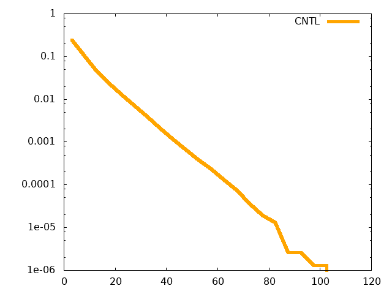
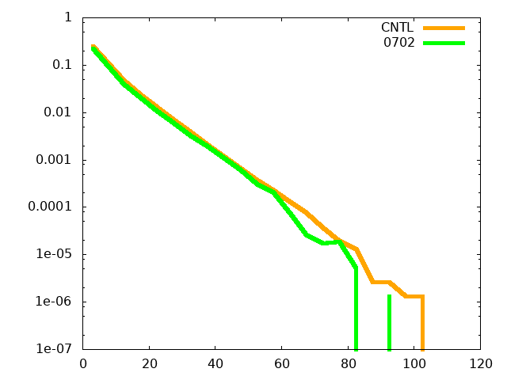

# WRF 雨量のヒストグラム

/work09/am/00.WORK/2022.RW3A/0JOS.FALL2023/02.12.RAIN/22.12.R1H_HISTO

[[_TOC_]]

## コンパイル・実行用スクリプト

#### R1H_HISTO.sh

```bash
#!/bin/bash

src=$(basename $0 .sh).F90
exe=$(basename $0 .sh).exe
nml=$(basename $0 .sh).nml

f90=ifort
DOPT=" -fpp -CB -traceback -fpe0 -check all"
OPT=" -fpp -convert big_endian -assume byterecl"

#f90=gfortran
#DOPT=" -ffpe-trap=invalid,zero,overflow,underflow -fcheck=array-temps,bounds,do,mem,pointer,recursion"
#OPT=" -L. -lncio_test -O2 "

# OpenMP
#OPT2=" -fopenmp "

RUNNAME=RW3A.00.03.05.05.0000.01
DOMAIN=d01

cat<<EOF>$nml
&para
INDIR="/work00/DATA/HD01/RW3A.ARWpost.DAT/basic_p/ARWpost_${RUNNAME}/",
PREFIX="${RUNNAME}.${DOMAIN}.basic_p.01HR_"
IM=599,
JM=599,
KM=30,
NM=73,
&end
EOF

echo; echo Created ${nml}.; echo
ls -lh --time-style=long-iso ${nml}; echo


echo
echo ${src}.
echo
ls -lh --time-style=long-iso ${src}
echo

echo Compiling ${src} ...
echo
echo ${f90} ${DOPT} ${OPT} ${src} -o ${exe}
echo
${f90} ${DOPT} ${OPT} ${OPT2} ${src} -o ${exe}
if [ $? -ne 0 ]; then

echo; echo "=============================================="; echo
echo "   COMPILE ERROR!!!"
echo; echo "=============================================="; echo
echo TERMINATED.; echo
exit 1
fi
echo "Done Compile."
echo; ls -lh ${exe}; echo

echo; echo ${exe} is running ...; echo
D1=$(date -R)
${exe} < ${nml}
if [ $? -ne 0 ]; then
echo
echo; echo "=============================================="; echo
echo "   RUNTIME ERROR!!!"
echo; echo "=============================================="; echo
echo TERMINATED.; echo
D2=$(date -R)
echo "START: $D1"; echo "END:   $D2"
exit 1
fi
echo; echo "Done ${exe}"; echo

D2=$(date -R)
echo "START: $D1"; echo "END:   $D2"
```


## CTLファイル

#### RW3A.00.03.05.05.0702.01.d01.basic_p.01HR.ctl

```
* /work00/DATA/HD01/RW3A.ARWpost.DAT/basic_p/ARWpost_RW3A.00.03.05.05.0702.01/RW3A.00.03.05.05.0702.01.d01.basic_p.01HR.ctl
dset ^RW3A.00.03.05.05.0702.01.d01.basic_p.01HR_%y4-%m2-%d2_%h2:%n2.dat
options  byteswapped template
undef 1.e30
title  OUTPUT FROM WRF V4.1.5 MODEL
pdef  599 599 lcc  27.000  130.500  300.000  300.000  32.00000  27.00000  130.50000   3000.000   3000.000
xdef 1469 linear  120.56867   0.01351351
ydef 1231 linear   18.56023   0.01351351
zdef   30 levels  
1000.00000
....
 100.00000
tdef   73 linear 00Z12AUG2021      60MN      
VARS   30
U             30  0  x-wind component (m s-1)
....
RAINRNC        1  0  RAIN RATE NON-CONV (mm per output interval)
....
dbz           30  0  Reflectivity (-)
ENDVARS
```


## Fortranプログラムの作成

### ステップ1

#### R1H_HISTO.F90

```fortran
PROGRAM R1H_HISTO

CHARACTER(LEN=200):: INDIR, PREFIX
CHARACTER(LEN=400):: INFLE
CHARACTER(LEN=600):: IN, OUT 
INTEGER IM,JM,KM,NM

REAL,DIMENSION(:,:,:),ALLOCATABLE::dummy3
REAL,DIMENSION(:,:),ALLOCATABLE::R1,dummy2

namelist /para/INDIR,PREFIX,OUT,IM,JM,KM,NM

READ(*,nml=para)

ALLOCATE(dummy3(IM,JM,KM))
ALLOCATE(R1(IM,JM),dummy2(IM,JM))

END PROGRAM R1H_HISTO
```


### ステップ2

#### R1H_HISTO.F90

```fortran
PROGRAM R1H_HISTO

! /work09/am/00.WORK/2022.RW3A/0JOS.FALL2023/02.12.RAIN/22.12.R1H_HISTO

CHARACTER(LEN=200):: INDIR, PREFIX
CHARACTER(LEN=400):: INFLE
CHARACTER(LEN=600):: IN, OUT 
INTEGER IM,JM,KM,NM
INTEGER YR0,MO0,DY0,HR0,MI0,DH

REAL,DIMENSION(:,:,:),ALLOCATABLE::dummy3
REAL,DIMENSION(:,:),ALLOCATABLE::R1,dummy2

namelist /para/INDIR,PREFIX,OUT,IM,JM,KM,NM,YR0,MO0,DY0,HR0,MI0,DH

READ(*,nml=para)
PRINT '(A)',' Y    MO  D  H MI DH'
PRINT '(I5,5I3)',YR0,MO0,DY0,HR0,MI0,DH

ALLOCATE(dummy3(IM,JM,KM))
ALLOCATE(R1(IM,JM),dummy2(IM,JM))

END PROGRAM R1H_HISTO
```

```bash
$ R1H_HISTO.sh 
```

```bash
 Y    MO  D  H MI DH
 2021  8 12  0  0  1
```


### ステップ3

#### DATE_CAL.F90

```fortran
      subroutine date2jd(year,month,day,hh,mm,ss,julian_day)
      implicit none
!-----------------------------------------------------------------------
!     get Julian day from Gregolian caldendar
!-----------------------------------------------------------------------

! ... intent(in)
      integer :: year, month, day, hh, mm, ss
! ... intent(out)
      real(8) :: julian_day
! ... parameter
      real(8), parameter :: jd0  = 1720996.5d0 ! BC4713/ 1/ 1 12:00:00
      real(8), parameter :: mjd0 = 2400000.5d0 !   1858/11/17 00:00:00
! ... local
      integer :: y, m
      if (month < 3) then
        y = year - 1
        m = month + 12
      else
        y = year
        m = month
      end if

      julian_day = 365*(y) + int(y)/4 - int(y)/100 + int(y)/400  &
     &           + int((m+1)*30.6001d0) &
     &           + day           &
     &           + hh/24.0d0     &
     &           + mm/1440.0d0   &
     &           + ss/86400.0d0  &
     &           + jd0

! ... convert julian day to modified julian day
      julian_day = julian_day - mjd0

      end subroutine date2jd

      subroutine jd2date(year,month,day,hour,min,sec,julian_day)
      implicit none
!-----------------------------------------------------------------------
!     get Gregolian caldendar from Julian day
!-----------------------------------------------------------------------

! ... intent(in)
      real(8) :: julian_day
! ... intent(out)
      integer :: year, month, day, hour, min, sec
! ... parameter
      real(8), parameter :: mjd0 = 2400000.5d0 !  1858/11/17 00:00:00
! ... local
      integer :: jalpha, ia, ib, ic, id
      integer :: itime
      real(8) :: jday, d, xtime

! ... convert modified julian day to julian day
      jday = julian_day + mjd0

      jday = jday + 0.5d0
      if (jday >= 2299161) then
        jalpha = int( (jday - 1867216.25d0)/36524.25d0 )
        d = jday + 1 + jalpha - int(0.25d0*jalpha)
      else
        d = jday
      end if

      ia = int(d) + 1524
      ib = int(6680.0d0 + ((ia-2439870) - 122.1d0)/365.25d0)
      ic = 365*ib + int(0.25d0*ib)
      id = int((ia-ic)/30.6001d0)
      xtime = (d-int(d))*86400.d0
      itime = xtime
      if ( xtime-itime > 0.5d0 ) itime = itime + 1

      day   = ia - ic - int(30.6001*id)

      month = id - 1
      if (month > 12) month = month - 12

      year  = ib - 4715
      if (month > 2) year = year - 1
      if (year <= 0) year = year - 1

      hour  = itime/3600.
      min   = (itime - hour*3600)/60
      sec   = itime - hour*3600 - min*60

      end subroutine jd2date
```


#### R1H_HISTO.sh

```bash
#!/bin/bash

src=$(basename $0 .sh).F90; exe=$(basename $0 .sh).exe
nml=$(basename $0 .sh).nml
SUB="DATE_CAL.F90"

f90=ifort
DOPT=" -fpp -CB -traceback -fpe0 -check all"
OPT=" -fpp -convert big_endian -assume byterecl"

#f90=gfortran
#DOPT=" -ffpe-trap=invalid,zero,overflow,underflow -fcheck=array-temps,bounds,do,mem,pointer,recursion"
#OPT=" -L. -lncio_test -O2 "
# OpenMP
#OPT2=" -fopenmp "

RUNNAME=RW3A.00.03.05.05.0000.01
DOMIAN=d01

cat<<EOF>$nml
&para
INDIR="/work00/DATA/HD01/RW3A.ARWpost.DAT/basic_p/ARWpost_${RUNNAME}/",
PREFIX="${RUNNAME}.${DOMAIN}.basic_p.01HR_"
IM=599,
JM=599,
KM=30,
NM=73,
YR0=2021, !00Z12AUG2021
MO0=8,
DY0=12,
HR0=0,
MI0=0,
DH=1,
&end
EOF

echo; echo Created ${nml}.; echo
ls -lh --time-style=long-iso ${nml}; echo


echo
echo ${src}.
echo
ls -lh --time-style=long-iso ${src}
echo

echo Compiling ${src} ...
echo
echo ${f90} ${DOPT} ${OPT} ${src} ${SUB} -o ${exe}
echo
${f90} ${DOPT} ${OPT} ${OPT2} ${src} ${SUB} -o ${exe}
if [ $? -ne 0 ]; then

echo; echo "=============================================="; echo
echo "   COMPILE ERROR!!!"
echo; echo "=============================================="; echo
echo TERMINATED.; echo
exit 1
fi
echo "Done Compile."
echo; ls -lh ${exe}; echo

echo; echo ${exe} is running ...; echo
D1=$(date -R)
${exe} < ${nml}
if [ $? -ne 0 ]; then
echo
echo; echo "=============================================="; echo
echo "   RUNTIME ERROR!!!"
echo; echo "=============================================="; echo
echo TERMINATED.; echo
D2=$(date -R)
echo "START: $D1"; echo "END:   $D2"
exit 1
fi
echo; echo "Done ${exe}"; echo

D2=$(date -R)
echo "START: $D1"; echo "END:   $D2"
```

#### R1H_HISTO.F90

```fortran
PROGRAM R1H_HISTO

! /work09/am/00.WORK/2022.RW3A/0JOS.FALL2023/02.12.RAIN/22.12.R1H_HISTO

CHARACTER(LEN=200):: INDIR, PREFIX
CHARACTER(LEN=400):: INFLE
CHARACTER(LEN=600):: IN, OUT 
INTEGER IM,JM,KM,NM
INTEGER YR0,MO0,DY0,HR0,MI0,SS0,DH

REAL,DIMENSION(:,:,:),ALLOCATABLE::dummy3
REAL,DIMENSION(:,:),ALLOCATABLE::R1,dummy2

REAL*8 julian_day
INTEGER year,month,day,hour,min,sec !FOR TEST

namelist /para/INDIR,PREFIX,OUT,IM,JM,KM,NM,YR0,MO0,DY0,HR0,MI0,DH
SS0=0

READ(*,nml=para)
PRINT '(A)',' Y    MO  D  H MI DH'
PRINT '(I5,5I3)',YR0,MO0,DY0,HR0,MI0,DH

ALLOCATE(dummy3(IM,JM,KM))
ALLOCATE(R1(IM,JM),dummy2(IM,JM))

call date2jd(YR0,MO0,DY0,HR0,MI0,SS0,julian_day)
PRINT '(A,F12.3)','MODIFIED JULIAN DAY (FROM 1858/11/17 00:00:00)=',julian_day
PRINT *

call jd2date(year,month,day,hour,min,sec,julian_day)
PRINT '(I5,5I3)',year,month,day,hour,min

END PROGRAM R1H_HISTO
```


```bash
$ R1H_HISTO.sh 
```

```bash
 Y    MO  D  H MI DH
 2021  8 12  0  0  1
MODIFIED JULIAN DAY (FROM 1858/11/17 00:00:00)=   59438.000
 
 2021  8 12  0  0
```


### ステップ4

#### R1H_HISTO.F90

```fortran
PROGRAM R1H_HISTO

! /work09/am/00.WORK/2022.RW3A/0JOS.FALL2023/02.12.RAIN/22.12.R1H_HISTO

CHARACTER(LEN=200):: INDIR, PREFIX
CHARACTER(LEN=400):: INFLE
CHARACTER(LEN=600):: IN, OUT 
INTEGER IM,JM,KM,NM
INTEGER YR0,MO0,DY0,HR0,MI0,SS0,DH

REAL,DIMENSION(:,:,:),ALLOCATABLE::dummy3
REAL,DIMENSION(:,:),ALLOCATABLE::R1,dummy2

REAL*8 julian_day
INTEGER year,month,day,hour,min,sec !FOR TEST

namelist /para/INDIR,PREFIX,OUT,IM,JM,KM,NM,YR0,MO0,DY0,HR0,MI0,DH
SS0=0

READ(*,nml=para)
PRINT '(A)',' Y    MO  D  H MI DH'
PRINT '(I5,5I3)',YR0,MO0,DY0,HR0,MI0,DH

ALLOCATE(dummy3(IM,JM,KM))
ALLOCATE(R1(IM,JM),dummy2(IM,JM))

call date2jd(YR0,MO0,DY0,HR0,MI0,SS0,julian_day)

DO N=1,NM

call jd2date(year,month,day,hour,min,sec,julian_day)
PRINT '(I5,5I3)',year,month,day,hour,min

julian_day=julian_day+dble(DH)/24.0d0 !DH [hr]

END DO !N

END PROGRAM R1H_HISTO
```


```bash
$ R1H_HISTO.sh 
```

```bash
 Y    MO  D  H MI DH
 2021  8 12  0  0  1
 2021  8 12  0  0
.....
 2021  8 15  0  0
```


### ステップ5

#### R1H_HISTO.F90

```fortran
PROGRAM R1H_HISTO

! /work09/am/00.WORK/2022.RW3A/0JOS.FALL2023/02.12.RAIN/22.12.R1H_HISTO

CHARACTER(LEN=200):: INDIR, PREFIX
CHARACTER(LEN=400):: INFLE
CHARACTER(LEN=600):: IN, OUT 
INTEGER IM,JM,KM,NM
INTEGER YR0,MO0,DY0,HR0,MI0,SS0,DH

REAL,DIMENSION(:,:,:),ALLOCATABLE::dummy3
REAL,DIMENSION(:,:),ALLOCATABLE::R1,dummy2

REAL*8 julian_day
INTEGER year,month,day,hour,min,sec !FOR TEST

namelist /para/INDIR,PREFIX,OUT,IM,JM,KM,NM,YR0,MO0,DY0,HR0,MI0,DH
SS0=0

READ(*,nml=para)

ALLOCATE(dummy3(IM,JM,KM))
ALLOCATE(R1(IM,JM),dummy2(IM,JM))

IN=TRIM(INDIR) // '/' // TRIM(PREFIX)
LL=lnblnk(IN)
PRINT '(A,I5)','LL=',LL
PRINT '(A)',IN(1:LL)

END PROGRAM R1H_HISTO
```


```bash
$ R1H_HISTO.sh 
```

```bash
LL=  114
/work00/DATA/HD01/RW3A.ARWpost.DAT/basic_p/ARWpost_RW3A.00.03.05.05.0000.01/RW3A.00.03.05.05.0000.01.basic_p.01HR_
```


### ステップ6

#### R1H_HISTO.F90

```fortran
PROGRAM R1H_HISTO

! /work09/am/00.WORK/2022.RW3A/0JOS.FALL2023/02.12.RAIN/22.12.R1H_HISTO

CHARACTER(LEN=200):: INDIR, PREFIX
CHARACTER(LEN=400):: INFLE
CHARACTER(LEN=600):: IN, OUT 
INTEGER IM,JM,KM,NM
INTEGER YR0,MO0,DY0,HR0,MI0,SS0,DH

REAL,DIMENSION(:,:,:),ALLOCATABLE::dummy3
REAL,DIMENSION(:,:),ALLOCATABLE::R1,dummy2

REAL*8 julian_day
INTEGER year,month,day,hour,min,sec !FOR TEST

namelist /para/INDIR,PREFIX,OUT,IM,JM,KM,NM,YR0,MO0,DY0,HR0,MI0,DH
SS0=0

READ(*,nml=para)

ALLOCATE(dummy3(IM,JM,KM))
ALLOCATE(R1(IM,JM),dummy2(IM,JM))

call date2jd(YR0,MO0,DY0,HR0,MI0,SS0,julian_day)

DO N=1,NM

call jd2date(year,month,day,hour,min,sec,julian_day)

IN=TRIM(INDIR) // '/' // TRIM(PREFIX)
IE=lnblnk(IN)

IS=IE+1;IE=IS+5
WRITE(IN(IS:IE),'(I4.4,A)')year, '-'

IS=IE;IE=IS+3
WRITE(IN(IS:IE),'(I2.2,A)')month, '-'

IS=IE;IE=IS+3
WRITE(IN(IS:IE),'(I2.2,A)')day, '_'

IS=IE;IE=IS+3
WRITE(IN(IS:IE),'(I2.2,A)')hour, ':'

IS=IE;IE=IS+2
WRITE(IN(IS:IE),'(I2.2,A)')min

IS=IE;IE=IS+4
WRITE(IN(IS:IE),'(A)')'.dat'

PRINT '(A)',TRIM(IN)


julian_day=julian_day+dble(DH)/24.0d0 !DH [hr]

END DO !N

END PROGRAM R1H_HISTO
```


```bash
$ R1H_HISTO.sh
```

```
.....
/work00/DATA/HD01/RW3A.ARWpost.DAT/basic_p/ARWpost_RW3A.00.03.05.05.0000.01/RW3A.00.03.05.05.0000.01.basic_p.01HR_2021-08-15_00:00:00.dat
```


### ステップ7

#### R1H_HISTO.F90

```fortran
PROGRAM R1H_HISTO

! /work09/am/00.WORK/2022.RW3A/0JOS.FALL2023/02.12.RAIN/22.12.R1H_HISTO

CHARACTER(LEN=200):: INDIR, PREFIX
CHARACTER(LEN=400):: INFLE
CHARACTER(LEN=600):: IN, OUT 
INTEGER IM,JM,KM,NM
INTEGER YR0,MO0,DY0,HR0,MI0,SS0,DH

REAL,DIMENSION(:,:,:),ALLOCATABLE::dummy3
REAL,DIMENSION(:,:),ALLOCATABLE::R1,dummy2

REAL*8 julian_day
INTEGER year,month,day,hour,min,sec !FOR TEST

namelist /para/INDIR,PREFIX,OUT,IM,JM,KM,NM,YR0,MO0,DY0,HR0,MI0,DH
SS0=0

READ(*,nml=para)

ALLOCATE(dummy3(IM,JM,KM))
ALLOCATE(R1(IM,JM),dummy2(IM,JM))

call date2jd(YR0,MO0,DY0,HR0,MI0,SS0,julian_day)

DO N=1,NM

call jd2date(year,month,day,hour,min,sec,julian_day)

IN=TRIM(INDIR) // '/' // TRIM(PREFIX)
IE=lnblnk(IN)

IS=IE+1;IE=IS+5; WRITE(IN(IS:IE),'(I4.4,A)')year, '-'
IS=IE  ;IE=IS+3; WRITE(IN(IS:IE),'(I2.2,A)')month,'-'
IS=IE  ;IE=IS+3; WRITE(IN(IS:IE),'(I2.2,A)')day,  '_'
IS=IE  ;IE=IS+3; WRITE(IN(IS:IE),'(I2.2,A)')hour, ':'
IS=IE  ;IE=IS+2; WRITE(IN(IS:IE),'(I2.2,A)')min
IS=IE  ;IE=IS+4; WRITE(IN(IS:IE),'(A)')'.dat'

OPEN(11,FILE=TRIM(IN),ACTION="READ",&
form='unformatted',access='direct',recl=IM*JM*4)

CLOSE(11)

julian_day=julian_day+dble(DH)/24.0d0 !DH [hr]

END DO !N
```

```bash
$ R1H_HISTO.sh
```


### ステップ8

#### R1H_HISTO.F90

```fortran
PROGRAM R1H_HISTO

! /work09/am/00.WORK/2022.RW3A/0JOS.FALL2023/02.12.RAIN/22.12.R1H_HISTO

CHARACTER(LEN=200):: INDIR, PREFIX
CHARACTER(LEN=400):: INFLE
CHARACTER(LEN=600):: IN, OUT 
INTEGER IM,JM,KM,NM
INTEGER YR0,MO0,DY0,HR0,MI0,SS0,DH

REAL,DIMENSION(:,:,:),ALLOCATABLE::dummy3
REAL,DIMENSION(:,:),ALLOCATABLE::R1,rlon,rlat,dummy2

REAL*8 julian_day
INTEGER year,month,day,hour,min,sec !FOR TEST

namelist /para/INDIR,PREFIX,OUT,IM,JM,KM,NM,YR0,MO0,DY0,HR0,MI0,DH
SS0=0

READ(*,nml=para)

ALLOCATE(dummy3(IM,JM,KM))
ALLOCATE(R1(IM,JM),rlon(IM,JM),rlat(IM,JM),dummy2(IM,JM))

call date2jd(YR0,MO0,DY0,HR0,MI0,SS0,julian_day)

DO N=1,NM

call jd2date(year,month,day,hour,min,sec,julian_day)

IN=TRIM(INDIR) // '/' // TRIM(PREFIX)
IE=lnblnk(IN)

IS=IE+1;IE=IS+5; WRITE(IN(IS:IE),'(I4.4,A)')year, '-'
IS=IE  ;IE=IS+3; WRITE(IN(IS:IE),'(I2.2,A)')month,'-'
IS=IE  ;IE=IS+3; WRITE(IN(IS:IE),'(I2.2,A)')day,  '_'
IS=IE  ;IE=IS+3; WRITE(IN(IS:IE),'(I2.2,A)')hour, ':'
IS=IE  ;IE=IS+2; WRITE(IN(IS:IE),'(I2.2,A)')min
IS=IE  ;IE=IS+4; WRITE(IN(IS:IE),'(A)')'.dat'

OPEN(11,FILE=TRIM(IN),ACTION="READ",&
form='unformatted',access='direct',recl=IM*JM*4)

write(*,'(I5,5I3)',advance='yes'),&
year,month,day,hour,min

irec=0

write(*,'(A)',advance='no') 'READ '

write(*,'(A)',advance='no') 'U '
DO K = 1, KM
irec=irec+1
read (11,rec=irec) ((dummy3(i,j,k),i=1,IM),j=1,JM)
END DO !K

write(*,'(A)',advance='no') 'V '
DO K = 1, KM
irec=irec+1
read (11,rec=irec) ((dummy3(i,j,k),i=1,IM),j=1,JM)
END DO !K

write(*,'(A)',advance="yes")'';write(*,*)

CLOSE(11)

julian_day=julian_day+dble(DH)/24.0d0 !DH [hr]

END DO !N

END PROGRAM R1H_HISTO
```

```bash
$ R1H_HISTO.sh
```

```bash
 2021  8 12  0  0
READ U V 
.....
```


### ステップ9

#### R1H_HISTO.F90

```fortran
PROGRAM R1H_HISTO

! /work09/am/00.WORK/2022.RW3A/0JOS.FALL2023/02.12.RAIN/22.12.R1H_HISTO

CHARACTER(LEN=200):: INDIR, PREFIX
CHARACTER(LEN=400):: INFLE
CHARACTER(LEN=600):: IN, OUT 
INTEGER IM,JM,KM,NM
INTEGER YR0,MO0,DY0,HR0,MI0,SS0,DH

REAL,DIMENSION(:,:,:),ALLOCATABLE::dummy3
REAL,DIMENSION(:,:),ALLOCATABLE::R1,rlon,rlat,dummy2

REAL*8 julian_day
INTEGER year,month,day,hour,min,sec !FOR TEST

namelist /para/INDIR,PREFIX,OUT,IM,JM,KM,NM,YR0,MO0,DY0,HR0,MI0,DH
SS0=0

READ(*,nml=para)

ALLOCATE(dummy3(IM,JM,KM))
ALLOCATE(R1(IM,JM),rlon(IM,JM),rlat(IM,JM),dummy2(IM,JM))

call date2jd(YR0,MO0,DY0,HR0,MI0,SS0,julian_day)

DO N=1,NM

call jd2date(year,month,day,hour,min,sec,julian_day)

IN=TRIM(INDIR) // '/' // TRIM(PREFIX)
IE=lnblnk(IN)

IS=IE+1;IE=IS+5; WRITE(IN(IS:IE),'(I4.4,A)')year, '-'
IS=IE  ;IE=IS+3; WRITE(IN(IS:IE),'(I2.2,A)')month,'-'
IS=IE  ;IE=IS+3; WRITE(IN(IS:IE),'(I2.2,A)')day,  '_'
IS=IE  ;IE=IS+3; WRITE(IN(IS:IE),'(I2.2,A)')hour, ':'
IS=IE  ;IE=IS+2; WRITE(IN(IS:IE),'(I2.2,A)')min
IS=IE  ;IE=IS+4; WRITE(IN(IS:IE),'(A)')'.dat'

OPEN(11,FILE=TRIM(IN),ACTION="READ",&
form='unformatted',access='direct',recl=IM*JM*4)

write(*,'(I5,5I3)',advance='yes'),&
year,month,day,hour,min

irec=0

write(*,'(A)',advance='no') 'READ '

write(*,'(A)',advance='no') 'U '
DO K = 1, KM
irec=irec+1
read (11,rec=irec) ((dummy3(i,j,k),i=1,IM),j=1,JM)
END DO !K

write(*,'(A)',advance='no') 'V '
DO K = 1, KM
irec=irec+1
read (11,rec=irec) ((dummy3(i,j,k),i=1,IM),j=1,JM)
END DO !K

write(*,'(A)',advance='no') 'W '
DO K = 1, KM
irec=irec+1
read (11,rec=irec) ((dummy3(i,j,k),i=1,IM),j=1,JM)
END DO !K

write(*,'(A)',advance='no') 'Q2 '
irec=irec+1
read (11,rec=irec) ((dummy2(i,j),i=1,IM),j=1,JM)

write(*,'(A)',advance='no') 'T2 '
irec=irec+1
read (11,rec=irec) ((dummy2(i,j),i=1,IM),j=1,JM)

write(*,'(A)',advance='no') 'U10 '
irec=irec+1
read (11,rec=irec) ((dummy2(i,j),i=1,IM),j=1,JM)

write(*,'(A)',advance='no') 'V10 '
irec=irec+1
read (11,rec=irec) ((dummy2(i,j),i=1,IM),j=1,JM)

write(*,'(A)',advance='no') 'QVAPOR '
DO K = 1, KM
irec=irec+1
read (11,rec=irec) ((dummy3(i,j,k),i=1,IM),j=1,JM)
END DO !K

write(*,'(A)',advance='no') 'QCLOUD '
DO K = 1, KM
irec=irec+1
read (11,rec=irec) ((dummy3(i,j,k),i=1,IM),j=1,JM)
END DO !K

write(*,'(A)',advance='no') 'QRAIN '
DO K = 1, KM
irec=irec+1
read (11,rec=irec) ((dummy3(i,j,k),i=1,IM),j=1,JM)
END DO !K

write(*,'(A)',advance='no') 'HGT '
irec=irec+1
read (11,rec=irec) ((dummy2(i,j),i=1,IM),j=1,JM)

write(*,'(A)',advance='no') 'RAINC '
irec=irec+1
read (11,rec=irec) ((dummy2(i,j),i=1,IM),j=1,JM)

write(*,'(A)',advance='no') 'RAINRC '
irec=irec+1
read (11,rec=irec) ((dummy2(i,j),i=1,IM),j=1,JM)

write(*,'(A)',advance='no') 'RAINNC '
irec=irec+1
read (11,rec=irec) ((dummy2(i,j),i=1,IM),j=1,JM)

write(*,'(A)',advance='no') 'RAINRNC '
irec=irec+1
read (11,rec=irec) ((dummy2(i,j),i=1,IM),j=1,JM)

write(*,'(A)',advance="yes")'';write(*,*)
CLOSE(11)

R1AVE=sum(R1)/size(R1); R1MAX=maxval(R1); R1MIN=minval(R1)
PRINT *,'R1AVE',R1AVE,'R1MAX=',R1MAX,'R1MIN=',R1MIN

julian_day=julian_day+dble(DH)/24.0d0 !DH [hr]

END DO !N

END PROGRAM R1H_HISTO
```

```bash
$ R1H_HISTO.sh 
```

```bash
 2021  8 12  1  0
READ U V W Q2 T2 U10 V10 QVAPOR QCLOUD QRAIN HGT RAINC RAINRC RAINNC R1=RAINRNC 
 
 R1AVE  0.6570713     R1MAX=   139.7314     R1MIN=  0.0000000E+00
.....
```


### ステップ10

#### R1H_HISTO.F90

```fortran
PROGRAM R1H_HISTO

! /work09/am/00.WORK/2022.RW3A/0JOS.FALL2023/02.12.RAIN/22.12.R1H_HISTO

CHARACTER(LEN=200):: INDIR, PREFIX, INDIR2
CHARACTER(LEN=400):: INFLE, INFLE2
CHARACTER(LEN=600):: IN, OUT, IN2
INTEGER IM,JM,KM,NM
INTEGER YR0,MO0,DY0,HR0,MI0,SS0,DH

REAL,DIMENSION(:,:,:),ALLOCATABLE::dummy3
REAL,DIMENSION(:,:),ALLOCATABLE::R1,rlon,rlat,dummy2
REAL,DIMENSION(:,:),ALLOCATABLE::XLAT,XLON

REAL*8 julian_day
INTEGER year,month,day,hour,min,sec !FOR TEST

namelist /para/INDIR,PREFIX,OUT,IM,JM,KM,NM,YR0,MO0,DY0,HR0,MI0,DH
SS0=0

READ(*,nml=para)

ALLOCATE(dummy3(IM,JM,KM))
ALLOCATE(R1(IM,JM),rlon(IM,JM),rlat(IM,JM),dummy2(IM,JM))
ALLOCATE(XLAT(IM,JM),XLON(IM,JM))

INDIR2='/work00/DATA/HD01/RW3A.ARWpost.DAT/hdiv_p/RW3A.00.03.05.05.0000.01'
INFLE2='RW3A.00.03.05.05.0000.01.d01.hdiv_p.01HR_2021-08-11_00:00.dat'
IN=TRIM(INDIR2) // '/' // TRIM(INFLE2)

OPEN(11,FILE=TRIM(IN),ACTION="READ",&
form='unformatted',access='direct',recl=IM*JM*4)
irec=0
write(*,'(A)') 'READ XLAT '
irec=irec+1
read (11,rec=irec) ((XLAT(i,j),i=1,IM),j=1,JM)
PRINT *,'XLAT',XLAT(1,1),XLAT(1,JM/2),XLAT(1,JM)

write(*,'(A)') 'READ XLON '
irec=irec+1
read (11,rec=irec) ((XLON(i,j),i=1,IM),j=1,JM)
PRINT *,'XLON',XLON(1,1),XLON(IM/2,1),XLON(IM,1)


call date2jd(YR0,MO0,DY0,HR0,MI0,SS0,julian_day)

DO N=1,NM

call jd2date(year,month,day,hour,min,sec,julian_day)

IN=TRIM(INDIR) // '/' // TRIM(PREFIX)
IE=lnblnk(IN)

IS=IE+1;IE=IS+5; WRITE(IN(IS:IE),'(I4.4,A)')year, '-'
IS=IE  ;IE=IS+3; WRITE(IN(IS:IE),'(I2.2,A)')month,'-'
IS=IE  ;IE=IS+3; WRITE(IN(IS:IE),'(I2.2,A)')day,  '_'
IS=IE  ;IE=IS+3; WRITE(IN(IS:IE),'(I2.2,A)')hour, ':'
IS=IE  ;IE=IS+2; WRITE(IN(IS:IE),'(I2.2,A)')min
IS=IE  ;IE=IS+4; WRITE(IN(IS:IE),'(A)')'.dat'

OPEN(11,FILE=TRIM(IN),ACTION="READ",&
form='unformatted',access='direct',recl=IM*JM*4)

write(*,'(I5,5I3)',advance='yes'),&
year,month,day,hour,min

irec=0

write(*,'(A)',advance='no') 'READ '

write(*,'(A)',advance='no') 'U '
DO K = 1, KM
irec=irec+1
read (11,rec=irec) ((dummy3(i,j,k),i=1,IM),j=1,JM)
END DO !K

write(*,'(A)',advance='no') 'V '
DO K = 1, KM
irec=irec+1
read (11,rec=irec) ((dummy3(i,j,k),i=1,IM),j=1,JM)
END DO !K

write(*,'(A)',advance='no') 'W '
DO K = 1, KM
irec=irec+1
read (11,rec=irec) ((dummy3(i,j,k),i=1,IM),j=1,JM)
END DO !K

write(*,'(A)',advance='no') 'Q2 '
irec=irec+1
read (11,rec=irec) ((dummy2(i,j),i=1,IM),j=1,JM)

write(*,'(A)',advance='no') 'T2 '
irec=irec+1
read (11,rec=irec) ((dummy2(i,j),i=1,IM),j=1,JM)

write(*,'(A)',advance='no') 'U10 '
irec=irec+1
read (11,rec=irec) ((dummy2(i,j),i=1,IM),j=1,JM)

write(*,'(A)',advance='no') 'V10 '
irec=irec+1
read (11,rec=irec) ((dummy2(i,j),i=1,IM),j=1,JM)

write(*,'(A)',advance='no') 'QVAPOR '
DO K = 1, KM
irec=irec+1
read (11,rec=irec) ((dummy3(i,j,k),i=1,IM),j=1,JM)
END DO !K

write(*,'(A)',advance='no') 'QCLOUD '
DO K = 1, KM
irec=irec+1
read (11,rec=irec) ((dummy3(i,j,k),i=1,IM),j=1,JM)
END DO !K

write(*,'(A)',advance='no') 'QRAIN '
DO K = 1, KM
irec=irec+1
read (11,rec=irec) ((dummy3(i,j,k),i=1,IM),j=1,JM)
END DO !K

write(*,'(A)',advance='no') 'HGT '
irec=irec+1
read (11,rec=irec) ((dummy2(i,j),i=1,IM),j=1,JM)

write(*,'(A)',advance='no') 'RAINC '
irec=irec+1
read (11,rec=irec) ((dummy2(i,j),i=1,IM),j=1,JM)

write(*,'(A)',advance='no') 'RAINRC '
irec=irec+1
read (11,rec=irec) ((dummy2(i,j),i=1,IM),j=1,JM)

write(*,'(A)',advance='no') 'RAINNC '
irec=irec+1
read (11,rec=irec) ((dummy2(i,j),i=1,IM),j=1,JM)

write(*,'(A)',advance='no') 'R1=RAINRNC '
irec=irec+1
read (11,rec=irec) ((R1(i,j),i=1,IM),j=1,JM)

write(*,'(A)',advance="yes")'';write(*,*)
CLOSE(11)

R1AVE=sum(R1)/size(R1); R1MAX=maxval(R1); R1MIN=minval(R1)
PRINT *,'R1AVE',R1AVE,'R1MAX=',R1MAX,'R1MIN=',R1MIN

julian_day=julian_day+dble(DH)/24.0d0 !DH [hr]

END DO !N

END PROGRAM R1H_HISTO
```

```bash
$ R1H_HISTO.sh 
```

```bash
READ XLAT 
 XLAT   18.69523       26.65958       34.72747    
READ XLON 
 XLON   122.1134       130.4719       138.8865    
 2021  8 12  0  0
```


### ステップ11

#### TEST_ARRAY_MUL.F90

```fortran
real,dimension(3)::a,b,c

data a/1,2,3/
data b/0.1,0.2,0.3/

print *,'a ',(a(i),i=1,3)
print *,'b ',(b(i),i=1,3)

c=a*b

print *,'c=a*b'
print *,'c ',(c(i),i=1,3)

end
```

```bash
$ ifort TEST_ARRAY_MUL.F90 -o TEST_ARRAY_MUL.EXE
```

```bash
$ TEST_ARRAY_MUL.EXE 
```

```bash
$ TEST_ARRAY_MUL.EXE 
 a    1.000000       2.000000       3.000000    
 b   0.1000000      0.2000000      0.3000000    
 c=a*b
 c   0.1000000      0.4000000      0.9000000  
```


#### R1H_HISTO.F90

```fortran
PROGRAM R1H_HISTO

! /work09/am/00.WORK/2022.RW3A/0JOS.FALL2023/02.12.RAIN/22.12.R1H_HISTO

CHARACTER(LEN=200):: INDIR, PREFIX, INDIR2
CHARACTER(LEN=400):: INFLE, INFLE2
CHARACTER(LEN=600):: IN, OUT, IN2
INTEGER IM,JM,KM,NM
INTEGER YR0,MO0,DY0,HR0,MI0,SS0,DH

REAL,DIMENSION(:,:,:),ALLOCATABLE::dummy3
REAL,DIMENSION(:,:),ALLOCATABLE::R1,rlon,rlat,dummy2
REAL,DIMENSION(:,:),ALLOCATABLE::XLAT,XLON,MASK

REAL*8 julian_day
INTEGER year,month,day,hour,min,sec !FOR TEST

REAL::LONW,LONE,LATS,LATN

LONW=129;LONE=132;LATS=31;LATN=34

namelist /para/INDIR,PREFIX,OUT,IM,JM,KM,NM,YR0,MO0,DY0,HR0,MI0,DH
SS0=0

READ(*,nml=para)

ALLOCATE(dummy3(IM,JM,KM))
ALLOCATE(R1(IM,JM),rlon(IM,JM),rlat(IM,JM),dummy2(IM,JM))
ALLOCATE(XLAT(IM,JM),XLON(IM,JM),MASK(IM,JM))

INDIR2='/work00/DATA/HD01/RW3A.ARWpost.DAT/hdiv_p/RW3A.00.03.05.05.0000.01'
INFLE2='RW3A.00.03.05.05.0000.01.d01.hdiv_p.01HR_2021-08-11_00:00.dat'
IN=TRIM(INDIR2) // '/' // TRIM(INFLE2)

OPEN(11,FILE=TRIM(IN),ACTION="READ",&
form='unformatted',access='direct',recl=IM*JM*4)
irec=0
write(*,'(A)') 'READ XLAT '
irec=irec+1
read (11,rec=irec) ((XLAT(i,j),i=1,IM),j=1,JM)

write(*,'(A)') 'READ XLON '
irec=irec+1
read (11,rec=irec) ((XLON(i,j),i=1,IM),j=1,JM)

MASK=0.0; GRIDNUM=0.0

DO J=1,JM
DO I=1,IM

IF(XLON(I,J)>=LONW .AND. XLON(I,J)<LONE .and. XLAT(I,J)>=LATS &
.and. XLAT(I,J)<LATN)THEN
MASK(I,J)=1.0
GRIDNUM=GRIDNUM+1.0
END IF !LON LAT

END DO !I
END DO !J
PRINT *,'GRIDNUM=',GRIDNUM

call date2jd(YR0,MO0,DY0,HR0,MI0,SS0,julian_day)

DO N=1,NM

call jd2date(year,month,day,hour,min,sec,julian_day)

IN=TRIM(INDIR) // '/' // TRIM(PREFIX)
IE=lnblnk(IN)

IS=IE+1;IE=IS+5; WRITE(IN(IS:IE),'(I4.4,A)')year, '-'
IS=IE  ;IE=IS+3; WRITE(IN(IS:IE),'(I2.2,A)')month,'-'
IS=IE  ;IE=IS+3; WRITE(IN(IS:IE),'(I2.2,A)')day,  '_'
IS=IE  ;IE=IS+3; WRITE(IN(IS:IE),'(I2.2,A)')hour, ':'
IS=IE  ;IE=IS+2; WRITE(IN(IS:IE),'(I2.2,A)')min
IS=IE  ;IE=IS+4; WRITE(IN(IS:IE),'(A)')'.dat'

OPEN(11,FILE=TRIM(IN),ACTION="READ",&
form='unformatted',access='direct',recl=IM*JM*4)

write(*,'(I5,5I3)',advance='yes'),&
year,month,day,hour,min

irec=0

write(*,'(A)',advance='no') 'READ '

write(*,'(A)',advance='no') 'U '
DO K = 1, KM
irec=irec+1
read (11,rec=irec) ((dummy3(i,j,k),i=1,IM),j=1,JM)
END DO !K

write(*,'(A)',advance='no') 'V '
DO K = 1, KM
irec=irec+1
read (11,rec=irec) ((dummy3(i,j,k),i=1,IM),j=1,JM)
END DO !K

write(*,'(A)',advance='no') 'W '
DO K = 1, KM
irec=irec+1
read (11,rec=irec) ((dummy3(i,j,k),i=1,IM),j=1,JM)
END DO !K

write(*,'(A)',advance='no') 'Q2 '
irec=irec+1
read (11,rec=irec) ((dummy2(i,j),i=1,IM),j=1,JM)

write(*,'(A)',advance='no') 'T2 '
irec=irec+1
read (11,rec=irec) ((dummy2(i,j),i=1,IM),j=1,JM)

write(*,'(A)',advance='no') 'U10 '
irec=irec+1
read (11,rec=irec) ((dummy2(i,j),i=1,IM),j=1,JM)

write(*,'(A)',advance='no') 'V10 '
irec=irec+1
read (11,rec=irec) ((dummy2(i,j),i=1,IM),j=1,JM)

write(*,'(A)',advance='no') 'QVAPOR '
DO K = 1, KM
irec=irec+1
read (11,rec=irec) ((dummy3(i,j,k),i=1,IM),j=1,JM)
END DO !K

write(*,'(A)',advance='no') 'QCLOUD '
DO K = 1, KM
irec=irec+1
read (11,rec=irec) ((dummy3(i,j,k),i=1,IM),j=1,JM)
END DO !K

write(*,'(A)',advance='no') 'QRAIN '
DO K = 1, KM
irec=irec+1
read (11,rec=irec) ((dummy3(i,j,k),i=1,IM),j=1,JM)
END DO !K

write(*,'(A)',advance='no') 'HGT '
irec=irec+1
read (11,rec=irec) ((dummy2(i,j),i=1,IM),j=1,JM)

write(*,'(A)',advance='no') 'RAINC '
irec=irec+1
read (11,rec=irec) ((dummy2(i,j),i=1,IM),j=1,JM)

write(*,'(A)',advance='no') 'RAINRC '
irec=irec+1
read (11,rec=irec) ((dummy2(i,j),i=1,IM),j=1,JM)

write(*,'(A)',advance='no') 'RAINNC '
irec=irec+1
read (11,rec=irec) ((dummy2(i,j),i=1,IM),j=1,JM)

write(*,'(A)',advance='no') 'R1=RAINRNC '
irec=irec+1
read (11,rec=irec) ((R1(i,j),i=1,IM),j=1,JM)

write(*,'(A)',advance="yes")''
CLOSE(11)

R1AVE=sum(R1*MASK)/GRIDNUM
PRINT *,'R1AVE',R1AVE; PRINT *

julian_day=julian_day+dble(DH)/24.0d0 !DH [hr]

END DO !N

END PROGRAM R1H_HISTO
```

```
$ R1H_HISTO.sh 
```

```
 2021  8 12  1  0
READ U V W Q2 T2 U10 V10 QVAPOR QCLOUD QRAIN HGT RAINC RAINRC RAINNC R1=RAINRNC 
 R1AVE   5.403089  
```


### ステップ12

#### R1H_HISTO.F90

```bash
PROGRAM R1H_HISTO

! /work09/am/00.WORK/2022.RW3A/0JOS.FALL2023/02.12.RAIN/22.12.R1H_HISTO

CHARACTER(LEN=200):: INDIR, PREFIX, INDIR2
CHARACTER(LEN=400):: INFLE, INFLE2
CHARACTER(LEN=600):: IN, OUT, IN2
INTEGER IM,JM,KM,NM
INTEGER YR0,MO0,DY0,HR0,MI0,SS0,DH

REAL,DIMENSION(:,:,:),ALLOCATABLE::dummy3
REAL,DIMENSION(:,:),ALLOCATABLE::R1,rlon,rlat,dummy2
REAL,DIMENSION(:,:),ALLOCATABLE::XLAT,XLON,MASK

REAL*8 julian_day
INTEGER year,month,day,hour,min,sec !FOR TEST

REAL::LONW,LONE,LATS,LATN

REAL,DIMENSION(:),ALLOCATABLE::RBIN_L, RBIN_R, RFRQ, RPCT
REAL,PARAMETER::R1MIN=1.0,R1LEFT=20.0;R1MAX=300.0; DR1=20.0


namelist /para/INDIR,PREFIX,OUT,IM,JM,KM,NM,YR0,MO0,DY0,HR0,MI0,DH
SS0=0

LONW=129;LONE=132;LATS=31;LATN=34

MB=INT((R1MAX-R1LEFT)/DR1)
ALLOCATE(RBIN_L(MB), RBIN_R(MB), RFRQ(MB), RPCT(MB))
RBIN_L(1)=R1MIN; RBIN_R(1)=R1LEFT
DO M=2,MB
RBIN_L(M)=R1LEFT+DR1*FLOAT(M-1)
RBIN_R(M)=R1LEFT+DR1*FLOAT(M)
END DO !M
DO M=1,MB
PRINT *,'RBIN_L(M),RBIN_R(M)',RBIN_L(M),RBIN_R(M)
END DO !M


READ(*,nml=para)

ALLOCATE(dummy3(IM,JM,KM))
ALLOCATE(R1(IM,JM),rlon(IM,JM),rlat(IM,JM),dummy2(IM,JM))
ALLOCATE(XLAT(IM,JM),XLON(IM,JM),MASK(IM,JM))

INDIR2='/work00/DATA/HD01/RW3A.ARWpost.DAT/hdiv_p/RW3A.00.03.05.05.0000.01'
INFLE2='RW3A.00.03.05.05.0000.01.d01.hdiv_p.01HR_2021-08-11_00:00.dat'
IN=TRIM(INDIR2) // '/' // TRIM(INFLE2)

OPEN(11,FILE=TRIM(IN),ACTION="READ",&
form='unformatted',access='direct',recl=IM*JM*4)
irec=0
write(*,'(A)') 'READ XLAT '
irec=irec+1
read (11,rec=irec) ((XLAT(i,j),i=1,IM),j=1,JM)

write(*,'(A)') 'READ XLON '
irec=irec+1
read (11,rec=irec) ((XLON(i,j),i=1,IM),j=1,JM)

MASK=0.0; GRIDNUM=0.0

DO J=1,JM
DO I=1,IM

IF(XLON(I,J)>=LONW .AND. XLON(I,J)<LONE .and. XLAT(I,J)>=LATS &
.and. XLAT(I,J)<LATN)THEN
MASK(I,J)=1.0
GRIDNUM=GRIDNUM+1.0
END IF !LON LAT

END DO !I
END DO !J
PRINT *,'GRIDNUM=',GRIDNUM

call date2jd(YR0,MO0,DY0,HR0,MI0,SS0,julian_day)

DO N=1,NM

call jd2date(year,month,day,hour,min,sec,julian_day)

IN=TRIM(INDIR) // '/' // TRIM(PREFIX)
IE=lnblnk(IN)

IS=IE+1;IE=IS+5; WRITE(IN(IS:IE),'(I4.4,A)')year, '-'
IS=IE  ;IE=IS+3; WRITE(IN(IS:IE),'(I2.2,A)')month,'-'
IS=IE  ;IE=IS+3; WRITE(IN(IS:IE),'(I2.2,A)')day,  '_'
IS=IE  ;IE=IS+3; WRITE(IN(IS:IE),'(I2.2,A)')hour, ':'
IS=IE  ;IE=IS+2; WRITE(IN(IS:IE),'(I2.2,A)')min
IS=IE  ;IE=IS+4; WRITE(IN(IS:IE),'(A)')'.dat'

OPEN(11,FILE=TRIM(IN),ACTION="READ",&
form='unformatted',access='direct',recl=IM*JM*4)

write(*,'(I5,5I3)',advance='yes'),&
year,month,day,hour,min

irec=0

write(*,'(A)',advance='no') 'READ '

write(*,'(A)',advance='no') 'U '
DO K = 1, KM
irec=irec+1
read (11,rec=irec) ((dummy3(i,j,k),i=1,IM),j=1,JM)
END DO !K

write(*,'(A)',advance='no') 'V '
DO K = 1, KM
irec=irec+1
read (11,rec=irec) ((dummy3(i,j,k),i=1,IM),j=1,JM)
END DO !K

write(*,'(A)',advance='no') 'W '
DO K = 1, KM
irec=irec+1
read (11,rec=irec) ((dummy3(i,j,k),i=1,IM),j=1,JM)
END DO !K

write(*,'(A)',advance='no') 'Q2 '
irec=irec+1
read (11,rec=irec) ((dummy2(i,j),i=1,IM),j=1,JM)

write(*,'(A)',advance='no') 'T2 '
irec=irec+1
read (11,rec=irec) ((dummy2(i,j),i=1,IM),j=1,JM)

write(*,'(A)',advance='no') 'U10 '
irec=irec+1
read (11,rec=irec) ((dummy2(i,j),i=1,IM),j=1,JM)

write(*,'(A)',advance='no') 'V10 '
irec=irec+1
read (11,rec=irec) ((dummy2(i,j),i=1,IM),j=1,JM)

write(*,'(A)',advance='no') 'QVAPOR '
DO K = 1, KM
irec=irec+1
read (11,rec=irec) ((dummy3(i,j,k),i=1,IM),j=1,JM)
END DO !K

write(*,'(A)',advance='no') 'QCLOUD '
DO K = 1, KM
irec=irec+1
read (11,rec=irec) ((dummy3(i,j,k),i=1,IM),j=1,JM)
END DO !K

write(*,'(A)',advance='no') 'QRAIN '
DO K = 1, KM
irec=irec+1
read (11,rec=irec) ((dummy3(i,j,k),i=1,IM),j=1,JM)
END DO !K

write(*,'(A)',advance='no') 'HGT '
irec=irec+1
read (11,rec=irec) ((dummy2(i,j),i=1,IM),j=1,JM)

write(*,'(A)',advance='no') 'RAINC '
irec=irec+1
read (11,rec=irec) ((dummy2(i,j),i=1,IM),j=1,JM)

write(*,'(A)',advance='no') 'RAINRC '
irec=irec+1
read (11,rec=irec) ((dummy2(i,j),i=1,IM),j=1,JM)

write(*,'(A)',advance='no') 'RAINNC '
irec=irec+1
read (11,rec=irec) ((dummy2(i,j),i=1,IM),j=1,JM)

write(*,'(A)',advance='no') 'R1=RAINRNC '
irec=irec+1
read (11,rec=irec) ((R1(i,j),i=1,IM),j=1,JM)

write(*,'(A)',advance="yes")''
CLOSE(11)

R1AVE=sum(R1*MASK)/GRIDNUM
PRINT *,'R1AVE',R1AVE; PRINT *

julian_day=julian_day+dble(DH)/24.0d0 !DH [hr]

END DO !N

END PROGRAM R1H_HISTO
```

```
$ R1H_HISTO.sh 
```

```
 RBIN_L(M),RBIN_R(M)   1.000000       20.00000    
 RBIN_L(M),RBIN_R(M)   40.00000       60.00000    
 RBIN_L(M),RBIN_R(M)   60.00000       80.00000    
 RBIN_L(M),RBIN_R(M)   80.00000       100.0000    
 RBIN_L(M),RBIN_R(M)   100.0000       120.0000    
 RBIN_L(M),RBIN_R(M)   120.0000       140.0000    
 RBIN_L(M),RBIN_R(M)   140.0000       160.0000    
 RBIN_L(M),RBIN_R(M)   160.0000       180.0000    
 RBIN_L(M),RBIN_R(M)   180.0000       200.0000    
 RBIN_L(M),RBIN_R(M)   200.0000       220.0000    
 RBIN_L(M),RBIN_R(M)   220.0000       240.0000    
 RBIN_L(M),RBIN_R(M)   240.0000       260.0000    
 RBIN_L(M),RBIN_R(M)   260.0000       280.0000    
 RBIN_L(M),RBIN_R(M)   280.0000       300.0000   
```


### ステップ13

#### R1H_HISTO.F90

```fortran
PROGRAM R1H_HISTO

! /work09/am/00.WORK/2022.RW3A/0JOS.FALL2023/02.12.RAIN/22.12.R1H_HISTO

CHARACTER(LEN=200):: INDIR, PREFIX, INDIR2
CHARACTER(LEN=400):: INFLE, INFLE2
CHARACTER(LEN=600):: IN, OUT, IN2
INTEGER IM,JM,KM,NM
INTEGER YR0,MO0,DY0,HR0,MI0,SS0,DH

REAL,DIMENSION(:,:,:),ALLOCATABLE::dummy3
REAL,DIMENSION(:,:),ALLOCATABLE::R1,rlon,rlat,dummy2
REAL,DIMENSION(:,:),ALLOCATABLE::XLAT,XLON,MASK

REAL*8 julian_day
INTEGER year,month,day,hour,min,sec !FOR TEST

REAL::LONW,LONE,LATS,LATN

REAL,DIMENSION(:),ALLOCATABLE::RBIN_L, RBIN_R, RFRQ, RPCT
REAL,PARAMETER::R1MIN=1.0,R1LEFT=20.0;R1MAX=300.0; DR1=20.0


namelist /para/INDIR,PREFIX,OUT,IM,JM,KM,NM,YR0,MO0,DY0,HR0,MI0,DH
SS0=0

LONW=129;LONE=132;LATS=31;LATN=34

MB=INT((R1MAX-R1LEFT)/DR1)
ALLOCATE(RBIN_L(MB), RBIN_R(MB), RFRQ(MB), RPCT(MB))
RBIN_L(1)=R1MIN; RBIN_R(1)=R1LEFT
DO M=2,MB
RBIN_L(M)=R1LEFT+DR1*FLOAT(M-1)
RBIN_R(M)=R1LEFT+DR1*FLOAT(M)
END DO !M
DO M=1,MB
PRINT *,'RBIN_L(M),RBIN_R(M)',RBIN_L(M),RBIN_R(M)
END DO !M


READ(*,nml=para)

ALLOCATE(dummy3(IM,JM,KM))
ALLOCATE(R1(IM,JM),rlon(IM,JM),rlat(IM,JM),dummy2(IM,JM))
ALLOCATE(XLAT(IM,JM),XLON(IM,JM),MASK(IM,JM))

INDIR2='/work00/DATA/HD01/RW3A.ARWpost.DAT/hdiv_p/RW3A.00.03.05.05.0000.01'
INFLE2='RW3A.00.03.05.05.0000.01.d01.hdiv_p.01HR_2021-08-11_00:00.dat'
IN=TRIM(INDIR2) // '/' // TRIM(INFLE2)

OPEN(11,FILE=TRIM(IN),ACTION="READ",&
form='unformatted',access='direct',recl=IM*JM*4)
irec=0
write(*,'(A)') 'READ XLAT '
irec=irec+1
read (11,rec=irec) ((XLAT(i,j),i=1,IM),j=1,JM)

write(*,'(A)') 'READ XLON '
irec=irec+1
read (11,rec=irec) ((XLON(i,j),i=1,IM),j=1,JM)

MASK=0.0; GRIDNUM=0.0

DO J=1,JM
DO I=1,IM

IF(XLON(I,J)>=LONW .AND. XLON(I,J)<LONE .and. XLAT(I,J)>=LATS &
.and. XLAT(I,J)<LATN)THEN
MASK(I,J)=1.0
GRIDNUM=GRIDNUM+1.0
END IF !LON LAT

END DO !I
END DO !J
PRINT *,'GRIDNUM=',GRIDNUM

call date2jd(YR0,MO0,DY0,HR0,MI0,SS0,julian_day)

DO N=1,NM

call jd2date(year,month,day,hour,min,sec,julian_day)

IN=TRIM(INDIR) // '/' // TRIM(PREFIX)
IE=lnblnk(IN)

IS=IE+1;IE=IS+5; WRITE(IN(IS:IE),'(I4.4,A)')year, '-'
IS=IE  ;IE=IS+3; WRITE(IN(IS:IE),'(I2.2,A)')month,'-'
IS=IE  ;IE=IS+3; WRITE(IN(IS:IE),'(I2.2,A)')day,  '_'
IS=IE  ;IE=IS+3; WRITE(IN(IS:IE),'(I2.2,A)')hour, ':'
IS=IE  ;IE=IS+2; WRITE(IN(IS:IE),'(I2.2,A)')min
IS=IE  ;IE=IS+4; WRITE(IN(IS:IE),'(A)')'.dat'

OPEN(11,FILE=TRIM(IN),ACTION="READ",&
form='unformatted',access='direct',recl=IM*JM*4)

write(*,'(I5,5I3)',advance='yes'),&
year,month,day,hour,min

irec=0

write(*,'(A)',advance='no') 'SKIP '

write(*,'(A)',advance='no') 'U '
DO K = 1, KM; irec=irec+1; END DO !K

write(*,'(A)',advance='no') 'V '
DO K = 1, KM; irec=irec+1; END DO !K

write(*,'(A)',advance='no') 'W '
DO K = 1, KM; irec=irec+1; END DO !K

write(*,'(A)',advance='no') 'Q2 '
irec=irec+1

write(*,'(A)',advance='no') 'T2 '
irec=irec+1

write(*,'(A)',advance='no') 'U10 '
irec=irec+1

write(*,'(A)',advance='no') 'V10 '
irec=irec+1

write(*,'(A)',advance='no') 'QVAPOR '
DO K = 1, KM; irec=irec+1; END DO !K

write(*,'(A)',advance='no') 'QCLOUD '
DO K = 1, KM; irec=irec+1; END DO !K

write(*,'(A)',advance='no') 'QRAIN '
DO K = 1, KM; irec=irec+1; END DO !K

write(*,'(A)',advance='no') 'HGT '
irec=irec+1

write(*,'(A)',advance='no') 'RAINC '
irec=irec+1

write(*,'(A)',advance='no') 'RAINRC '
irec=irec+1

write(*,'(A)',advance='no') 'RAINNC '
irec=irec+1

write(*,'(A)',advance='no') 'R1=RAINRNC '
irec=irec+1
read (11,rec=irec) ((R1(i,j),i=1,IM),j=1,JM)

write(*,'(A)',advance="yes")''
CLOSE(11)

R1AVE=sum(R1*MASK)/GRIDNUM
PRINT *,'GRIDNUM=',GRIDNUM
PRINT *,'R1AVE  =',R1AVE; PRINT *

julian_day=julian_day+dble(DH)/24.0d0 !DH [hr]

END DO !N

END PROGRAM R1H_HISTO
```

```bash
$ R1H_HISTO.sh 
```

```bash
 .....
 2021  8 15  0  0
SKIP U V W Q2 T2 U10 V10 QVAPOR QCLOUD QRAIN HGT RAINC RAINRC RAINNC R1=RAINRNC 
 GRIDNUM=   10419.00    
 R1AVE  =  5.1457845E-02
```


### ステップ14

#### R1H_HISTO.F90

```fortran
PROGRAM R1H_HISTO

! /work09/am/00.WORK/2022.RW3A/0JOS.FALL2023/02.12.RAIN/22.12.R1H_HISTO

CHARACTER(LEN=200):: INDIR, PREFIX, INDIR2
CHARACTER(LEN=400):: INFLE, INFLE2
CHARACTER(LEN=600):: IN, OUT, IN2
INTEGER IM,JM,KM,NM
INTEGER YR0,MO0,DY0,HR0,MI0,SS0,DH

REAL,DIMENSION(:,:,:),ALLOCATABLE::dummy3
REAL,DIMENSION(:,:),ALLOCATABLE::R1,rlon,rlat,dummy2
REAL,DIMENSION(:,:),ALLOCATABLE::XLAT,XLON,MASK

REAL*8 julian_day
REAL RTOTAL
INTEGER NTOTAL

INTEGER year,month,day,hour,min,sec !FOR TEST

REAL::LONW,LONE,LATS,LATN

REAL,DIMENSION(:),ALLOCATABLE::RBIN_L, RBIN_R, NFRQ, RFRQ, RPCT
REAL,PARAMETER::R1MIN=1.0,R1LEFT=5.0;R1MAX=120.0; DR1=5.0


namelist /para/INDIR,PREFIX,OUT,IM,JM,KM,NM,YR0,MO0,DY0,HR0,MI0,DH
SS0=0

LONW=129;LONE=132;LATS=31;LATN=34

MB=INT((R1MAX-R1LEFT)/DR1)
ALLOCATE(RBIN_L(MB), RBIN_R(MB), NFRQ(MB), RFRQ(MB), RPCT(MB))

RTOTAL=0.0; NTOTAL=0
NFRQ=0.0; RFRQ=0.0; RPCT(MB)=0.0

RBIN_L(1)=R1MIN; RBIN_R(1)=R1LEFT
DO M=2,MB
RBIN_L(M)=R1LEFT+DR1*FLOAT(M-1)
RBIN_R(M)=R1LEFT+DR1*FLOAT(M)
END DO !M


READ(*,nml=para)

ALLOCATE(dummy3(IM,JM,KM))
ALLOCATE(R1(IM,JM),rlon(IM,JM),rlat(IM,JM),dummy2(IM,JM))
ALLOCATE(XLAT(IM,JM),XLON(IM,JM),MASK(IM,JM))

INDIR2='/work00/DATA/HD01/RW3A.ARWpost.DAT/hdiv_p/RW3A.00.03.05.05.0000.01'
INFLE2='RW3A.00.03.05.05.0000.01.d01.hdiv_p.01HR_2021-08-11_00:00.dat'
IN=TRIM(INDIR2) // '/' // TRIM(INFLE2)

OPEN(11,FILE=TRIM(IN),ACTION="READ",&
form='unformatted',access='direct',recl=IM*JM*4)
irec=0
write(*,'(A)') 'READ XLAT '
irec=irec+1
read (11,rec=irec) ((XLAT(i,j),i=1,IM),j=1,JM)

write(*,'(A)') 'READ XLON '
irec=irec+1
read (11,rec=irec) ((XLON(i,j),i=1,IM),j=1,JM)

MASK=0.0; GRIDNUM=0.0

DO J=1,JM
DO I=1,IM

IF(XLON(I,J)>=LONW .AND. XLON(I,J)<LONE .and. XLAT(I,J)>=LATS &
.and. XLAT(I,J)<LATN)THEN
MASK(I,J)=1.0
GRIDNUM=GRIDNUM+1.0
END IF !LON LAT

END DO !I
END DO !J
PRINT *,'GRIDNUM=',GRIDNUM

call date2jd(YR0,MO0,DY0,HR0,MI0,SS0,julian_day)

DO N=1,NM

call jd2date(year,month,day,hour,min,sec,julian_day)

IN=TRIM(INDIR) // '/' // TRIM(PREFIX)
IE=lnblnk(IN)

IS=IE+1;IE=IS+5; WRITE(IN(IS:IE),'(I4.4,A)')year, '-'
IS=IE  ;IE=IS+3; WRITE(IN(IS:IE),'(I2.2,A)')month,'-'
IS=IE  ;IE=IS+3; WRITE(IN(IS:IE),'(I2.2,A)')day,  '_'
IS=IE  ;IE=IS+3; WRITE(IN(IS:IE),'(I2.2,A)')hour, ':'
IS=IE  ;IE=IS+2; WRITE(IN(IS:IE),'(I2.2,A)')min
IS=IE  ;IE=IS+4; WRITE(IN(IS:IE),'(A)')'.dat'

OPEN(11,FILE=TRIM(IN),ACTION="READ",&
form='unformatted',access='direct',recl=IM*JM*4)

write(*,'(I5,5I3)',advance='yes'),&
year,month,day,hour,min

irec=0

write(*,'(A)',advance='no') 'SKIP '

write(*,'(A)',advance='no') 'U '
DO K = 1, KM; irec=irec+1; END DO !K

write(*,'(A)',advance='no') 'V '
DO K = 1, KM; irec=irec+1; END DO !K

write(*,'(A)',advance='no') 'W '
DO K = 1, KM; irec=irec+1; END DO !K

write(*,'(A)',advance='no') 'Q2 '
irec=irec+1

write(*,'(A)',advance='no') 'T2 '
irec=irec+1

write(*,'(A)',advance='no') 'U10 '
irec=irec+1

write(*,'(A)',advance='no') 'V10 '
irec=irec+1

write(*,'(A)',advance='no') 'QVAPOR '
DO K = 1, KM; irec=irec+1; END DO !K

write(*,'(A)',advance='no') 'QCLOUD '
DO K = 1, KM; irec=irec+1; END DO !K

write(*,'(A)',advance='no') 'QRAIN '
DO K = 1, KM; irec=irec+1; END DO !K

write(*,'(A)',advance='no') 'HGT '
irec=irec+1

write(*,'(A)',advance='no') 'RAINC '
irec=irec+1

write(*,'(A)',advance='no') 'RAINRC '
irec=irec+1

write(*,'(A)',advance='no') 'RAINNC '
irec=irec+1

write(*,'(A)',advance='no') 'R1=RAINRNC '
irec=irec+1
read (11,rec=irec) ((R1(i,j),i=1,IM),j=1,JM)

write(*,'(A)',advance="yes")''
CLOSE(11)

DO J=1,JM
DO I=1,IM

IF( MASK(I,J)==1.0)THEN
RTOTAL=RTOTAL+R1(I,J)
NTOTAL=NTOTAL+1
DO M=1,MB
IF(R1(I,J)>=RBIN_L(M) .and. R1(I,J)<RBIN_R(M))THEN
NFRQ(M)=NFRQ(M)+1.0
END IF !R1
END DO !M
END IF !MASK

END DO !I
END DO !J

julian_day=julian_day+dble(DH)/24.0d0 !DH [hr]

END DO !N

DO M=1,MB
RFRQ(M)=NFRQ(M)/FLOAT(NTOTAL)
END DO !M

PRINT '(A)','RBIN_L, RBIN_R, RFRQ, NFRQ'
DO M=1,MB
PRINT '(2F9.2,E12.4,F12.0)',RBIN_L(M),RBIN_R(M),RFRQ(M),NFRQ(M)
END DO !M

END PROGRAM R1H_HISTO
```

```bash
$ R1H_HISTO.sh 
```

```bash
RBIN_L, RBIN_R, RFRQ, NFRQ
     1.00     5.00  0.2460E+00     187080.
    10.00    15.00  0.4737E-01      36029.
    15.00    20.00  0.2427E-01      18462.
    20.00    25.00  0.1289E-01       9807.
    25.00    30.00  0.7075E-02       5381.
    30.00    35.00  0.3896E-02       2963.
    35.00    40.00  0.2133E-02       1622.
    40.00    45.00  0.1179E-02        897.
    45.00    50.00  0.6718E-03        511.
    50.00    55.00  0.3747E-03        285.
    55.00    60.00  0.2275E-03        173.
    60.00    65.00  0.1315E-03        100.
    65.00    70.00  0.7626E-04         58.
    70.00    75.00  0.3681E-04         28.
    75.00    80.00  0.1972E-04         15.
    80.00    85.00  0.1315E-04         10.
    85.00    90.00  0.2630E-05          2.
    90.00    95.00  0.2630E-05          2.
    95.00   100.00  0.1315E-05          1.
   100.00   105.00  0.1315E-05          1.
   105.00   110.00  0.0000E+00          0.
   110.00   115.00  0.0000E+00          0.
   115.00   120.00  0.0000E+00          0.
```


### ステップ15

### R1H_HISTO.sh

```bash
#!/bin/bash

src=$(basename $0 .sh).F90; exe=$(basename $0 .sh).exe
nml=$(basename $0 .sh).nml
SUB="DATE_CAL.F90"

f90=ifort
DOPT=" -fpp -CB -traceback -fpe0 -check all"
OPT=" -fpp -convert big_endian -assume byterecl"

#f90=gfortran
#DOPT=" -ffpe-trap=invalid,zero,overflow,underflow -fcheck=array-temps,bounds,do,mem,pointer,recursion"
#OPT=" -L. -lncio_test -O2 "
# OpenMP
#OPT2=" -fopenmp "

RUNNAME=RW3A.00.03.05.05.0000.01
#RUNNAME=RW3A.00.03.05.05.0702.01
DOMAIN=d01

cat<<EOF>$nml
&para
INDIR="/work00/DATA/HD01/RW3A.ARWpost.DAT/basic_p/ARWpost_${RUNNAME}/",
PREFIX="${RUNNAME}.${DOMAIN}.basic_p.01HR_"
OUT="${RUNNAME}.${DOMAIN}.01HR_HISTO.TXT"
IM=599,
JM=599,
KM=30,
NM=73,
YR0=2021, !00Z12AUG2021
MO0=8,
DY0=12,
HR0=0,
MI0=0,
DH=1,
&end
EOF

echo; echo Created ${nml}.; echo
ls -lh --time-style=long-iso ${nml}; echo


echo
echo ${src}.
echo
ls -lh --time-style=long-iso ${src}
echo

echo Compiling ${src} ...
echo
echo ${f90} ${DOPT} ${OPT} ${src} ${SUB} -o ${exe}
echo
${f90} ${DOPT} ${OPT} ${OPT2} ${src} ${SUB} -o ${exe}
if [ $? -ne 0 ]; then

echo; echo "=============================================="; echo
echo "   COMPILE ERROR!!!"
echo; echo "=============================================="; echo
echo TERMINATED.; echo
exit 1
fi
echo "Done Compile."
echo; ls -lh ${exe}; echo

echo; echo ${exe} is running ...; echo
D1=$(date -R)
${exe} < ${nml}
if [ $? -ne 0 ]; then
echo
echo; echo "=============================================="; echo
echo "   RUNTIME ERROR!!!"
echo; echo "=============================================="; echo
echo TERMINATED.; echo
D2=$(date -R)
echo "START: $D1"; echo "END:   $D2"
exit 1
fi
echo; echo "Done ${exe}"; echo

D2=$(date -R)
echo "START: $D1"; echo "END:   $D2"
```

#### R1H_HISTO.F90

```fortran
PROGRAM R1H_HISTO

! /work09/am/00.WORK/2022.RW3A/0JOS.FALL2023/02.12.RAIN/22.12.R1H_HISTO

CHARACTER(LEN=200):: INDIR, PREFIX, INDIR2
CHARACTER(LEN=400):: INFLE, INFLE2
CHARACTER(LEN=600):: IN, OUT, IN2
INTEGER IM,JM,KM,NM
INTEGER YR0,MO0,DY0,HR0,MI0,SS0,DH

REAL,DIMENSION(:,:,:),ALLOCATABLE::dummy3
REAL,DIMENSION(:,:),ALLOCATABLE::R1,rlon,rlat,dummy2
REAL,DIMENSION(:,:),ALLOCATABLE::XLAT,XLON,MASK

REAL*8 julian_day
REAL RTOTAL
INTEGER NTOTAL

INTEGER year,month,day,hour,min,sec !FOR TEST

REAL::LONW,LONE,LATS,LATN

REAL,DIMENSION(:),ALLOCATABLE::RBIN_L, RBIN_R, NFRQ, RFRQ, RPCT
REAL,PARAMETER::R1MIN=1.0,R1LEFT=5.0;R1MAX=120.0; DR1=5.0


namelist /para/INDIR,PREFIX,OUT,IM,JM,KM,NM,YR0,MO0,DY0,HR0,MI0,DH
SS0=0

LONW=129;LONE=132;LATS=31;LATN=34

MB=INT((R1MAX-R1LEFT)/DR1)
ALLOCATE(RBIN_L(MB), RBIN_R(MB), NFRQ(MB), RFRQ(MB), RPCT(MB))

RTOTAL=0.0; NTOTAL=0
NFRQ=0.0; RFRQ=0.0; RPCT(MB)=0.0

RBIN_L(1)=R1MIN; RBIN_R(1)=R1LEFT
DO M=2,MB
RBIN_L(M)=R1LEFT+DR1*FLOAT(M-1)
RBIN_R(M)=R1LEFT+DR1*FLOAT(M)
END DO !M


READ(*,nml=para)

ALLOCATE(dummy3(IM,JM,KM))
ALLOCATE(R1(IM,JM),rlon(IM,JM),rlat(IM,JM),dummy2(IM,JM))
ALLOCATE(XLAT(IM,JM),XLON(IM,JM),MASK(IM,JM))

INDIR2='/work00/DATA/HD01/RW3A.ARWpost.DAT/hdiv_p/RW3A.00.03.05.05.0000.01'
INFLE2='RW3A.00.03.05.05.0000.01.d01.hdiv_p.01HR_2021-08-11_00:00.dat'
IN=TRIM(INDIR2) // '/' // TRIM(INFLE2)

OPEN(11,FILE=TRIM(IN),ACTION="READ",&
form='unformatted',access='direct',recl=IM*JM*4)
irec=0
write(*,'(A)') 'READ XLAT '
irec=irec+1
read (11,rec=irec) ((XLAT(i,j),i=1,IM),j=1,JM)

write(*,'(A)') 'READ XLON '
irec=irec+1
read (11,rec=irec) ((XLON(i,j),i=1,IM),j=1,JM)

MASK=0.0; GRIDNUM=0.0

DO J=1,JM
DO I=1,IM

IF(XLON(I,J)>=LONW .AND. XLON(I,J)<LONE .and. XLAT(I,J)>=LATS &
.and. XLAT(I,J)<LATN)THEN
MASK(I,J)=1.0
GRIDNUM=GRIDNUM+1.0
END IF !LON LAT

END DO !I
END DO !J
PRINT *,'GRIDNUM=',GRIDNUM

call date2jd(YR0,MO0,DY0,HR0,MI0,SS0,julian_day)

DO N=1,NM

call jd2date(year,month,day,hour,min,sec,julian_day)

IN=TRIM(INDIR) // '/' // TRIM(PREFIX)
IE=lnblnk(IN)

IS=IE+1;IE=IS+5; WRITE(IN(IS:IE),'(I4.4,A)')year, '-'
IS=IE  ;IE=IS+3; WRITE(IN(IS:IE),'(I2.2,A)')month,'-'
IS=IE  ;IE=IS+3; WRITE(IN(IS:IE),'(I2.2,A)')day,  '_'
IS=IE  ;IE=IS+3; WRITE(IN(IS:IE),'(I2.2,A)')hour, ':'
IS=IE  ;IE=IS+2; WRITE(IN(IS:IE),'(I2.2,A)')min
IS=IE  ;IE=IS+4; WRITE(IN(IS:IE),'(A)')'.dat'

OPEN(11,FILE=TRIM(IN),ACTION="READ",&
form='unformatted',access='direct',recl=IM*JM*4)

write(*,'(I5,5I3)',advance='yes'),&
year,month,day,hour,min

irec=0

write(*,'(A)',advance='no') 'SKIP '

write(*,'(A)',advance='no') 'U '
DO K = 1, KM; irec=irec+1; END DO !K

write(*,'(A)',advance='no') 'V '
DO K = 1, KM; irec=irec+1; END DO !K

write(*,'(A)',advance='no') 'W '
DO K = 1, KM; irec=irec+1; END DO !K

write(*,'(A)',advance='no') 'Q2 '
irec=irec+1

write(*,'(A)',advance='no') 'T2 '
irec=irec+1

write(*,'(A)',advance='no') 'U10 '
irec=irec+1

write(*,'(A)',advance='no') 'V10 '
irec=irec+1

write(*,'(A)',advance='no') 'QVAPOR '
DO K = 1, KM; irec=irec+1; END DO !K

write(*,'(A)',advance='no') 'QCLOUD '
DO K = 1, KM; irec=irec+1; END DO !K

write(*,'(A)',advance='no') 'QRAIN '
DO K = 1, KM; irec=irec+1; END DO !K

write(*,'(A)',advance='no') 'HGT '
irec=irec+1

write(*,'(A)',advance='no') 'RAINC '
irec=irec+1

write(*,'(A)',advance='no') 'RAINRC '
irec=irec+1

write(*,'(A)',advance='no') 'RAINNC '
irec=irec+1

write(*,'(A)',advance='no') 'R1=RAINRNC '
irec=irec+1
read (11,rec=irec) ((R1(i,j),i=1,IM),j=1,JM)

write(*,'(A)',advance="yes")''
CLOSE(11)

DO J=1,JM
DO I=1,IM

IF( MASK(I,J)==1.0)THEN
RTOTAL=RTOTAL+R1(I,J)
NTOTAL=NTOTAL+1
DO M=1,MB
IF(R1(I,J)>=RBIN_L(M) .and. R1(I,J)<RBIN_R(M))THEN
NFRQ(M)=NFRQ(M)+1.0
END IF !R1
END DO !M
END IF !MASK

END DO !I
END DO !J

julian_day=julian_day+dble(DH)/24.0d0 !DH [hr]

END DO !N

DO M=1,MB
RFRQ(M)=NFRQ(M)/FLOAT(NTOTAL)
END DO !M

PRINT *; PRINT '(A,A)','OUTPUT: ',TRIM(OUT)
OPEN(21,FILE=TRIM(OUT))

WRITE(21, '(A)') ,'# RBIN, RFRQ, NFRQ'
DO M=1,MB
RBIN=(RBIN_L(M)+RBIN_R(M))/2.0
WRITE(21,'(F9.2,E12.4,F12.0)'),RBIN,RFRQ(M),NFRQ(M)
END DO !M

END PROGRAM R1H_HISTO
```

```
$ R1H_HISTO.sh 
```

```
OUTPUT: RW3A.00.03.05.05.0000.01.d01.01HR_HISTO.TXT
```


## 結果の確認

### 計算結果のテキストファイル表示

```bash
$ cat RW3A.00.03.05.05.0000.01.d01.01HR_HISTO.TXT
```

```bash
# RBIN, RFRQ, NFRQ
     3.00  0.2460E+00     187080.
    12.50  0.4737E-01      36029.
    17.50  0.2427E-01      18462.
    22.50  0.1289E-01       9807.
    27.50  0.7075E-02       5381.
    32.50  0.3896E-02       2963.
    37.50  0.2133E-02       1622.
    42.50  0.1179E-02        897.
    47.50  0.6718E-03        511.
    52.50  0.3747E-03        285.
    57.50  0.2275E-03        173.
    62.50  0.1315E-03        100.
    67.50  0.7626E-04         58.
    72.50  0.3681E-04         28.
    77.50  0.1972E-04         15.
    82.50  0.1315E-04         10.
    87.50  0.2630E-05          2.
    92.50  0.2630E-05          2.
    97.50  0.1315E-05          1.
   102.50  0.1315E-05          1.
   107.50  0.0000E+00          0.
   112.50  0.0000E+00          0.
   117.50  0.0000E+00          0.
```

### gnuplotによるクイックルック

#### gnuplotの起動

```bash
$ gnuplot 
```

#### 出力ファイルの形式をPNGにする

```bash
gnuplot> set term png
```

#### 出力ファイル名の指定

```bash
gnuplot> set output "R1H_HISTO_CNTL.png"  
```

#### グラフを書く

```bash
gnuplot> plot 'RW3A.00.03.05.05.0000.01.d01.01HR_HISTO.TXT' using 1:2 with lines
```

#### 縦軸を対数にする

```
gnuplot> clear
```

```
gnuplot> set output "R1H_HISTO_CNTL.png"
```

```
gnuplot> set logscale y
```

```
p 'RW3A.00.03.05.05.0000.01.d01.01HR_HISTO.TXT' u 1:2 w l ti "CNTL" lt rgbcolor "orange" lw 5
```



#### 2つの異なるファイルのデータを同時にプロットする

```
gnuplot> clear
gnuplot> set output "R1H_HISTO_CNTLvs0702.png"
gnuplot> set logscale y
gnuplot> p 'RW3A.00.03.05.05.0000.01.d01.01HR_HISTO.TXT' u 1:2 w l ti "CNTL" lt rgbcolor "orange" lw 5 , 'RW3A.00.03.05.05.0702.01.d01.01HR_HISTO.TXT' u 1:2 w l ti "0702" lt rgbcolor "green" lw 5
```



#### スクリプトの保存

```
gnuplot> save "HISTO.gnu"
```

#### 終了

```
gnuplot> quit
```

