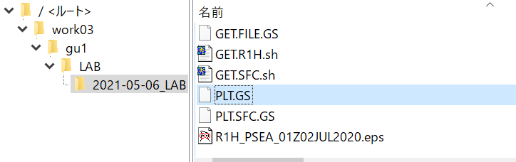

GrADSスクリプト入門
===========================

[[_TOC_]]
## はじめの一歩

### スクリプトファイル作成

```
$ cat > PLT.GS
```


**カーソルが$マークの下に出ていることを確認する**

詳細は下記参照

https://www.ibm.com/docs/ja/aix/7.2?topic=redirection-creating-text-file-from-keyboard

もしくは,

cat リダイレクト CTRL+D

で検索


**下記の灰色の部分をコピーして, 貼り付け**

```
'sdfopen /work01/DATA/MSM/MSM-S/r1h/2020/0702.nc'
'sdfopen /work01/DATA/MSM/MSM-S/2020/0702.nc'

'q ctlinfo 1'
'q ctlinfo 2'

'set time 06Z02JUL2020'
'q dims 1'
'q dims 2'

'cc'
'set xlab on'
'set ylab on'
'color 0 30 3 -kind white->antiquewhite->mistyrose->lightpink->mediumvioletred->navy->darkblue->blue->dodgerblue->aqua'
'set mpdset hires'
'd r1h'
'cbarn'

'set gxout vector'
'set ccolor 0'
'set cthick 10'
'd skip(u.2,20,20);v.2'
'set ccolor 1'
'set cthick 4'
'd skip(u.2,20,20);v.2'

'set xlab off'
'set ylab off'

'set gxout contour'
'set cint 2'
'set ccolor 0'
'set cthick 10'
'd psea.2/100'

'set clskip 2'
'set clopts 1 4 0.16'
'set cthick 2'
'set ccolor 1'
'd psea.2/100'

'draw title MSM 06Z02JUL2020'
'gxprint R1H_PSEA_06Z02JUL2020.eps'
'!ls -lh R1H_PSEA_06Z02JUL2020.eps'

'close 2'
'close 1' 
```


**貼り付けたら，CTL+Dを押す**


プロンプト（$マーク）が画面に表示されるのを確認する

```
$
```


### GrADS起動

```
$ grads -bp
```

### スクリプト実行

```
ga-> PLT.GS
```

> white->antiquewhite->mistyrose->lightpink->mediumvioletred->navy->darkblue->blue->dodgerblue->aqua
> clevs= 0 3 6 9 12 15 18 21 24 27 30
> ccols= 16 17 18 19 20 21 22 23 24 25 26 27
> -rw-r--r--. 1 gu1 oc 1.2M  5月  6 20:26 R1H_PSEA_01Z02JUL2020.eps

### GrADS終了

```
ga-> quit
```


### スクリプトファイルの書き換え方法

WinSCPを開く  




該当のファイル（今の場合PLT.GS）を右クリック→ 編集→内臓エディタ  

編集が終わったら，画面右上の×を押して，画面を閉じる

GrADS起動に戻る  


注：より効率的なやり方については次回以降で説明

### GrADSスクリプトの参考資料

http://wind.gp.tohoku.ac.jp/index.php?%B8%F8%B3%AB%BE%F0%CA%F3/GrADS/GrADS%A5%B9%A5%AF%A5%EA%A5%D7%A5%C8%A4%CETips

https://seesaawiki.jp/ykamae_grads-note/d/GrADS%A5%B9%A5%AF%A5%EA%A5%D7%A5%C8%A4%C7%A4%E8%A4%AF%BB%C8%A4%A6%CA%B8%A4%DE%A4%C8%A4%E1


## デバッグ

### デバッグ (debug)とは  

プログラムの誤りを直すこと  

詳しくは, 

https://ja.wikipedia.org/wiki/%E3%83%87%E3%83%90%E3%83%83%E3%82%B0

https://www.marubun.co.jp/service/technicalsquare/a7ijkd000000e6j3.html

### デバッグの例

#### エラーが起こった状況を再現する

```
$ grads -bp
```

```
ga-> sdfopen /work01/DATA/MSM/MSM-S/r1h/2019/0827.nc
```

Scanning self-describing file:  /work01/DATA/MSM/MSM-S/r1h/2019/0827.nc  
SDF file /work01/DATA/MSM/MSM-S/r1h/2019/0827.nc is open as file 1　  　


```
ga-> sdfopen /work01/DATA/MSM/MSM-S/2019/0827.nc
```

Scanning self-describing file:  /work01/DATA/MSM/MSM-S/2019/0827.nc  
SDF file /work01/DATA/MSM/MSM-S/2019/0828.nc is open as file **2**  


```
ga-> set time 00Z27AUG2019
```

Time values set: **2019:8:27:0 2019:8:27:0**  

```
ga-> d r1h.1
```

Data Request <u>Warning</u>:  **Request is completely outside file limits**   
  **Entire grid contents are set to missing data**  
  Grid limits of file:     X = 1 481  Y = 1 505  Z = 1 1  T = 1 24  E = 1 1  
  Grid limits of request:  X = 1 481  Y = 1 505  Z = 1 1  T = 0 0  E = 1 1  
  <u>Warning</u> issued for variable = **r1h.1**  
**Cannot contour grid** - **all undefined values**    

  

#### エラーメッセージを読んで，エラーの内容を把握する  

Request is completely outside file limits  → 範囲外のデータを作図した  

<u>Warning</u> issued for variable = **r1h.1**    →  ファイル番号1のr1hの作図の際に問題が生じた  

Cannot contour grid - all undefined values      →   r1hにはすべて未定義値となっている  

- エラーの発生している箇所を特定する

- どのようなエラーなのか把握する

  　

#### 詳しい情報を得る

```
ga-> set dfile 1
```

Default file set to: /work01/DATA/MSM/MSM-S/r1h/2019/0827.nc  

```
ga-> q dims
```

Default file number is: 1  
X is varying   Lon = 120 to 150   X = 1 to 481  
Y is varying   Lat = 22.4 to 47.6   Y = 1 to 505  
Z is fixed     Lev = 0  Z = 1  
T is fixed     Time = **00Z27AUG2019**  T = 0  
E is fixed     Ens = 1  E = 1  

```
ga-> q ctlinfo
```

dset /work01/DATA/MSM/MSM-S/r1h/2019/0827.nc  

...   

tdef 24 linear **01**Z27AUG2019 60mn    

27日<u>01時</u>から<u>データが始まっている</u> → 27日<u>00時</u><u>のデータは</u>，使用しているファイル ( /work01/DATA/MSM/MSM-S/r1h/2019/0827.nc)には<u>入っていない</u>    


### バグの修正

今回の場合は，使用するファイルを別な日付のものに変更する  


### まとめ

デバッグの手順  

エラーが起こった状況を再現する  

エラーメッセージを読んで，エラーの内容を把握する  

- エラーの発生している箇所を特定する
- どのようなエラーなのか把握する

詳しい情報を得る  

バグの修正  


## BASHスクリプト

### 概要

bashとは   
Linuxのシェルの一種  
シェルとは  
https://eng-entrance.com/linux-shell    

スクリプトとは  
シェル上で動かすことのできる簡単なプログラム 

### 準備

```
$ mkdir -vp LAB
```

```
$ cd LAB
```

```
$ mkdir -vp $(myymdh)
```

mkdir: ディレクトリ \`2021-05-20_11\' を作成しました  

```
$ myymdh
```

2021-05-20_11

```
$ locate myymdh
```

/work03/am/mybin/myymdh  
/work04/work03/am/mybin/myymdh   

```
$ cat /work03/am/mybin/myymdh
```

```
#!/bin/bash

date "+%Y-%m-%d_%H"
```


### 簡単な例   

```
$ cat > ex01.sh    
```

\>記号をリダイレクトと呼ぶ。これを使うと，下記のようにコピペでテキストファイルを新規作成できる。  
下の四角で囲まれた部分をコピー (ドラッグして反転表示させてCTL+C)    

```
echo
date -R
echo
```

Rloginの画面に戻り右クリックで貼り付け    
（もしくは，Rloginのメニュー→編集→貼り付け）    

**CTL+Dを押す** 
(今後CTL+Dと略記する)  

プロンプト（$マーク）が画面に表示されるのを確認する   


**コピー結果確認**　　  

```
$ cat ex01.sh  
```

```
echo
date -R
echo
```

\>が無いことに注意。\>が無いとファイルの書き込みでなく，ファイルの内容を表示させる，という意味になる。  

```
$ bash ex01.sh  
```

Sat, 15 May 2021 18:25:37 +0900    

```
$ ll ex01.sh  
```

-rw-r--r--. 1 gu1 18 2021-05-15 18:25 ex01.sh  

```
$ chmod u+x ex01.sh  
```

```
$ ll  
```

合計 4.0K  
-rwxr--r--. 1 gu1 18 2021-05-15 18:25 ex01.sh*  

```
$ ex01.sh 
```

Sat, 15 May 2021 18:26:13 +0900    


### シェルスクリプト入門用の資料  

https://gitlab.com/infoaofd/lab/-/blob/master/LINUX/03.BASH_SCRIPT/LINUX_SCRIPT_TUTORIAL.md  


### サンプル

MSMデータをダウンロードするシェルスクリプトの例  

```
$ ls /work01/DATA/MSM/MSM-P/
```

2016/  2017/  2018/  2019/  2020/

```
$ cat > DLMSM3D.sh
```

```
Y=2020; M=07; D=02
ORG=http://database.rish.kyoto-u.ac.jp/arch/jmadata/data/gpv/netcdf/MSM-P/$Y
DEST=/work01/DATA/MSM/MSM-P/$Y

mkdir -vp $DEST

wget -nv -nc -P $DEST $ORG/$M$D.nc

OUT=$DEST/$M$D.nc
echo
if [ -f $OUT ]; then
ls -lh $DEST/$M$D.nc
else
echo ERROR: NO SUCH FILE $M$D.nc in $DEST. 
exit 1
fi
exit 0
```

CTL+D

```
$ cat MAPMSM3D.GS 
```


```
$ chmod u+x DLMSM3D.sh   
```

```
$ DLMSM3D.sh   
```

2021-05-15 18:33:43 URL:http://database.rish.kyoto-u.ac.jp/arch/jmadata/data/gpv/netcdf/MSM-P/2020/0702.nc [187313144/187313144] ->   "/work01/DATA/MSM/MSM-P/2020/0702.nc" [1]  
    
-rw-r--r--. 1 gu1 oc 179M  7月  3  2020 /work01/DATA/MSM/MSM-P/2020/0702.nc    


#### データ内容の確認

```
$ ncdump -h /work01/DATA/MSM/MSM-P/2020/0702.nc
```

```
netcdf \0702 {
dimensions:
        lon = 241 ;
        lat = 253 ;
        p = 16 ;
        time = 8 ;
variables:
        float lon(lon) ;
                lon:long_name = "longitude" ;
                lon:units = "degrees_east" ;
                lon:standard_name = "longitude" ;
        float lat(lat) ;
                lat:long_name = "latitude" ;
                lat:units = "degrees_north" ;
                lat:standard_name = "latitude" ;
        float p(p) ;
                p:long_name = "pressure level" ;
                p:standard_name = "air_pressure" ;
                p:units = "hPa" ;
        float time(time) ;
                time:long_name = "time" ;
                time:standard_name = "time" ;
                time:units = "hours since 2020-07-02 00:00:00+00:00" ;
        double z(time, p, lat, lon) ;
                z:long_name = "geopotential height" ;
                z:units = "m" ;
                z:standard_name = "geopotential_height" ;
        double w(time, p, lat, lon) ;
                w:long_name = "vertical velocity in p" ;
                w:units = "Pa/s" ;
                w:standard_name = "lagrangian_tendency_of_air_pressure" ;
        short u(time, p, lat, lon) ;
                u:scale_factor = 0.006116208155 ;
                u:add_offset = 0. ;
                u:long_name = "eastward component of wind" ;
                u:units = "m/s" ;
                u:standard_name = "eastward_wind" ;
        short v(time, p, lat, lon) ;
                v:scale_factor = 0.006116208155 ;
                v:add_offset = 0. ;
                v:long_name = "northward component of wind" ;
                v:units = "m/s" ;
                v:standard_name = "northward_wind" ;
        short temp(time, p, lat, lon) ;
                temp:scale_factor = 0.002613491379 ;
                temp:add_offset = 255.4004974 ;
                temp:long_name = "temperature" ;
                temp:units = "K" ;
                temp:standard_name = "air_temperature" ;
        short rh(time, p, lat, lon) ;
                rh:scale_factor = 0.002293577883 ;
                rh:add_offset = 75. ;
                rh:long_name = "relative humidity" ;
                rh:units = "%" ;
                rh:standard_name = "relative_humidity" ;

// global attributes:
                :Conventions = "CF-1.0" ;
                :history = "created by create_1daync_msm_p.rb  2020-07-03" ;
}
```


## GrADSスクリプト　初めの一歩

### スクリプトファイル作成

```
$ cat > MAPMSM3D.GS
```

```
Y=2020
MM=07
MMM=JUL
DD=02
HH=06
PLEV=850

'sdfopen /work01/DATA/MSM/MSM-P/' Y '/' MM '' DD '.nc'

'q ctlinfo 1'

'set time ' HH 'Z'DD''MMM''Y
'set lev 'PLEV

say
'q dims'
say result
say

'cc'
'set xlab on'
'set ylab on'
'color 8 23 1 -kind cyan->blue->palegreen->azure->white->papayawhip->gold->red->magenta'
'set mpdset hires'
'd temp-273.15'
'cbarn'

'set xlab off'
'set ylab off'

'set gxout vector'
'set ccolor 0'
'set cthick 10'
'd skip(u,10,10);v'
'set ccolor 1'
'set cthick 4'
'd skip(u,10,10);v'

'set gxout contour'
'set clab off'
'set ccolor 0'
'set cthick 10'
'd z/1000'

'set clab on'
'set clskip 2'
'set clopts 1 4 0.16'
'set cthick 2'
'set ccolor 1'
'd z/1000'

'draw title MSM 'PLEV' 'HH 'Z'DD''MMM''Y
FIG='MAP_' HH 'Z'DD''MMM''Y'_'PLEV'.eps'
'gxprint 'FIG
say
'!ls -lh 'FIG
say
'quit'
```

CTL+D


### GrADS起動とスクリプト実行

```
$ grads -bcp MAPMSM3D.GS
```

c: 指定されたスクリプトを実行する　　

b: バッチモード（プロンプト無し）　　

p: ポートレイトモード（画面を縦長に使う）　　

> Default file number is: 1
> X is varying   Lon = **120 to 150**   X = 1 to 241
> Y is varying   Lat = 22.4 to 47.6   Y = 1 to 253
> Z is fixed     Lev = **850**  Z = 6
> T is fixed     Time = **06Z02JUL2020**  T = 3
> E is fixed     Ens = 1  E = 1
>
> Warning: Could not retrieve scale factor -- setting to 1.0
> Warning: Could not retrieve add offset -- setting to 0.0
>
> -rw-r--r--. 1 gu1 oc 981K  5月 17 18:45 MSM3D_06Z02JUL2020_850.eps　


#### 引用符(')の使い方

```
$ cat > appo01.gs
```

```
A=10

say
say 'A='A
say
say 'A=A'
say

'quit'
```

 CTL+D

```
$ grads -bcp appo01.gs 
```

Grid Analysis and Display System (GrADS) Version 2.2.1  
.....  

A=10  

A=A  

GX Package Terminated     


**引用符の扱い**  

引用符(')で囲まれた部分はそのまま文字として解釈される。    

引用符で囲まれていない部分は，変数として解釈され，変数に値が代入される。  

もし変数に何も値が入っていない場合，何も代入されない  


### 緯度高度断面

```
$ cat > LATZMSM3D.GS 
```

```
Y=2020
MM=07
MMM=JUL
DD=02
HH=06
PLEV='1000 200'
LON=130

'sdfopen /work01/DATA/MSM/MSM-P/' Y '/' MM '' DD '.nc'

'q ctlinfo 1'

'set time ' HH 'Z'DD''MMM''Y
'set lon 'LON
'set lev 'PLEV

say
'q dims'
say result
say

'cc'

'set xlab on'
'set ylab on'
'color -50 30 5 -kind cyan->blue->palegreen->azure->white->papayawhip->gold->red->magenta'
'set mpdset hires'
'd temp-273.15'

'cbarn'

'set xlab off'
'set ylab off'

'set gxout vector'
'set ccolor 0'
'set cthick 10'
'd skip(u,10,1);v'
'set ccolor 1'
'set cthick 4'
'd skip(u,10,1);v'

'set gxout contour'
'set clab off'
'set ccolor 0'
'set cthick 10'
'd z/1000'

'set clab on'
'set clskip 1'
'set clopts 1 4 0.16'
'set cthick 2'
'set ccolor 1'
'd z/1000'

'draw title MSM 'LON' 'HH 'Z'DD''MMM''Y
FIG='LATZ_' HH 'Z'DD''MMM''Y'_'LON'.eps'
'gxprint 'FIG
say
'!ls -lh 'FIG
say
'quit'
```

CTL+D

```
$ grads -bcp LATZMSM3D.GS
```

> Default file number is: 1  
> X is fixed     Lon = **130**  X = 81  
> Y is varying   Lat = **22.4 to 47.6**   Y = 1 to 253  
> Z is varying   Lev = 1000 to 200   Z = 1 to 14  
> T is fixed     Time = **06Z02JUL2020**  T = 3  
> E is fixed     Ens = 1  E = 1  
> Warning: Could not retrieve scale factor -- setting to 1.0  
> Warning: Could not retrieve add offset -- setting to 0.0  
>
> -rw-r--r--. 1 gu1 oc 392K  5月 17 18:44 LATZ_06Z02JUL2020_130.eps  


### 図のサイズを変える　　

```
$ cat > LATZMSM3D.2.GS
```

```
Y=2020
MM=07
MMM=JUL
DD=02
HH=06
PLEV='1000 200'
LON=130

'sdfopen /work01/DATA/MSM/MSM-P/' Y '/' MM '' DD '.nc'

'q ctlinfo 1'

'set time ' HH 'Z'DD''MMM''Y
'set lon 'LON
'set lev 'PLEV

say
'q dims'
say result
say

'cc'

'set vpage 0.0 8.5 0.0 11'

xs=1; xe=6
ys=3; ye=10
'set parea 'xs ' 'xe' 'ys' 'ye

'set xlab on'
'set ylab on'
'color -50 30 5 -kind cyan->blue->palegreen->azure->white->papayawhip->gold->red->magenta'
'set mpdset hires'
'd temp-273.15'

'xcbar 6.5 6.6 3 10 -fw 0.12 -fh 0.17 -ft 4 -fs 2'

'set xlab off'
'set ylab off'

'set gxout vector'
'set ccolor 0'
'set cthick 10'
'd skip(u,10,1);v'
'set ccolor 1'
'set cthick 4'
'd skip(u,10,1);v'

'set gxout contour'
'set clab off'
'set ccolor 0'
'set cthick 10'
'd z/1000'

'set clab on'
'set clskip 1'
'set clopts 1 4 0.16'
'set cthick 2'
'set ccolor 1'
'd z/1000'

'draw title MSM 'LON' 'HH 'Z'DD''MMM''Y
FIG='LATZ_' HH 'Z'DD''MMM''Y'_'LON'.eps'
'gxprint 'FIG
say
'!ls -lh 'FIG
say
'quit'
```

CTL+D  

```
$ grads -bcp LATZMSM3D.2.GS 
```

> Default file number is: 1  
> X is fixed     Lon = **130**  X = 81  
> Y is varying   Lat = 22.4 to **47.6**   Y = 1 to 253  
> Z is varying   Lev = 1000 to **200**   Z = 1 to 14  
> T is fixed     Time = **06Z02JUL2020**  T = 3  
> E is fixed     Ens = 1  E = 1  
> Warning: Could not retrieve scale factor -- setting to 1.0  
> Warning: Could not retrieve add offset -- setting to 0.0  
>
> -rw-r--r--. 1 gu1 oc 380K  5月 17 18:43 LATZ_06Z02JUL2020_130.eps  


#### set vpageとset pareaについて  

```
'set vpage 0.0 8.5 0.0 11'

xs=1; xe=6
ys=3; ye=10
'set parea 'xs ' 'xe' 'ys' 'ye
```

http://akyura.sakura.ne.jp/study/GrADS/Command/page.html  

http://mausam.hyarc.nagoya-u.ac.jp/~hatsuki/grads/node7.html  

  

**もう少し凝ったやり方 ** 

```bash
xs = 1
ytop=9

xwid = 5
ywid = 6

xe = xs + xwid
ye = ytop
ys = ye - ywid

'set vpage 0.0 8.5 0.0 11'
'set parea 'xs ' 'xe' 'ys' 'ye
```


### xcbar使用法  

http://kodama.fubuki.info/wiki/wiki.cgi/GrADS/script/xcbar.gs?lang=jp  


### 経度高度断面

```
$ cat > LONZMSM3D.GS 
```

```
Y=2020
MM=07
MMM=JUL
DD=02
HH=06
PLEV='1000 200'
LAT=30

'sdfopen /work01/DATA/MSM/MSM-P/' Y '/' MM '' DD '.nc'

'q ctlinfo 1'

'set time ' HH 'Z'DD''MMM''Y
'set lat 'LAT
'set lev 'PLEV

say
'q dims'
say result
say

'cc'

'set vpage 0.0 8.5 0.0 11'

xs=1; xe=6
ys=3; ye=10
'set parea 'xs ' 'xe' 'ys' 'ye

'set xlab on'
'set ylab on'
'color -50 30 5 -kind cyan->blue->palegreen->azure->white->papayawhip->gold->red->magenta'
'set mpdset hires'
'd temp-273.15'

'xcbar 6.5 6.6 3 10 -fw 0.12 -fh 0.17 -ft 4 -fs 2'

'set xlab off'
'set ylab off'

'set gxout vector'
'set ccolor 0'
'set cthick 10'
'd skip(u,10,1);v'
'set ccolor 1'
'set cthick 4'
'd skip(u,10,1);v'

'set gxout contour'
'set clab off'
'set ccolor 0'
'set cthick 10'
'd z/1000'

'set clab on'
'set clskip 1'
'set clopts 1 4 0.16'
'set cthick 2'
'set ccolor 1'
'd z/1000'

'draw title MSM 'LAT' 'HH 'Z'DD''MMM''Y
FIG='LONZ_' HH 'Z'DD''MMM''Y'_'LAT'.eps'
'gxprint 'FIG
say
'!ls -lh 'FIG
say
'quit'
```

CTL+D    

```
$ grads -bcp LONZMSM3D.GS 
```

> Default file number is: 1  
> X is varying   Lon = **120** to **150**   X = 1 to 241  
> Y is fixed     Lat = **30**  Y = 77  
> Z is varying   Lev = **1000** to 200   Z = 1 to 14  
> T is fixed     Time = 06Z02JUL2020  T = 3  
> E is fixed     Ens = 1  E = 1  
> Warning: Could not retrieve scale factor -- setting to 1.0  
> Warning: Could not retrieve add offset -- setting to 0.0    
>
> -rw-r--r--. 1 gu1 oc 373K  5月 17 18:42 LONZ_06Z02JUL2020_30.eps  

### 時系列

```
$ cat > TSRMSM3D.GS 
```

```
Y1=2020; MM1=07; MMM1=JUL; DD1=02; HH1=00
Y2=2020; MM2=07; MMM2=JUL; DD2=02; HH2=21
TIME1=HH1 'Z' DD1 '' MMM1 '' Y1
TIME2=HH2 'Z' DD2 '' MMM2 '' Y2
say
say 'TIME1=' TIME1 ' TIME2=' TIME2
say

PLEV='1000'
LON=130
LAT=30

'sdfopen /work01/DATA/MSM/MSM-P/' Y1 '/' MM1 '' DD1 '.nc'

'q ctlinfo 1'

'set time 'TIME1' 'TIME2
'set lon 'LON
'set lat 'LAT
'set lev 'PLEV

say
'q dims'
say result
say

'cc'

'set vpage 0.0 8.5 0.0 11'

xs=1; xe=6
ys=3; ye=10
'set parea 'xs ' 'xe' 'ys' 'ye

'set xlab on'
'set ylab on'


'set gxout line'
'set ccolor 1'
'set cthick 3'
'set cstyle 1'
'set cmark 0'

'set vrange 24 28'

'd temp-273.15'

'set xlab off'
'set ylab off'

'draw title MSM 'LAT'N 'LON'E ' PLEV' hPa'
FIG='TSR_'PLEV'_'LAT'N'LON'E.eps'

'gxprint 'FIG
say
'!ls -lh 'FIG
say
'quit'

```

CTL+D

```
$ grads -bcp TSRMSM3D.GS
```

> Default file number is: 1
> X is fixed     Lon = 130  X = 81
> Y is fixed     Lat = 30  Y = 77
> Z is fixed     Lev = 1000  Z = 1
> T is varying   Time = **00Z02JUL2020** to **21Z02JUL2020**  T = 1 to 8
> E is fixed     Ens = 1  E = 1
>
> 
>
> -rw-r--r--. 1 gu1 oc 65K  5月 17 18:31 TSR_1000_30N130E.eps


**描画する時間帯の設定**      

```
Y1=2020; MM1=07; MMM1=JUL; DD1=02; HH1=00
Y2=2020; MM2=07; MMM2=JUL; DD2=02; HH2=21
TIME1=HH1 'Z' DD1 '' MMM1 '' Y1
TIME2=HH2 'Z' DD2 '' MMM2 '' Y2
say
say 'TIME1=' TIME1 ' TIME2=' TIME2
say
```

  

**描画する地点の設定**       

```
PLEV='1000'
LON=130
LAT=30
```


**GrADSに設定内容を指示**    

```
'set time 'TIME1' 'TIME2
'set lon 'LON
'set lat 'LAT
'set lev 'PLEV
```


**折れ線グラフ指定**    

```
'set gxout line'
```


**グラフの線の設定**    

```
'set ccolor 1'
'set cthick 3'
'set cstyle 1'
'set cmark 0'
```


**グラフの縦軸の範囲を指定**    

```
'set vrange 24 28'
```


### 鉛直プロファイル

```
$ cat > VPMSM3D.GS
```

```
Y=2020
MM=07
MMM=JUL
DD=02
HH=06
PLEV='1000 200'
LAT=30
LON=130

'sdfopen /work01/DATA/MSM/MSM-P/' Y '/' MM '' DD '.nc'

'q ctlinfo 1'

'set time ' HH 'Z'DD''MMM''Y
'set lon 'LON
'set lat 'LAT
'set lev 'PLEV

say
'q dims'
say result
say

'cc'
'set xlab on'
'set ylab on'


'set gxout line'
'set ccolor 1'
'set cthick 3'
'set cstyle 1'
'set cmark 0'

'd temp-273.15'

'draw title MSM 'LAT' 'LON' 'HH 'Z'DD''MMM''Y
FIG='VP_' HH 'Z'DD''MMM''Y'_'LAT'_'LON'.eps'
'gxprint 'FIG
say
'!ls -lh 'FIG
say
'quit'
```

CTL+D

```
$ grads -bcp VPMSM3D.GS
```

> Default file number is: 1
> X is fixed     Lon = **130**  X = 81
> Y is fixed     Lat = **30**  Y = 77
> Z is varying   Lev = 1000 to 200   Z = 1 to 14
> T is fixed     Time = **06Z02JUL2020**  T = 3
> E is fixed     Ens = 1  E = 1
>
> 
>
> -rw-r--r--. 1 gu1 oc 97K  5月 17 20:22 VP_06Z02JUL2020_30_130.eps


### 経度時間断面

横軸に経度，縦軸に時間をとったホフメラー図

```
$ cat > LONTMSM3D.GS
```

```
Y1=2020; MM1=07; MMM1=JUL; DD1=02; HH1=00
Y2=2020; MM2=07; MMM2=JUL; DD2=02; HH2=21
TIME1=HH1 'Z' DD1 '' MMM1 '' Y1
TIME2=HH2 'Z' DD2 '' MMM2 '' Y2
say
say 'TIME1=' TIME1 ' TIME2=' TIME2
say

PLEV='850'
LON='120 140'
LAT=30

'sdfopen /work01/DATA/MSM/MSM-P/' Y1 '/' MM1 '' DD1 '.nc'

'q ctlinfo 1'

'set time 'TIME1' 'TIME2
'set lon 'LON
'set lat 'LAT
'set lev 'PLEV

say
'q dims'
say result
say

'cc'

'set vpage 0.0 8.5 0.0 11'

xs=2; xe=6
ys=3; ye=10
'set parea 'xs ' 'xe' 'ys' 'ye

'set xlab on'
'set ylab on'

'set xlint 4'

'color 17 20 0.5 -kind cyan->blue->palegreen->azure->white->papayawhip->gold->red->magenta'

'd temp-273.15'

'xcbar 6.5 6.6 3 10 -fw 0.12 -fh 0.17 -ft 4 -fs 2'

'set xlab off'
'set ylab off'

'set gxout vector'
'set ccolor 0'
'set cthick 10'
'd skip(u,10,1);v'
'set ccolor 1'
'set cthick 4'
'd skip(u,10,1);v'

'set gxout contour'
'set clab off'
'set ccolor 0'
'set cthick 10'
'd z/1000'

'set clab on'
'set clskip 1'
'set clopts 1 4 0.16'
'set cthick 2'
'set ccolor 1'
'd z/1000'

'draw title MSM 'LAT'N 'PLEV' hPa'

FIG='LONT_'PLEV'_'LAT'N.eps'

'gxprint 'FIG
say
'!ls -lh 'FIG
say
'quit'
```

CTL+D

```
$ grads -bcp LONTMSM3D.GS
```

> Default file number is: 1  
> X is varying   Lon = **120 to 140**   X = 1 to 161  
> Y is fixed     Lat = 30  Y = 77  
> Z is fixed     Lev = **850**  Z = 6  
> T is varying   Time = **00Z02JUL2020** to **21Z02JUL2020**  T = 1 to 8 
> E is fixed     Ens = 1  E = 1  
>
> cyan->blue->palegreen->azure->white->papayawhip->gold->red->magenta
> clevs= 17 17.5 18 18.5 19 19.5 20
> ccols= 16 17 18 19 20 21 22 23
>
> -rw-r--r--. 1 gu1 oc 198K  5月 17 18:32 LONT_850_30N.eps


###  緯度時間断面

横軸に緯度，縦軸に時間をとったホフメラー図

```
$ cat > LATTMSM3D.GS
```

```
Y1=2020; MM1=07; MMM1=JUL; DD1=02; HH1=00
Y2=2020; MM2=07; MMM2=JUL; DD2=02; HH2=21
TIME1=HH1 'Z' DD1 '' MMM1 '' Y1
TIME2=HH2 'Z' DD2 '' MMM2 '' Y2
say
say 'TIME1=' TIME1 ' TIME2=' TIME2
say

PLEV='850'
LON='130'
LAT='22 45'

'sdfopen /work01/DATA/MSM/MSM-P/' Y1 '/' MM1 '' DD1 '.nc'

'q ctlinfo 1'

'set time 'TIME1' 'TIME2
'set lon 'LON
'set lat 'LAT
'set lev 'PLEV

say
'q dims'
say result
say

'cc'

'set vpage 0.0 8.5 0.0 11'

xs=2; xe=6
ys=3; ye=10
'set parea 'xs ' 'xe' 'ys' 'ye

'set xlab on'
'set ylab on'

'set xlint 4'

'color 10 20 1 -kind cyan->blue->palegreen->azure->white->papayawhip->gold->red->magenta'

'd temp-273.15'

'xcbar 6.5 6.6 3 10 -fw 0.12 -fh 0.17 -ft 4 -fs 2'

'set xlab off'
'set ylab off'

'set gxout contour'
'set clab off'
'set ccolor 0'
'set cthick 10'
'set cint 0.01'
'd z/1000'

'set clab on'
'set clskip 1'
'set clopts 1 4 0.16'
'set cthick 2'
'set ccolor 1'
'set cint 0.01'
'd z/1000'

'set gxout vector'
'set ccolor 0'
'set cthick 10'
'd skip(u,10,1);v'
'set ccolor 1'
'set cthick 4'
'd skip(u,10,1);v'

'draw title MSM 'LON'E 'PLEV' hPa'

FIG='LATT_'PLEV'_'LON'E.eps'

'gxprint 'FIG
say
'!ls -lh 'FIG
say
'quit'
```

CTL+D

```
$ grads -bcp LATTMSM3D.GS
```

> Default file number is: 1
> X is fixed     Lon = **130**  X = 81
> Y is varying   Lat = **22 to 45**   Y = -2.99998 to 227
> Z is fixed     Lev = 850  Z = 6
> T is varying   Time = **00Z02JUL2020** to **21Z02JUL2020**  T = 1 to 8
> E is fixed     Ens = 1  E = 1
>
> 
>
> Warning: Could not retrieve scale factor -- setting to 1.0
> Warning: Could not retrieve add offset -- setting to 0.0
>
> -rw-r--r--. 1 gu1 oc 192K  5月 17 18:40 LATT_850_130E.eps


### 時間高度断面

```
$ cat > TZ_MSM3D.GS
```

```
Y1=2020; MM1=07; MMM1=JUL; DD1=02; HH1=00
Y2=2020; MM2=07; MMM2=JUL; DD2=02; HH2=21
TIME1=HH1 'Z' DD1 '' MMM1 '' Y1
TIME2=HH2 'Z' DD2 '' MMM2 '' Y2
say
say 'TIME1=' TIME1 ' TIME2=' TIME2
say

PLEV='1000 200'
LON=130
LAT=30

'sdfopen /work01/DATA/MSM/MSM-P/' Y1 '/' MM1 '' DD1 '.nc'

'q ctlinfo 1'

'set time 'TIME1' 'TIME2
'set lon 'LON
'set lat 'LAT
'set lev 'PLEV

say
'q dims'
say result
say

'cc'

'set vpage 0.0 8.5 0.0 11'

xs=1; xe=6
ys=3; ye=10
'set parea 'xs ' 'xe' 'ys' 'ye

'set xlab on'
'set ylab on'
'color -50 30 5 -kind cyan->blue->palegreen->azure->white->papayawhip->gold->red->magenta'
'set mpdset hires'
'd temp-273.15'

'xcbar 6.5 6.6 3 10 -fw 0.12 -fh 0.17 -ft 4 -fs 2'

'set xlab off'
'set ylab off'

'set gxout vector'
'set ccolor 0'
'set cthick 10'
'd skip(u,1,1);v'
'set ccolor 1'
'set cthick 4'
'd skip(u,1,1);v'

'set gxout contour'
'set clab off'
'set ccolor 0'
'set cthick 10'
'd z/1000'

'set clab on'
'set clskip 1'
'set clopts 1 4 0.16'
'set cthick 2'
'set ccolor 1'
'd z/1000'

'draw title MSM 'LAT'N 'LON'E'

FIG='TZ_LAT' LAT '_LON' LON '.eps'
'gxprint 'FIG
say

'!ls -lh 'FIG
say
'quit'
```

CTL+D

```
$ grads -bcp TZ_MSM3D.GS
```


### 領域平均の時系列

```
$ cat > TSR_AAV.GS
```

```
Y1=2020; MM1=07; MMM1=JUL; DD1=02; HH1=00
Y2=2020; MM2=07; MMM2=JUL; DD2=02; HH2=21
TIME1=HH1 'Z' DD1 '' MMM1 '' Y1
TIME2=HH2 'Z' DD2 '' MMM2 '' Y2
say
say 'TIME1=' TIME1 ' TIME2=' TIME2
say

PLEV='1000'
LONW=125; LONE=130
LATS=25 ; LATN=30

'sdfopen /work01/DATA/MSM/MSM-P/' Y1 '/' MM1 '' DD1 '.nc'

'q ctlinfo 1'

'set time 'TIME1' 'TIME2
'set lon 'LONW
'set lat 'LATS
'set lev 'PLEV

'TAAV=tloop(aave(temp,lon=' LONW ',lon='LONE',lat='LATS',lat='LATN'))'

say
'q dims'
say result
say

'cc'

'set vpage 0.0 8.5 0.0 11'

xs=1; xe=6
ys=3; ye=10
'set parea 'xs ' 'xe' 'ys' 'ye

'set xlab on'
'set ylab on'

'set gxout line'
'set ccolor 1'
'set cthick 3'
'set cstyle 1'
'set cmark 0'

'set vrange 24 28'

'd TAAV-273.15'

'set xlab off'
'set ylab off'

'draw title MSM 'LATS'-'LATN'N 'LONW'-'LONE'E' PLEV'hPa'
FIG='TSR_'PLEV'_'LATS'-'LATN'N_'LONW'-'LONE'E.eps'

'gxprint 'FIG
say
'!ls -lh 'FIG
say
'quit'
```

CTL+D

```
$ grads -bcp TSR_AAV.GS
```

> Default file number is: 1
> X is fixed     Lon = **125**  X = 41
> Y is fixed     Lat = 25  Y = 27
> Z is fixed     Lev = **1000**  Z = 1
> T is varying   Time = **00Z02JUL2020 to 21Z02JUL2020**  T = 1 to 8
> E is fixed     Ens = 1  E = 1
>
> 
>
> -rw-r--r--. 1 gu1 oc 67K  5月 17 20:26 TSR_1000_25-30N_125-130E.eps

**tloopに関する資料**    

http://cola.gmu.edu/grads/gadoc/gradfunctloop.html      


### 任意方向の断面図

経線・緯線に平行でない方向（ななめ方向）の断面図の作成法   

https://gradsaddict.blogspot.com/2013/05/tutorial-draw-arbitrary-cross-section.html

http://www.met.wur.nl/education/atd/Practical/functions/across.gs

```
$ cat > ARB_Z_MSM3D.GS
```

```
# https://gradsaddict.blogspot.com/2013/05/tutorial-draw-arbitrary-cross-section.html

# http://www.met.wur.nl/education/atd/Practical/functions/across.gs

Y=2020
MM=07
MMM=JUL
DD=02
HH=06
PLEV='1000 200'

lon1 = 123
lon2 = 130
lat1 = 24
lat2 = 32

'sdfopen /work01/DATA/MSM/MSM-P/' Y '/' MM '' DD '.nc'

'q ctlinfo 1'


'set time ' HH 'Z'DD''MMM''Y
'set x 1'
'set y 1'
'set LEV 'PLEV


lon=lon1
'collect 1 free'
coeff=(lat2-lat1)/(lon2-lon1)
while (lon <= lon2)
  lat = lat1 + coeff*(lon-lon1)
  'collect 1 gr2stn(temp,'lon','lat')'
  lon = lon + 0.2
endwhile


'cc'
'set vpage 0.0 8.5 0.0 11'

xs=1; xe=6
ys=3; ye=10
'set parea 'xs ' 'xe' 'ys' 'ye


'set x 1 50'
say
'q dims'
say result
say

'set xaxis 'lon1' 'lon2

'color 200 300 5 -kind cyan->blue->palegreen->azure->white->papayawhip->gold->red->magenta'

'set xlab on'
'set ylab on'

'd coll2gr(1,-u)'

'xcbar 6.5 6.6 3 10 -fw 0.12 -fh 0.17 -ft 4 -fs 2'

'set xlab off'
'set ylab off'


'draw title MSM 'HH 'Z'DD''MMM''Y' 'lat1'N-'lat2'N 'lon1'E-'lon2'E'

FIG='ARB_Z_' HH 'Z'DD''MMM''Y'_'lat1'-'lat2'_'lon1'-'lon2'.eps'

'gxprint 'FIG
say
'!ls -lh 'FIG
say
'quit'
```

CTL+D  

```
$ grads -bcp ARB_Z_MSM3D.GS
```

> -rw-r--r--. 1 gu1 oc 107K  5月 17 21:24 ARB_Z_06Z02JUL2020_25-40_125-130.eps


### マニュアル  

**Drawing Arbitrary Cross Sections**　  　

http://cola.gmu.edu/grads/gadoc/usingstationdata.html#xsection  

**collect**  

http://cola.gmu.edu/grads/gadoc/gradcomdcollect.html  

**gr2stn**  

http://cola.gmu.edu/grads/gadoc/gradfuncgr2stn.html

**coll2gr **

http://cola.gmu.edu/grads/gadoc/gradfunccoll2gr.html  

**Tutorial: Draw arbitrary cross-section with terrain in pressure coordinates using GrADS**
(詳しい説明)
https://gradsaddict.blogspot.com/2013/05/tutorial-draw-arbitrary-cross-section.html


### シェルスクリプトにGrADSスクリプトを埋め込む

GrADSスクリプトでは，引用符(’)をつかって，変数名とそれ以外の部分を区別している。    

これは上の例のように，わかりにくいコードとなることが多い。  

これを避けるために, シェルスクリプトにGrADSスクリプトを埋め込むという手法がある。  

```
$ cat > ARB_Z_MSM3D.2.sh
```

```
#!/bin/bash

Y=2020; MM=07; MMM=JUL; DD=02; HH=06
PLEV1=1000; PLEV2=200
LON1=123; LON2=130
LAT1=24; LAT2=32

TIME=${HH}Z${DD}${MMM}${Y}
INDIR=/work01/DATA/MSM/MSM-P
INFLE=${INDIR}/$Y/${MM}${DD}.nc

FIG="ARB_Z_${Y}${MM}${DD}_${HH}_${LAT1}-${LAT2}_${LON1}-${LON2}.eps"

GS=$(basename $0 .sh).GS


# GRADS SCRIPT GOES HERE:
cat <<EOF>$GS

# https://gradsaddict.blogspot.com/2013/05/tutorial-draw-arbitrary-cross-section.html
# http://www.met.wur.nl/education/atd/Practical/functions/across.gs

Y=$Y; MM=$MM; MMM=$MMM; DD=$DD; HH=$HH
PLEV1=$PLEV1; PLEV2=$PLEV2
lon1=${LON1}; lon2=${LON2}
lat1=${LAT1}; lat2=${LAT2}


'sdfopen $INFLE'

'q ctlinfo 1'


'set time ${TIME}'
'set x 1'
'set y 1'
'set lev $PLEV1 $PLEV2'


lon=lon1
'collect 1 free'
coeff=(lat2-lat1)/(lon2-lon1)
while (lon <= lon2)
  lat = lat1 + coeff*(lon-lon1)
  'collect 1 gr2stn(temp,'lon','lat')'
  lon = lon + 0.2
endwhile


'cc'
'set vpage 0.0 8.5 0.0 11'

xs=1; xe=6
ys=3; ye=10
'set parea 'xs ' 'xe' 'ys' 'ye


'set x 1 50'
say
'q dims'
say result
say

'set xaxis $LON1 $LON2'

'color 200 300 5 -kind cyan->blue->palegreen->azure->white->papayawhip->gold->red->magenta'

'set xlab on'
'set ylab on'

'd coll2gr(1,-u)'

'xcbar 6.5 6.6 3 10 -fw 0.12 -fh 0.17 -ft 4 -fs 2'

'set xlab off'
'set ylab off'

'draw title MSM $TIME ${LAT1}N-${LAT2}N ${LON1}E-${LON2}E'


'gxprint $FIG'
say
'!ls -lh $FIG'
say
'quit'
EOF
# END OF GRADS SCRIPT

# RUN GRADS WHITHIN SHELL SCRIPT
grads -bcp "$GS"
```

CTL+D  

```
$ chmod u+x ARB_Z_MSM3D.2.sh
```

```
$ ARB_Z_MSM3D.2.sh
```

作成されたGrADSスクリプトを確認してみる  

```
$ cat ARB_Z_MSM3D.2.GS
```

```
# https://gradsaddict.blogspot.com/2013/05/tutorial-draw-arbitrary-cross-section.html

# http://www.met.wur.nl/education/atd/Practical/functions/across.gs

Y=2020; MM=07; MMM=JUL; DD=02; HH=06
PLEV1=1000; PLEV2=200
LON1=123; LON2=130
LAT1=24; LAT2=32


'sdfopen /work01/DATA/MSM/MSM-P/2020/0702.nc'

'q ctlinfo 1'


'set time 06Z02JUL2020'
'set x 1'
'set y 1'
'set lev 1000 200'


lon=lon1
'collect 1 free'
coeff=(lat2-lat1)/(lon2-lon1)
while (lon <= lon2)
  lat = lat1 + coeff*(lon-lon1)
  'collect 1 gr2stn(temp,'lon','lat')'
  lon = lon + 0.2
endwhile


'cc'
'set vpage 0.0 8.5 0.0 11'

xs=1; xe=6
ys=3; ye=10
'set parea 'xs ' 'xe' 'ys' 'ye


'set x 1 50'
say
'q dims'
say result
say

'set xaxis 125 130'

'color 200 300 5 -kind cyan->blue->palegreen->azure->white->papayawhip->gold->red->magenta'

'set xlab on'
'set ylab on'

'd coll2gr(1,-u)'

'xcbar 6.5 6.6 3 10 -fw 0.12 -fh 0.17 -ft 4 -fs 2'

'set xlab off'
'set ylab off'

'draw title MSM 06Z02JUL2020 25N-40N 125E-130E'


'gxprint ARB_Z_20200702_06_25-40_125-130.eps'
say
'!ls -lh ARB_Z_20200702_06_25-40_125-130.eps'
say
'quit'
```

$で始まるシェルスクリプトの変数が，実際の値に置き換わっていることに注意  


### 図にヘッダーを入れる

ファイルが増えてくるといつ，どこで作成した図かわからなくなり，  

- どのような条件で作成した結果なのかわからなくなる

- 後で図を清書するときなどに，使用したスクリプトやデータを探すのに苦労する

などいろいろ困ったことが起きる。  

これを避けるためには，図の余白にメモを入れるとよい。    

```
$ cat ARB_Z_MSM3D.3.sh
```

```
#!/bin/bash

Y=2020; MM=07; MMM=JUL; DD=02; HH=06
PLEV1=1000; PLEV2=200
LON1=123; LON2=130
LAT1=24; LAT2=32

TIME=${HH}Z${DD}${MMM}${Y}
INDIR=/work01/DATA/MSM/MSM-P
INFLE=${INDIR}/$Y/${MM}${DD}.nc

TITLE="MSM $TIME ${LAT1}N-${LAT2}N ${LON1}E-${LON2}E"

FIG="ARB_Z_${Y}${MM}${DD}_${HH}_${LAT1}-${LAT2}_${LON1}-${LON2}.eps"

HOST=$(hostname);     CWD=$(pwd)
TIMESTAMP=$(date -R); CMD="$0 $@"

GS=$(basename $0 .sh).GS

cat <<EOF>$GS

# https://gradsaddict.blogspot.com/2013/05/tutorial-draw-arbitrary-cross-section.html
# http://www.met.wur.nl/education/atd/Practical/functions/across.gs

Y=$Y; MM=$MM; MMM=$MMM; DD=$DD; HH=$HH
PLEV1=$PLEV1; PLEV2=$PLEV2
lon1=${LON1}; lon2=${LON2}
lat1=${LAT1}; lat2=${LAT2}


'sdfopen $INFLE'

'q ctlinfo 1'


'set time ${TIME}'
'set x 1'
'set y 1'
'set lev $PLEV1 $PLEV2'

say '### CREATE CROSS SECTION'
lon=lon1
dlon=0.2
'collect 1 free'
coeff=(lat2-lat1)/(lon2-lon1)
while (lon <= lon2)
  lat = lat1 + coeff*(lon-lon1) 
  'collect 1 gr2stn(temp,'lon','lat')'
  lon = lon + dlon
endwhile

nlon=(lon2-lon1)/dlon
say 'nlon = 'nlon

'cc'
'set vpage 0.0 8.5 0.0 11'

xs=1; xe=6
ys=3; ye=9
'set parea 'xs ' 'xe' 'ys' 'ye

say
'q dims'
say result
say


'set x 1 'nlon

'set xaxis $LON1 $LON2'

'color 200 300 1 -kind cyan->blue->palegreen->azure->\
white->papayawhip->gold->red->magenta '

'set xlab on'
'set ylab on'
'set xlint 1'

say '### PLOT'
'd coll2gr(1,-u)'


'set xlab off'
'set ylab off'

'set gxout contour'
'set cthick 1'
'set ccolor 1'
'set cint 1'
'set clskip 5'
'd coll2gr(1,-u)'

'q gxinfo'
#say result
line=sublin(result,3); xl=subwrd(line,4); xr=subwrd(line,6)
line=sublin(result,4); yb=subwrd(line,4); yt=subwrd(line,6)

say '### COLOR BAR'
x1=xr+0.2; x2=x1+0.1
y1=yb    ; y2=yt
'xcbar 'x1' 'x2' 'y1' 'y2 ' -fw 0.12 -fh 0.17 -ft 4 -fs 10'

say '### TITLE'
'set strsiz 0.12 0.14'
'set string 1 c 4 0'
xx = (xl+xr)/2; yy=yt+0.2
'draw string ' xx ' ' yy ' ${TITLE}'

say '### HEADER'
'set strsiz 0.12 0.14'
'set string 1 l 2 0'
xx = 0.2; yy=yy+0.5
'draw string ' xx ' ' yy ' ${GS}'
yy = yy+0.2
'draw string ' xx ' ' yy ' ${CMD}'
yy = yy+0.2
'draw string ' xx ' ' yy ' ${TIMESTAMP}'
yy = yy+0.2
'draw string ' xx ' ' yy ' ${HOST}'
yy = yy+0.2
'draw string ' xx ' ' yy ' ${CWD}'

'gxprint $FIG'
say
'!ls -lh $FIG'
say
'quit'
EOF

grads -bcp "$GS"
```

CTL+D

#### メモ

```
q gxinfo
```

現在のグラフィック環境の情報を表示する  

直前に描いた図の種類やページのサイズなどを取得できる  

(例)    

```
ga-> q gxinfo
Last Graphic = Contour
Page Size = 11 by 8.5
X Limits = 4.4 to 7.4
Y Limits = 1 to 4
Xaxis = Lat  Yaxis = Lev
Mproj = 2
```


次の3つのコマンドのマニュアルについては，

- set strsiz   

- set string  

- draw string  


http://mausam.hyarc.nagoya-u.ac.jp/~hatsuki/grads/node13.html  
を参照のこと


### 断面図のチェック

ななめ方向の断面図を書く際は，誤りがないか平面図と比較してチェックする  

```
$ cat > ARB_Z_MSM3D.3.CHK.sh
```

```
#!/bin/bash

Y=2020; MM=07; MMM=JUL; DD=02; HH=06
PLEV1=800
LON1=123; LON2=130
LAT1=24; LAT2=32

MLONW=115; MLONE=132
MLATS=22 ; MLATN=40
 
TIME=${HH}Z${DD}${MMM}${Y}
INDIR=/work01/DATA/MSM/MSM-P
INFLE=${INDIR}/$Y/${MM}${DD}.nc

TITLE="$TIME ${LAT1}N-${LAT2}N ${LON1}E-${LON2}E ${PLEV1}hPa"

FIG="ARB_Z_${Y}${MM}${DD}_${HH}_${LAT1}-${LAT2}_${LON1}-${LON2}_${PLEV1}_CHK.eps"

HOST=$(hostname);     CWD=$(pwd)
TIMESTAMP=$(date -R); CMD="$0 $@"

GS=$(basename $0 .sh).GS

cat <<EOF>$GS

# https://gradsaddict.blogspot.com/2013/05/tutorial-draw-arbitrary-cross-section.html
# http://www.met.wur.nl/education/atd/Practical/functions/across.gs

Y=$Y; MM=$MM; MMM=$MMM; DD=$DD; HH=$HH
PLEV1=$PLEV1
lon1=${LON1}; lon2=${LON2}
lat1=${LAT1}; lat2=${LAT2}


'sdfopen $INFLE'

'q ctlinfo 1'


'set time ${TIME}'


'cc'
'set vpage 0.0 8.5 0.0 11'

xs=1; xe=6
ys=3; ye=9
'set parea 'xs ' 'xe' 'ys' 'ye


'set lon $MLONW $MLONE'
'set lat $MLATS $MLATN'
'set lev $PLEV1'

say
'q dims'
say result
say

say '### PLOT'
'set xlab on'
'set ylab on'
'set xlint 5'

'set grid off'
'set mpdset hires'

'set gxout contour'
'set cthick 1'
'set ccolor 1'
'd temp'

'trackplot $LON1 $LAT1 $LON2 $LAT2 -c 1 -l 1 -t 6'

'set xlab off'
'set ylab off'

'q gxinfo'
#say result
line=sublin(result,3); xl=subwrd(line,4); xr=subwrd(line,6)
line=sublin(result,4); yb=subwrd(line,4); yt=subwrd(line,6)

say '### TITLE'
'set strsiz 0.12 0.14'
'set string 1 c 4 0'
xx = (xl+xr)/2; yy=yt+0.2
'draw string ' xx ' ' yy ' ${TITLE}'

say '### HEADER'
'set strsiz 0.12 0.14'
'set string 1 l 2 0'
xx = 0.2; yy=yy+0.5
'draw string ' xx ' ' yy ' ${GS}'
yy = yy+0.2
'draw string ' xx ' ' yy ' ${INFLE}'
yy = yy+0.2
'draw string ' xx ' ' yy ' ${TIMESTAMP}'
yy = yy+0.2
'draw string ' xx ' ' yy ' ${HOST}'
yy = yy+0.2
'draw string ' xx ' ' yy ' ${CWD}'

'gxprint $FIG'
say
'!ls -lh $FIG'
say
'quit'
EOF

grads -bcp "$GS"
```

CTL+D  

```
$ ARB_Z_MSM3D.3.CHK.sh
```


もしくは東西（南北）断面を書いてみて，通常の方法と比較してみてもよい


### GrADSスクリプトの参考資料

http://wind.gp.tohoku.ac.jp/index.php?%B8%F8%B3%AB%BE%F0%CA%F3/GrADS/GrADS%A5%B9%A5%AF%A5%EA%A5%D7%A5%C8%A4%CETips

https://seesaawiki.jp/ykamae_grads-note/d/GrADS%A5%B9%A5%AF%A5%EA%A5%D7%A5%C8%A4%C7%A4%E8%A4%AF%BB%C8%A4%A6%CA%B8%A4%DE%A4%C8%A4%E1


## GrADSに関する情報源

- GrADS講座  
  http://akyura.sakura.ne.jp/study/GrADS/kouza/grads.html  

- はじめてのGrADS  
  https://sites.google.com/site/afcgrads/  

- 東北大学大学院理学研究科 流体地球物理学講座 公開情報/GrADS  
  http://wind.geophys.tohoku.ac.jp/index.php?%B8%F8%B3%AB%BE%F0%CA%F3/GrADS  

- GrADS-Note  
  http://seesaawiki.jp/ykamae_grads-note/  

- 研究室作成のマニュアル
  https://gitlab.com/infoaofd/lab/-/tree/master/GRADS

- スクリプト集  
  http://kodama.fubuki.info/wiki/wiki.cgi/GrADS/script?lang=jp  

- GrADS コマンドリファレンス  
  http://akyura.sakura.ne.jp/study/GrADS/Command/  

- IT memo  
  http://hydro.iis.u-tokyo.ac.jp/~kei/?IT%20memo%2FGrADS%20memo  

- GrADS リファレンスマニュアル  
  http://mausam.hyarc.nagoya-u.ac.jp/%7Ehatsuki/grads/gradsmanu.html 

- GrADS-aholic!  

  https://gradsaddict.blogspot.com/ 

- Bin Guan's GrADS Script Library  
  http://bguan.bol.ucla.edu/bGASL.html  

- GrADS Functions (chapter 10)  
  https://www.lmd.jussieu.fr/~lmdz/grads/ga10.htm  

- GrADS Documentation  
  http://cola.gmu.edu/grads/gadoc/gadoc.php 　　

  

## viエディタ入門

エディタ ＝ テキストファイルの編集をするソフト（アプリ） 。  

viエディタ = Linuxユーザーの中で最も広く使われているエディタ。Windowsでいうところのショートカットキーが非常に充実しているため, 慣れれば非常に早く作業が進む。  

ショートカットを使う際に，ノーマルモードと呼ばれるモードに切り替えることになれるのが肝要。  

###  起動

```
$ vi
```

もしくは，    

```
$ vi ファイル名
```

###  終了  

保存して終了  

ESC    

```
:wq
```

 保存せずに終了  

ESC  

```
:q!
```


### 文字の入力

i  

画面の 左下に「-- 挿入 --」と表示されたら，文字の入力が可能   


### 教材

```
$ vimtutor
```

### 動画  

https://dotinstall.com/lessons/basic_vim     


### 練習  

VIM ADVENTURE  
https://qiita.com/arufa/items/1cac121ea73cebc421dc  
https://vim-adventures.com/       


### 演習

#### 1 スクリプトに慣れる

前回選んだ日付に関して，

- MSMの3次元データのダウンロード

- 上記のスクリプトを利用した作図

を行ってください。自分が見てみたい時刻, 緯度, 経度, 高度の図を作図できるように，スクリプトを適宜書き換えてみてください。  

目的：スクリプトを使えるようになる  

#### 2 viの練習

今後自分でスクリプトを書き換えたり，作成する際に，エディタを頻繁に使用します。viエディタに慣れるため，下記の演習を行って下さい。

#### 動画  

https://dotinstall.com/lessons/basic_vim     

＃1から＃7までを見て，基本的な操作方法を頭に入れて下さい。  


#### 練習１

```
$ vimtutor
```

実地教材を使って，動画で勉強した内容を復習してください。  

  

#### 練習２

VIM ADVENTURE  
https://qiita.com/arufa/items/1cac121ea73cebc421dc         

VI独特のカーソルの移動法に慣れるため，上記のゲームをやってみてください。  

攻略法  

https://vim-adventures.com/ 


## viエディタQUICK REFERENCE

### コマンドリスト

### モードの切り替え  

i 　編集モード  
ESC 　ノーマルモード   

 

### 保存と終了　(ノーマルモード)    

保存　:w  
保存して終了　:wq  
保存せず終了　:q!  

### 取り消し・やり直し・繰り返し　(ノーマルモード)  

U　アンドゥ（取り消し）  
Ctrl + r　アンドゥで戻した操作を、元に戻す。  
.　直前の操作の繰り返し  

CTL+L 画面のリフレッシュ


### 削除 (ノーマルモード)    

D　行末まで削除  
行数 dd　カーソル位置から指定した行分カット  
dw　 カーソル位置から空白を含む単語の末尾まで削除   
de  カーソル位置から空白を含まない単語の末尾まで削除   
d0  行先頭からカーソル位置まで削除   
dG  カーソル行からファイル末尾まで削除   
dd  1行削除切り取り（カット）    


### コピーとペースト　(ノーマルモード)  

y0　行頭からカーソルの直前まで のコピー  
y$	カーソルの位置から行末まで のコピー  
yy	カーソル行をヤンク  
p	ヤンクした文字列をカーソル位置後にペースト  
3yy	カーソル行から3行ヤンク