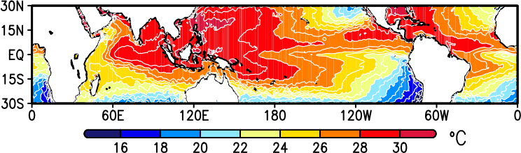

# GrADS SST MAP



```bash
#!/bin/bash

# Thu, 21 Dec 2023 01:45:42 +0900
# /work09/am/16.TOOL/22.ANALYSIS/22.CLASS/2023-12-21_01_SST_MAP_TROPICS

YYYYMMDDHH=2022071600
#YYYY=${YYYYMMDDHH:0:4}; MM=${YYYYMMDDHH:4:2}; DD=${YYYYMMDDHH:6:2}; HH=${YYYYMMDDHH:8:2}

#if [ $MM = "01" ]; then MMM="JAN"; fi; if [ $MM = "02" ]; then MMM="FEB"; fi
#if [ $MM = "03" ]; then MMM="MAR"; fi; if [ $MM = "04" ]; then MMM="APR"; fi
#if [ $MM = "05" ]; then MMM="MAY"; fi; if [ $MM = "06" ]; then MMM="JUN"; fi
#if [ $MM = "07" ]; then MMM="JUL"; fi; if [ $MM = "08" ]; then MMM="AUG"; fi
#if [ $MM = "09" ]; then MMM="SEP"; fi; if [ $MM = "10" ]; then MMM="OCT"; fi
#if [ $MM = "11" ]; then MMM="NOV"; fi; if [ $MM = "12" ]; then MMM="DEC"; fi

TIME=${HH}Z${DD}${MMM}${YYYY}

#CTL=$(basename $0 .sh).CTL
#if [ ! -f $CTL ];then echo NO SUCH FILE,$CTL;exit 1;fi

INDIR=/work01/DATA/J-OFURO3/V1.2_PRE/SST
INFLE=J-OFURO_EM_SST_V0.5.1_MON_2022.nc
IN=${INDIR}/${INFLE}
if [ ! -f $IN ];then echo NO SUCH FILE,$IN;exit 1;fi

GS=$(basename $0 .sh).GS
FIG=$(basename $0 .sh)_$(basename $INFLE .nc).PDF

# LONW= ;LONE= 
LATS=-30 ;LATN=30
# LEV=

LEVS="16 30 2"
# LEVS=" -levs -3 -2 -1 0 1 2 3"
KIND='midnightblue->blue->deepskyblue->lightcyan->yellow->orange->red->crimson'
FS=1
UNIT="\`ao\`nC"

HOST=$(hostname);CWD=$(pwd);NOW=$(date -R);CMD="$0 $@"

cat << EOF > ${GS}

'sdfopen ${IN}'
'q ctlinfo';say result

xmax = 1; ymax = 1

ytop=9

xwid = 5.0/xmax; ywid = 5.0/ymax

xmargin=0.5; ymargin=0.1

nmap = 1
ymap = 1
#while (ymap <= ymax)
xmap = 1
#while (xmap <= xmax)

xs = 1.5 + (xwid+xmargin)*(xmap-1); xe = xs + xwid
ye = ytop - (ywid+ymargin)*(ymap-1); ys = ye - ywid

# SET PAGE
'set vpage 0.0 8.5 0.0 11'
'set parea 'xs ' 'xe' 'ys' 'ye

'cc'
'set grid off';'set grads off'
'set ylint 15'
'set xlopts 1 3 0.1';'set ylopts 1 3 0.1'
# SET COLOR BAR
'color ${LEVS} -kind ${KIND} -gxout shaded'

# 'set lon ${LONW} ${LONE}'; 
'set lat ${LATS} ${LATN}'
# 'set lev ${LEV}'
'set t 7' ;#'set time ${TIME}'

'd SST'

'set xlab off';'set ylab off'
'set gxout contour'
'set cint 1'
'set clab off'
'set ccolor 0';'set cthick 1'
'd SST'


# GET COORDINATES OF 4 CORNERS
'q gxinfo'
line3=sublin(result,3); line4=sublin(result,4)
xl=subwrd(line3,4); xr=subwrd(line3,6)
yb=subwrd(line4,4); yt=subwrd(line4,6)

# LEGEND COLOR BAR
x1=xl+0.5; x2=xr-0.3-0.5; y1=yb-0.35; y2=y1+0.08
'xcbar 'x1' 'x2' 'y1' 'y2 ' -fw 0.08 -fh 0.1 -fs $FS -ft 3 -line on -edge circle'
x=x2+0.1; y=y1
'set strsiz 0.12 0.15'; 'set string 1 l 3 0'
'draw string 'x' 'y' ${UNIT}'


# TEXT
#x=xl ;# (xl+xr)/2; y=yt+0.2
#'set strsiz 0.12 0.15'; 'set string 1 c 3 0'
#'draw string 'x' 'y' ${TEXT}'

# HEADER
'set strsiz 0.1 0.12'; 'set string 1 l 3 0'
xx = 0.1; yy=yt+0.5
'draw string ' xx ' ' yy ' ${INFLE}'
yy = yy+0.2
'draw string ' xx ' ' yy ' ${INDIR}'
yy = yy+0.2
'draw string ' xx ' ' yy ' ${CWD}'
yy = yy+0.2
'draw string ' xx ' ' yy ' ${CMD}'
yy = yy+0.2
'draw string ' xx ' ' yy ' ${NOW}'

'gxprint ${FIG}'
'quit'
EOF

grads -bcp "$GS"
# rm -vf $GS

echo
if [ -f $FIG ]; then
echo "OUTPUT : "
ls -lh --time-style=long-iso $FIG
fi
echo

echo "DONE $(basename $0)."
echo
```

