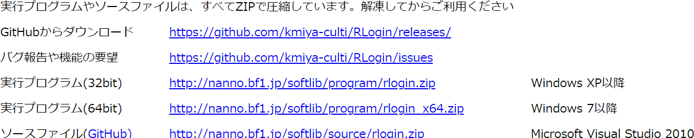
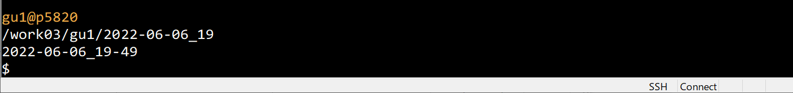

# Linux使用法

[[_TOC_]]


## 困ったときは
https://www.google.com/  
### キーワード指定のコツ
#### コマンド名+オプション名
例  linux cp "-r"  

#### やりたいこと
例 linux まとめて　コピー  

#### できないこと
例  linux コピー できない"

#### エラーメッセージ
例 linux no such file

#### OS名＋上記の組み合わせ
例 Cent OS ログイン できない

### 検索の進め方
スタート
→ 最初の検索語  
→ さらに具体的なキーワードを得る  
→ 再度検索  
→ くりかえし  
→ ...  
→ 解決策   
→ ゴール  

   

## 情報源
- シス管系女子  
  https://system-admin-girl.com/comic/  
- LINUXコマンド  
  https://sites.google.com/site/afcinbash/  
- Qiita  
  https://qiita.com/  
- Linux基本コマンドTips  
  https://www.atmarkit.co.jp/ait/subtop/linux/  
- Rlogin  
  https://qiita.com/tags/rlogin  
- .bashrc  
https://qiita.com/takutoki/items/021b804b9957fe65e093  


# ターミナル

リモートでサーバにつなぐためのソフトを**ターミナル** (端末)と呼ぶ。ここでは, Rloginというターミナルを用いる。

### Rloginのダウンロードサイト

https://kmiya-culti.github.io/RLogin/

Windowsのセキュリティー設定が厳しくなっている場合ダウンロードできないので，その場合，下記のサイトからのダウンロードを許可するよう設定を変更する。

ダウンロード用ファイルへの**リンク先は下の方にある**（下記スクリーンショットを参照のこと）。





## VPN接続

リモートでサーバーに接続する場合，VPN接続という方法を用いる。FortiClientというソフトを用いると，VPN接続が可能となる。

### VPN接続の方法

https://www.cc.mie-u.ac.jp/cc/sslvpn.html  


# シェル

下記はRloginでサーバーに接続した直後の，ターミナルの画面である。

Linuxでコマンドを打ち込む画面のことをシェルという（大雑把な説明）。



画面の左下に$と点滅したカーソルが表示されている場合，シェルが作動していることを意味している。

$は「ここにコマンド入力可」を意味する記号で，**コマンドプロンプト**と呼ばれる。


## 基本コマンド

### ユーザー名の確認

```
$ whoami
```


### パスワードの変更  
```
$ passwd 
```

am 用にパスワードを変更中  
現在の UNIX パスワード:   
新しい UNIX パスワードを入力してください:   
新しい UNIX パスワードを再入力してください:     


### ls - ディレクトリの中身を表示
ls = list  

```
$ ls 
```

### tree - ディレクトリの階層構造を表示
```
$ tree
```

### cd - ディレクトリの移動
cd = change directory  
一つ上のディレクトリに移動する  
```
$ cd ..
```
..は一つ上のディレクトリという意味。


### pwd - カレントディレクトリ (current directory)を表示
pwd = Print Working Directory  
```
$ pwd
```

### ホームディレクトリ
ログインしたときに自分のいるディレクトリのことをホームディレクトリという。  

ホームディレクトリの調べかた  

```
$ echo $HOME
```

### ディレクトリの作成
mkdir = make directory  
```
$ mkdir dir1
```
mkdir: ディレクトリ 'dir1' を作成しました    
```
$ mkdir dir2
```
```
$ ls
```
```
$ ls d*
```
dir1:  

dir2:  

\*は任意の文字列を意味する。

### サブディレクトリ
あるディレクトリの下位にあるディレクトリのことをサブディレクトリという  

サブディレクトリの作成法  
```
$ mkdir dir1/dir11
```
mkdir: ディレクトリ 'dir1/dir11' を作成しました    
```
$ ls dir1
```
dir11  

```
$ tree dir1
```

dir1  
└── dir11   

```
$ mkdir dir1/dir11/dir111
```
```
$ tree dir1
```
dir1  
└── dir11  
    └── dir111  

```
$ ls dir2
```
```
$ tree dir2
```
dir2  

0 directories, 0 files  


#### 孫ディレクトリの作成

-p オプションを付ける  
```
$ mkdir -vp dir2/dir22/dir222 
```

mkdir: ディレクトリ 'dir2/dir22' を作成しました  
mkdir: ディレクトリ 'dir2/dir22/dir222' を作成しました   


### 設定ファイルの変更
```
$ cd $HOME
```
```
$ pwd
```
```
$ ls .bashrc
.bashrc
```
```
$ cat .bashrc
```
```shell
PS1="\n\$(date +"%Y-%m-%d_%H-%M") \n\$(pwd)\n\u@\h\n\$ "
```
```shell
alias mkdir='mkdir -vp '
```


#### 設定ファイルの有効化

```
$ source $HOME/.basrhc  
```


### シェル変数の内容の表示

```
$ echo $HOME
```

シェル変数の内容設定  
```
$ HENSUU=LINUX
$ echo $HENSUU
```

LINUX  

\$を付けないと文字列そのものを表示する    

```
$ echo HENSUU
```

HENSUU  


コマンドの結果をシェル変数に代入  

```
$ NOW=$(date -R)
$ echo $NOW
```

Tue, 13 Aug 2019 12:28:14 +0900  


### キー操作
TABキー = ファイル名の補完  

i 挿入モード（文字を打ち込むことが出来る状態）に変更    

`ESC`または`jk`: ノーマルモード（下記のような操作を行うことが出来る状態）に変更

jk k (もしくは↑) = コマンド入力履歴をさかのぼって表示（前に入力したコマンドを表示する)
jk j  (もしくは↓) =  コマンド履歴を表示を前に進んで表示

jk 0 入力行の先頭にカーソルを移動
jk $  入力行の末尾にカーソルを移動


### ファイルの作成
```
$ touch NEW_FILE
```
```
$ ls -lh NEW_FILE 
```


### ファイルの削除

```
$ rm NEW_FILE
```
'NEW_FILE' を削除しました  

```
$ ls NEW_FILE
```
ls: 'NEW_FILE' にアクセスできません: そのようなファイルやディレクトリはありません  

**==rmで削除したファイルは復元できない==**  


rmにiオプションを付けると削除前に確認できる  

```
$ touch NEW_FILE
```
```
$ rm -i NEW_FILE
```
rm: 通常の空ファイル 'NEW_FILE' を削除しますか? y  
'NEW_FILE' を削除しました   


### ディレクトリの削除
```
$ tree dir1
```
dir1  
└── dir11  
    └── dir111  
```
$ rmdir dir1
```
rmdir: 'dir1' を削除できません: ディレクトリは空ではありません  
```
$ rm -rvf dir1
```
removed directory 'dir1/dir11/dir111'  
removed directory 'dir1/dir11'  
removed directory 'dir1'  

==**消しても絶対問題がないディレクトリにのみ, -rfオプションを付ける**==  
```
$ rm -riv dir1/dir11/dir111
```
rm: ディレクトリ 'dir1/dir11/dir111' を削除しますか? y  
removed directory 'dir1/dir11/dir111'  


Tips:  
基本的にソースファイルは消さなくてよい。  
理由：データファイルに比べてソースファイルの容量は比較にならないくらい小さいから。  


### ハードディスクの容量確認
#### 全体の容量確認
```
$ df -h
```
Filesystem     Type      Size  Used Avail Use% Mounted on  
/dev/sda2      ext4      9.1T  3.6T  5.1T  42% /  
/dev/sdb1      ext4      9.1T  3.2T  5.5T  37% /work02  
/dev/sdd1      ext4      9.1T   80M  8.6T   1% /work04  
/dev/sdc1      ext4      9.1T  204M  8.6T   1% /work03  

#### 自分がどのくらい使っているのか確認
```
$ du -sch $HOME
```
647M    /home/am  
647M    合計  


### cpuの使用状況確認

```
$ top
```
top - 13:48:12 up 105 days, 23:35,  4 users,  load average: 0.01, 0.02, 0.00  
Tasks: 366 total,   1 running, 289 sleeping,   0 stopped,   2 zombie  
%Cpu(s):  0.3 us,  0.1 sy,  0.0 ni, 99.6 id,  0.0 wa,  0.0 hi,  0.0 si,  0.0 st  
KiB Mem : 32613808 total,   984608 free,  2864052 used, 28765148 buff/cache  
KiB Swap:  2097148 total,  2097148 free,        0 used. 29192692 avail Mem   

  PID USER      PR  NI    VIRT    RES    SHR S  %CPU %MEM     TIME+ COMMAND  
 1795 gdm       20   0 1281468  53384  12016 S   1.3  0.2 906:36.11 gsd-color   
 2284 am        20   0  627260  46600  11116 S   1.0  0.1 877:06.71 gsd-color  

topコマンドの終了  
```
q
```
### メモリの使用状況
https://sites.google.com/site/afcinbash/home/admin/free

### ファイルとディレクトリのコピー
```
$ tree dir1
```
dir1  
└── dir11  

1 directory, 0 files  

```
$ cp -arv dir1 dir1_COPY
```
'dir1' -> 'dir1_COPY'  
'dir1/dir11' -> 'dir1_COPY/dir11'  

```
$ tree dir1_COPY
```
dir1_COPY  
└── dir11  
```
$ ls -lrh dir1
```
合計 4.0K  
drwxrwxr-x 2 am am 4.0K  8月 13 13:37 dir11  
```
$ ls -lrh dir1_COPY
```
合計 4.0K  
drwxrwxr-x 2 am am 4.0K  8月 13 13:37 dir11  

#### -aオプションの有無の違い
-aオプションを**付けない**と、オリジナルのファイルの作成時刻ではなく、**コピーをとった時刻**が記録される  
```
$ cp -rv dir1 dir1_COPY_2
```
'dir1' -> 'dir1_COPY_2'
'dir1/dir11' -> 'dir1_COPY_2/dir11'

```
$ ls -lrh dir1_COPY_2
```
合計 4.0K  
drwxrwxr-x 2 am am 4.0K  8月 13 13:58 dir11  

### ファイルの検索
```
$ sudo touch /usr/local/TEMP_FILE
```
```
$ locate TEMP_FILE
```
####locateの使用法  
https://eng-entrance.com/linux-command-locate  

```
$ find /  -name TEMP_FILE -print 2>/dev/null
```
findの使用法  

https://eng-entrance.com/linux-command-find  


### 自分のパソコンにファイルをコピー

Winscpを使う  

https://forest.watch.impress.co.jp/library/software/winscp/  

新規ファイル作成  

右クリック→新規  

```
$ pwd
/home/am/dir1
```
```
$ cat script.sh 
echo AAA
```
```
$ ./script.sh
-bash: ./script.sh: 許可がありません
```
```
$ chmod u+x script.sh 
```

```
$ ./script.sh
AAA
```

参考: 改行コードが正しくないことによるエラー  

/bin/bash==^M==: bad interpreter  

改行コードの変更法  

```shell
$ sed -i 's/\r//' ファイル名
```

### 自宅から接続する
#### 接続法
https://www.cc.mie-u.ac.jp/cc/sslvpn.html  

