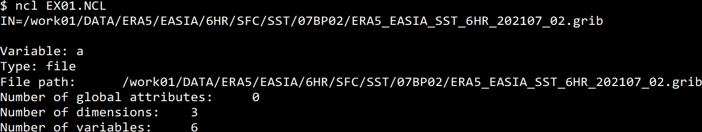

# NCL Tutorial 01

[[_TOC_]]

## はじめに

### NCLとは

NCAR COMMAND LANGUAGEの略。NCAR（エヌ・カー）は米国の気象関係の研究所

データ解析，描画用のソフトウェア

極めて高品質の図が描ける

プログラミングもできる

豊富な関数が用意されており，自分で一からプログラムを作成せずとも高度な解析が可能


### 参考になるサイト

1. http://www.atmos.rcast.u-tokyo.ac.jp/shion/NCLtips/index.php

2. https://sites.google.com/site/tips4ncl/
3. https://www.ncl.ucar.edu/gallery.shtml

4. https://www.ncl.ucar.edu/Applications/

5. https://gitlab.com/infoaofd/lab/-/blob/master/NCL/NCL_QUICK_REF.md

   

## 予備知識

下記が必要な予備知識である。

### Linuxのシェルの基本操作

https://gitlab.com/infoaofd/lab/-/blob/master/LINUX/01.BASH/0.LINUX_TUTORIAL_01.md

### シェルスクリプトの文法の基礎

https://gitlab.com/infoaofd/lab/-/blob/master/LINUX/03.BASH_SCRIPT/LINUX_SCRIPT_TUTORIAL.md


### 困ったときは

#### Google等を使って下記で検索

```
NCL keyword
```

```
NCAR Command Language keyword
```

keywordのところには，例えば，'等値線'や'countour'など**自分がやりたいこと**などを入れてみる。検索でヒットしたサイトをを見ながら，keywordを絞り込んでいく。例えば, '等値線　フォント　変更'や'change contour font size'など。


#### 上記の「参考になるサイト」を調べてみる

英語の方が情報が多い。有用な情報が英語でのみ提供されていることも多い。一度で理解できなくても，有用と思われる情報は，PDFファイルなどに書き出すなどして，何度か読み込んでみること。


## 基本的な使用法

今, スクリプトを書いたファイル名を`SCRIPT0.NCL`とする。

シェルのプロンプト (`$`)が表示された状態で，下記のように入力すると，**nclがSCRIPT0.NCLに書かれた内容を実行する**。

```bash
$ ncl SCRIPT0.NCL
```


### スクリプトの例

#### SCRIPT0.NCL

```bash
print("Hello!")
```


#### 実行例


```
$ ncl SCRIPT0.NCL
```

```
Hello!
```


## 練習1: データファイルを開く

### データファイルの所在

```bash
$ ls /work01/DATA/ERA5/EASIA/6HR/SFC/SST/07BP02/*grib |head -3
```

```
/work01/DATA/ERA5/EASIA/6HR/SFC/SST/07BP02/ERA5_EASIA_SST_6HR_198207_02.grib*
/work01/DATA/ERA5/EASIA/6HR/SFC/SST/07BP02/ERA5_EASIA_SST_6HR_198307_02.grib*
/work01/DATA/ERA5/EASIA/6HR/SFC/SST/07BP02/ERA5_EASIA_SST_6HR_198407_02.grib*
```

lsで末尾がgribで終わるファイルの名前を書き出す

head -3でlsの結果の最初の3行のみ画面に表示させる


### スクリプト

#### EX01.NCL

```bash
INDIR="/work01/DATA/ERA5/EASIA/6HR/SFC/SST/07BP02/"
; INDIR: 入力ファイルの存在するディレクトリ名

INFLE="ERA5_EASIA_SST_6HR_202107_02.grib"
; INFLE: 入力ファイル名

IN=INDIR+INFLE
; INDIRとINFLEをつないで一つの変数INを作る

print("IN="+IN)
; 変数INの内容を画面に表示する

a=addfile(IN,"r")
; 読み込み(r)モードで変数INに記憶されたファイルを開く
; aはファイルを指すポインター

printVarSummary(a)
; 開いたファイルに関する概要を画面に表示させる
```

### 実行例



```bash
$ ncl EX01.NCL
```

```
IN=/work01/DATA/ERA5/EASIA/6HR/SFC/SST/07BP02/ERA5_EASIA_SST_6HR_202107_02.grib

Variable: a
Type: file
File path:      /work01/DATA/ERA5/EASIA/6HR/SFC/SST/07BP02/ERA5_EASIA_SST_6HR_202107_02.grib
Number of global attributes:     0
Number of dimensions:    3
Number of variables:     6
```


## 練習2: 変数名の確認

開いたデータファイルに記載された変数の名前とデータに関する情報を確認する

### 注意

スクリプト (プログラム)を作成する上で，以上のようにデータファイルに含まれる**変数の名称**，データの**格子間隔**，**欠損値の設定**などの**情報を把握しておく**ことは極めて重要である。

### スクリプト

#### EX02.NCL

```bash
INDIR="/work01/DATA/ERA5/EASIA/6HR/SFC/SST/07BP02/"
;入力ファイルの存在するディレクトリ名

INFLE="ERA5_EASIA_SST_6HR_202107_02.grib"
;入力ファイル名

IN=INDIR+INFLE
;INDIRとINFLEをつないで一つの変数INを作る

print("IN="+IN)
; 変数INの内容を画面に表示する

a=addfile(IN,"r")
; 読み込み(r)モードで変数INに記憶されたファイルを開く
; aはファイルを指すポインター

print(a)
;開いたファイルに関する情報を画面に表示させる
```

EX01.NCLの`printVarSummary(a)`を`print(a)`に変更した。

#### 実行例

```bash
$ ncl EX02.NCL
```

#### 画面表示の一部抜粋

```
IN=/work01/DATA/ERA5/EASIA/6HR/SFC/SST/07BP02/ERA5_EASIA_SST_6HR_202107_02.grib

Variable: a
Type: file
filename:	ERA5_EASIA_SST_6HR_202107_02
path:	/work01/DATA/ERA5/EASIA/6HR/SFC/SST/07BP02/ERA5_EASIA_SST_6HR_202107_02.grib
   file global attributes:
   dimensions:
      initial_time0_hours = 40
      g0_lat_1 = 201
      g0_lon_2 = 281
   variables:
      float SSTK_GDS0_SFC ( initial_time0_hours, g0_lat_1, g0_lon_2 )
         center :	European Center for Medium-Range Weather Forecasts (RSMC)
         long_name :	Sea surface temperature
         units :	K
         _FillValue :	1e+20

      double initial_time0_hours ( initial_time0_hours )
         long_name :	initial time
         units :	hours since 1800-01-01 00:00

      float g0_lat_1 ( g0_lat_1 )
         long_name :	latitude
         GridType :	Cylindrical Equidistant Projection Grid
         units :	degrees_north
         Dj :	0.25
         Di :	0.25
         Lo2 :	150
         La2 :	 0
         Lo1 :	80
         La1 :	50

      float g0_lon_2 ( g0_lon_2 )
         long_name :	longitude
         GridType :	Cylindrical Equidistant Projection Grid
         units :	degrees_east
         Dj :	0.25
         Di :	0.25
         Lo2 :	150
         La2 :	 0
         Lo1 :	80
         La1 :	50

      string initial_time0 ( initial_time0_hours )
         long_name :	Initial time of first record
         units :	mm/dd/yyyy (hh:mm)
```

#### 表示内容の説明

```
   dimensions:
      initial_time0_hours = 40
      g0_lat_1 = 201
      g0_lon_2 = 281
```

データの次元。時間方向に40個, 緯度方向に201個, 経度方向に281個のデータが収納されている


```
float SSTK_GDS0_SFC ( initial_time0_hours, g0_lat_1, g0_lon_2 )
```

変数の説明

float: 実数型の変数 (配列)

SSTK_GDS0_SFC: 変数 (配列)の名称

initial_time0_hours, g0_lat_1, g0_lon_2: それぞれ，時間方向，緯度方向，経度方向の配列要素の数


```
long_name :	Sea surface temperature
```

変数の名称


```
 units :	K
```

変数の単位


```
_FillValue :	1e+20
```

欠損値(データが存在しない点に入っているダミーの値)


```
double initial_time0_hours ( initial_time0_hours )
```

double: 倍精度実数

最初のinitial_time0_hours: 変数 (配列)の名称

カッコの中のinitial_time0_hours: 配列要素数


```
units :	hours since 1800-01-01 00:00
```

単位: 1800-01-01 00:00からの経過時間


```
 float g0_lat_1 ( g0_lat_1 )
```

最初のg0_lat_1: 変数 (配列)の名称

カッコの中のg0_lat_1: 配列要素数


         units :	degrees_north
         Dj :	0.25
         Di :	0.25
         Lo2 :	150
         La2 :	 0
         Lo1 :	80
         La1 :	50

units: degrees_north=北緯

Dj: データの南北方向の格子間隔 = 0.25º

Di: データの東西方向の格子間隔 = 0.25º

Lo2: データの東の端の経度

La2: データの南の端の緯度

Lo1: データの西の端の経度

La1: データの北の端の緯度 (北から測っているので北の端がLa1で南の端がLa2になっている)


## 練習3: データを読み込む

海面水温のデータを読み込む

### スクリプト

#### EX03.NCL

```bash
INDIR="/work01/DATA/ERA5/EASIA/6HR/SFC/SST/07BP02/"
;入力ファイルの存在するディレクトリ名

INFLE="ERA5_EASIA_SST_6HR_202107_02.grib"
;入力ファイル名

IN=INDIR+INFLE
;INDIRとINFLEをつないで一つの変数INを作る

print("IN="+IN)
; 変数INの内容を画面に表示する

a=addfile(IN,"r")
; 読み込み(r)モードで変数INに記憶されたファイルを開く
; aはファイルを指すポインター

SST=a->SSTK_GDS0_SFC
; ポインターaで指定された入力ファイルに含まれるSSTK_GDS0_SFCという
; 名称の変数に記憶されたデータを読み込む。
; 読み込み先の変数の名称はSSTとする

printVarSummary(SST)
; 読み込んだSSTという変数の概要を画面に表示させる
```

#### 実行例

```bash
$ ncl EX03.NCL
```

#### 画面表示の抜粋

```bash
IN=/work01/DATA/ERA5/EASIA/6HR/SFC/SST/07BP02/ERA5_EASIA_SST_6HR_202107_02.grib

Variable: SST
Type: float

Number of Dimensions: 3
Dimensions and sizes:   [initial_time0_hours | 40] x [g0_lat_1 | 201] x [g0_lon_2 | 281]
Coordinates:
            initial_time0_hours: [1941840..1942074]
            g0_lat_1: [50.. 0]
            g0_lon_2: [80..150]

Number Of Attributes: 10
  center :      European Center for Medium-Range Weather Forecasts (RSMC)
  long_name :   Sea surface temperature
  units :       K
  _FillValue :  1e+20
```

## 課題

1. EX03.NCLとEX02.NCLの結果をファイルに出力させ(方法は下記の通り), 内容を比較せよ。

2. ファイルに書き出された, 変数の名称，データの格子間隔，欠損値の設定などの情報を確認せよ

```bash
$ ncl EX02.NCL > EX02_RESULT.TXT
```

EX02.NCLの結果が，EX02_RESULT.TXTというテキストファイルに出力される。

```bash
$ ncl EX03.NCL > EX03_RESULT.TXT
```


## 上達のためのポイント

**エラーが出た時の対応の仕方でプログラミングの上達の速度が大幅に変わる**。

ポイントは次の3つである。

1. エラーメッセージをよく読む
2. エラーメッセージを検索し，ヒットしたサイトをよく読む
3. 変数に関する情報を書き出して確認する

エラーメッセージは，プログラムが不正終了した直接の原因とその考えられる理由が書いてあるので，よく読むことが必要不可欠である。

記述が簡潔なため，内容が十分に理解できないことも多いが，その場合**エラーメッセージをブラウザで検索**してヒットした記事をいくつか読んでみる。エラーの原因だけでなく，**考えうる解決策**が記載されていることも良くある。

エラーを引き起こしていると思われる箇所の**変数の情報**や**変数の値そのものを書き出して**，**期待した通りにプログラムが動作しているか確認する**ことも重要である。

エラーの場所が特定できれば，エラーの修正の大部分は完了したと考えてもよいほどである。

エラーメッセージや検索してヒットするウェブサイトは英語で記載されていることも多いが，**重要な情報は英語で記載されていることが多い**ので，よく読むようにする。

重要そうに思われるが，一回で理解できないものは，PDFなどに書き出して後で繰り返し読んでみる。どうしても頭に入らないものは印刷してから読む。
