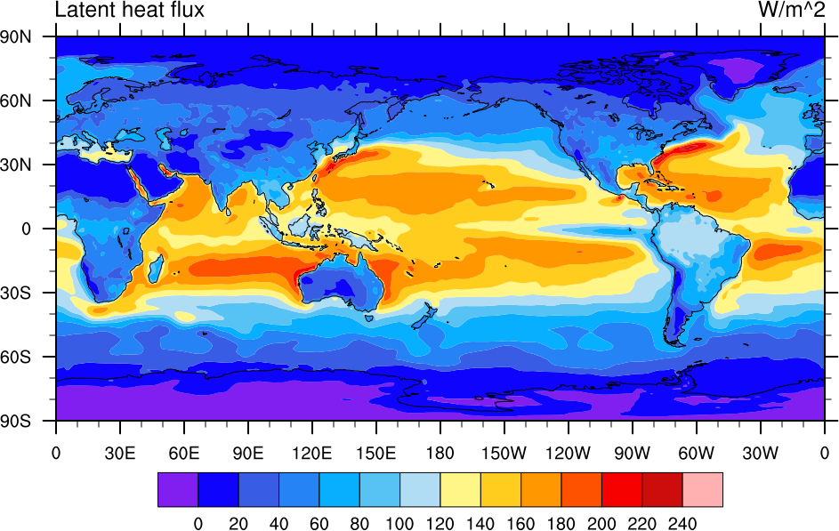

# NCL Tutorial 04

- JRA55の月平均の海面潜熱フラックスを使って, 平年の年平均を計算しその分布を作図する

  

[[_TOC_]]

## 注意

作業は<font color="red">tmuxを起動させて</font>から行う

https://gitlab.com/infoaofd/lab/-/blob/master/LINUX/01.BASH/0.TMUX.md


## はじめに

### 参考になるサイト

1. http://www.atmos.rcast.u-tokyo.ac.jp/shion/NCLtips/index.php
2. https://sites.google.com/site/tips4ncl/
3. https://www.ncl.ucar.edu/gallery.shtml
4. https://www.ncl.ucar.edu/Applications/
5. https://gitlab.com/infoaofd/lab/-/blob/master/NCL/NCL_QUICK_REF.md

## 予備知識

下記が必要な予備知識である。

### Linuxのシェルの基本操作

https://gitlab.com/infoaofd/lab/-/blob/master/LINUX/01.BASH/0.LINUX_TUTORIAL_01.md

### シェルスクリプトの文法の基礎

https://gitlab.com/infoaofd/lab/-/blob/master/LINUX/03.BASH_SCRIPT/LINUX_SCRIPT_TUTORIAL.md

### 困ったときは

#### Google等を使って下記で検索

```plaintext
NCL keyword
```

```plaintext
NCAR Command Language keyword
```

keywordのところには，例えば，'等値線'や'countour'など**自分がやりたいこと**などを入れてみる。検索でヒットしたサイトをを見ながら，keywordを絞り込んでいく。例えば, '等値線　フォント　変更'や'change contour font size'など。

#### 上記の「参考になるサイト」を調べてみる

英語の方が情報が多い。有用な情報が英語でのみ提供されていることも多い。一度で理解できなくても，有用と思われる情報は，PDFファイルなどに書き出すなどして，何度か読み込んでみること。


## 練習1: 複数の入力ファイルを一度に開く

### 入力ファイルの所在の確認

```bash
/work01/DATA/JRA55C/MON/SFC/FCT
$ ll /work01/DATA/JRA55C/MON/SFC/FCT/fcst_phy2m125.C.*lh* |head -3
-rw-r-xr--. 1 am 123K 2015-07-25 01:16 /work01/DATA/JRA55C/MON/SFC/FCT/fcst_phy2m125.C.121_lhtfl.197211_197212*
-rw-r-xr--. 1 am 736K 2015-07-25 01:16 /work01/DATA/JRA55C/MON/SFC/FCT/fcst_phy2m125.C.121_lhtfl.197301_197312*
-rw-r-xr--. 1 am 736K 2015-07-25 01:16 /work01/DATA/JRA55C/MON/SFC/FCT/fcst_phy2m125.C.121_lhtfl.197401_197412*
```

lhtfl: Latent heat flux (潜熱フラックス)の略

197211_197212: 収納されているデータの期間

### 使用する関数

複数のファイルを一度に開きたいときはaddfilesを用いる。複数計の**s**がついていることに注意。

```
f = addfiles(filenames, X)
```

#### 入力変数

filenames: 読み込むファイル名が入った1次元配列。自分で作ってもよいし，systemfuncなどを使って得てもよい。

X: X = "r" とすると読み込み "w" とすると書き込み "c"とすると新しいファイル形成

#### 出力変数

f: ファイルを示す変数(list)


無事にファイルを開けたら変数を取り出す。ファイル内の変数を指定するさいには`->`という記号を使う。

```bash
var = f[:]->X
```

```bash
var = f->X
```

```bash
var = f->$X$
```

など。逆に変数varの値をXとしてファイルfに書き込みたい時には，

```bash
f->X = var
```

のようにする。

f: ファイルを示す変数。前述のaddfilesで開いたもの。fが複数のファイルからなる場合，すべてから変数を取り出したければf[:]とする。fのうち一つのファイルだけから取り出したければf[i]のようにできる。

X: 取り出す変数名。ファイル内の変数名を直接書いても良いし，変数名が文字列として入ったNCL上の変数でも良い。後者については，例えばファイル内の変数名がNCL上の変数Xに入っている場合，`f->$X$`のように$で囲んで記述する。Xは配列でもよく，`f->$X(i)$`のように記述できる。

var: NCLスクリプト上での変数

addfilesで開いたファイルから変数を読む場合，すべてのファイルで変数名が共通で，最も左の次元以外のサイズが同じでなくてはならない。

変数は，defaultでは最も左の次元が結合された配列として読み込まれる。つまり，1ファイルに[12]×[180]×[360]のデータが入っており，これを30ファイルから同時に読み込むと，[12*30]×[180]×[360]となる。タイムステップごとに別のファイルにlat×lonとして入っているのをtime×lat×lonとして読みたいときや，アンサンブルメンバー別のファイルを読み込んで左端にアンサンブル次元を増やしたいときなど，複数ファイルを別次元として扱いたい場合，読み込む前にListSetTypeで設定変更をすればよい。


### スクリプト: EX04-00.NCL

変数名の確認

```bash
;入力変数名の確認

INDIR="/work01/DATA/JRA55C/MON/SFC/FCT/" 
;入力ファイルの存在するディレクトリ

INFLE="fcst_phy2m125.C.121_lhtfl.201201_201212"
; ファイル名

IN=INDIR+INFLE

f = addfile(IN, "r")
; ファイルを開く

print (f)
; 変数名の確認
```

実行例

```bash
$ ncl EX04-00.NCL > EX04-00.TXT
```

EX04-00.TXT

```bash
Variable: f
Type: file
filename:	fcst_phy2m125.C.121_lhtfl.201201_201212
path:	/work01/DATA/JRA55C/MON/SFC/FCT/fcst_phy2m125.C.121_lhtfl.201201_201212
   file global attributes:
   dimensions:
      initial_time0_hours = 12
      g0_lat_1 = 145
      g0_lon_2 = 288
   variables:
      float LHTFL_GDS0_SFC_S130 ( initial_time0_hours, g0_lat_1, g0_lon_2 )
         sub_center :	241
         center :	Japanese Meteorological Agency - Tokyo (RSMC)
         long_name :	Latent heat flux
         units :	W/m^2
         _FillValue :	1e+20
         level_indicator :	1
         gds_grid_type :	0
         parameter_table_version :	200
         parameter_number :	121
         forecast_time :	0
         forecast_time_units :	hours
         statistical_process_descriptor :	average of N forecast products; valid time of equal specified duration with all N products covering a continuous time span.
         statistical_process_duration :	6 hours (beginning at reference time)
         N :	<ARRAY of 12 elements>

      double initial_time0_hours ( initial_time0_hours )
         long_name :	initial time
         units :	hours since 1800-01-01 00:00

      double initial_time0_encoded ( initial_time0_hours )
         long_name :	initial time encoded as double
         units :	yyyymmddhh.hh_frac

      float g0_lat_1 ( g0_lat_1 )
         long_name :	latitude
         GridType :	Cylindrical Equidistant Projection Grid
         units :	degrees_north
         Dj :	1.25
         Di :	1.25
         Lo2 :	-1.25
         La2 :	-90
         Lo1 :	 0
         La1 :	90

      float g0_lon_2 ( g0_lon_2 )
         long_name :	longitude
         GridType :	Cylindrical Equidistant Projection Grid
         units :	degrees_east
         Dj :	1.25
         Di :	1.25
         Lo2 :	-1.25
         La2 :	-90
         Lo1 :	 0
         La1 :	90

      string initial_time0 ( initial_time0_hours )
         long_name :	Initial time of first record
         units :	mm/dd/yyyy (hh:mm) 
```

variables:
      float **LHTFL_GDS0_SFC_S130** ( initial_time0_hours, g0_lat_1, g0_lon_2 )

太字が変数名


### スクリプト: EX04-01.NCL

複数ファイルを一度に開く

```bash
INDIR="/work01/DATA/JRA55C/MON/SFC/FCT" 
;入力ファイルの存在するディレクトリ

PREFIX="fcst_phy2m125.C.121_lhtfl."
; ファイル名の一部

filenames = systemfunc("ls "+INDIR+PREFIX+"*")
; ファイル名一覧を作ってfilenamesという変数に代入する

f = addfiles(filenames, "r")
; ファイルを開く

print(f)
; 結果の確認
```

#### 実行例

```bash
$ ncl EX04-01.NCL
```


### スクリプト: EX04-02.NCL

複数ファイルに含まれる変数を一度に読み込む

```bash
INDIR="/work01/DATA/JRA55C/MON/SFC/FCT/" 
;入力ファイルの存在するディレクトリ

PREFIX="fcst_phy2m125.C.121_lhtfl."
; ファイル名の一部

filenames = systemfunc("ls "+INDIR+PREFIX+"*")
; ファイル名一覧を作ってfilenamesという変数に代入する

f = addfiles(filenames, "r")
; ファイルを開く

LHF=f[:]->LHTFL_GDS0_SFC_S130
; データの読み込み

printVarSummary(LHF)
; 読み込み結果の確認
```

実行例

```bash
$ ncl EX04-02.NCL > EX04-02.TXT
```

実行結果: EX04-02.TXT

```bash
Variable: LHF
Type: float
Total Size: 80513280 bytes
            20128320 values
Number of Dimensions: 3
Dimensions and sizes:	[initial_time0_hours | 482] x [g0_lat_1 | 145] x [g0_lon_2 | 288]
Coordinates: 
            initial_time0_hours: [1515024..1866384]
            g0_lat_1: [90..-90]
            g0_lon_2: [ 0..358.75]
Number Of Attributes: 14
  sub_center :	241
  center :	Japanese Meteorological Agency - Tokyo (RSMC)
  long_name :	Latent heat flux
  units :	W/m^2
  _FillValue :	1e+20
  level_indicator :	1
  gds_grid_type :	0
  parameter_table_version :	200
  parameter_number :	121
  forecast_time :	0
  forecast_time_units :	hours
  statistical_process_descriptor :	average of N forecast products; valid time of equal specified duration with all N products covering a continuous time span.
  statistical_process_duration :	6 hours (beginning at reference time)
  N :	( 120, 124 )
```

配列要素数

Dimensions and sizes:	[initial_time0_hours | 482] x [g0_lat_1 | 145] x [g0_lon_2 | 288]
Coordinates: 
            initial_time0_hours: [1515024..1866384]
            g0_lat_1: [90..-90]
            g0_lon_2: [ 0..358.75]

欠損値の設定

_FillValue :	1e+20: 欠損値をいくつに設定しているか


## 練習2 平年値の計算と描画

### スクリプト: EX04-03.NCL

30年分のデータを抜き出す

```bash
;30年分のデータを抜き出す

INDIR="/work01/DATA/JRA55C/MON/SFC/FCT/" 
;入力ファイルの存在するディレクトリ

PREFIX="fcst_phy2m125.C.121_lhtfl."
; ファイル名の一部

filenames = systemfunc("ls "+INDIR+PREFIX+"*")
; ファイル名一覧を作ってfilenamesという変数に代入する

f = addfiles(filenames, "r")
; ファイルを開く

LHF=f[:]->LHTFL_GDS0_SFC_S130
; データの読み込み


LHF30=LHF(481-360+1:481, :, :)
;30年分のデータを抜き出す

printVarSummary(LHF30)
```

実行例

```bash
$ ncl EX04-03.NCL > EX04-03.TXT
```

実行結果: EX04-03.TXT

```bash
Variable: LHF30
Type: float
Total Size: 60134400 bytes
            15033600 values
Number of Dimensions: 3
Dimensions and sizes:	[initial_time0_hours | 360] x [g0_lat_1 | 145] x [g0_lon_2 | 288]
Coordinates: 
            initial_time0_hours: [1604136..1866384]
            g0_lat_1: [90..-90]
            g0_lon_2: [ 0..358.75]
Number Of Attributes: 14
  N :	( 120, 124 )
  statistical_process_duration :	6 hours (beginning at reference time)
  statistical_process_descriptor :	average of N forecast products; valid time of equal specified duration with all N products covering a continuous time span.
  forecast_time_units :	hours
  forecast_time :	0
  parameter_number :	121
  parameter_table_version :	200
  gds_grid_type :	0
  level_indicator :	1
  _FillValue :	1e+20
  units :	W/m^2
  long_name :	Latent heat flux
  center :	Japanese Meteorological Agency - Tokyo (RSMC)
  sub_center :	241
```

LHF30: 抜き出した値を収納している配列

Dimensions and sizes:	[initial_time0_hours | 360] x [g0_lat_1 | 145] x [g0_lon_2 | 288]

initial_time0_hoursの要素数がLHFでは482であったのに対し, LHF30では360になっていることに注意。


### スクリプト: EX04-04.NCL

30年分のデータの平均を計算する

#### dim_avg_n_Wrap

配列の指定した次元についての平均を求める関数。dim_avg_nとほとんど同じ。ただし，もとの配列のメタデータを残したいときにはこれを使う。

```bash
val = dim_avg_n_Wrap(x,dim)
```

##### 入力変数

x: 平均を計算したい変数。

dim: xの平均を計算したい次元。例えば，`x(time,lat,lon)`から時間平均を求めたければ `dim=0` とし，経度平均を求めたければ `dim=2` とする。配列で指定することもでき，`dim=(/1,2/)` とすれば緯度経度にわたって平均され，時間の次元だけ残る。ただし，配列で指定する場合には，連続する次元を昇順に指定しなくてはならない。

##### 出力変数

val: 入力した配列xのdim番目の次元について計算した平均値。例えば，xが [12]x[180]x[360] の配列で dim=0 場合，最も左の次元について平均され，戻り値の配列は [180]x[360] となる。xに欠損値(x@_FillValue)があれば無視される。


```bash
;平年値の計算

INDIR="/work01/DATA/JRA55C/MON/SFC/FCT/" 
;入力ファイルの存在するディレクトリ

PREFIX="fcst_phy2m125.C.121_lhtfl."
; ファイル名の一部

filenames = systemfunc("ls "+INDIR+PREFIX+"*")
; ファイル名一覧を作ってfilenamesという変数に代入する

f = addfiles(filenames, "r")
; ファイルを開く

LHF=f[:]->LHTFL_GDS0_SFC_S130
; データの読み込み

LHF30=LHF(481-360+1:481, :, :)
;30年分のデータを抜き出す

LHFC = dim_avg_n_Wrap(LHF30, 0)
; 30年分の平均を計算する

printVarSummary(LHFC)
; 結果の確認
```

実行例

```bash
$ ncl EX04-04.NCL > EX04-04.TXT
```

実行結果: EX04-04.TXT

```bash
Variable: LHFC
Type: float
Total Size: 167040 bytes
            41760 values
Number of Dimensions: 2
Dimensions and sizes:	[g0_lat_1 | 145] x [g0_lon_2 | 288]
Coordinates: 
            g0_lat_1: [90..-90]
            g0_lon_2: [ 0..358.75]
Number Of Attributes: 15
  _FillValue :	1e+20
  N :	( 120, 124 )
  statistical_process_duration :	6 hours (beginning at reference time)
  statistical_process_descriptor :	average of N forecast products; valid time of equal specified duration with all N products covering a continuous time span.
  forecast_time_units :	hours
  forecast_time :	0
  parameter_number :	121
  parameter_table_version :	200
  gds_grid_type :	0
  level_indicator :	1
  units :	W/m^2
  long_name :	Latent heat flux
  center :	Japanese Meteorological Agency - Tokyo (RSMC)
  sub_center :	241
  average_op_ncl :	dim_avg_n over dimension(s): initial_time0_hours
```


### スクリプト: EX04-05.NCL

平年値の分布を作図する

### 参考

以前使用したスクリプトを流用できる

https://gitlab.com/infoaofd/lab/-/blob/master/NCL/NCL_TUTORIAL/NCL_TUTORIAL02/EX02-03C.NCL

```bash
;平年値の作図

INDIR="/work01/DATA/JRA55C/MON/SFC/FCT/" 
;入力ファイルの存在するディレクトリ

PREFIX="fcst_phy2m125.C.121_lhtfl."
; ファイル名の一部

filenames = systemfunc("ls "+INDIR+PREFIX+"*")
; ファイル名一覧を作ってfilenamesという変数に代入する

f = addfiles(filenames, "r")
; ファイルを開く

LHF=f[:]->LHTFL_GDS0_SFC_S130
; データの読み込み

LHF30=LHF(481-360+1:481, :, :)
;30年分のデータを抜き出す

LHFC = dim_avg_n_Wrap(LHF30, 0)
; 30年分の平均を計算する

g0_lon_2=f[0]->g0_lon_2
; 入力ファイルから経度を読み込む
g0_lat_1=f[0]->g0_lat_1
; 入力ファイルから緯度を読み込む

print("MMMMM PLOTTING")
; 作図開始

FIG="JRA55C_LHF_CLIM"
TYP="pdf"
; 図のファイル名とファイルの種類(pdf)を指定

wks = gsn_open_wks(TYP, FIG)
;作図するファイルを開く

resmp=True
; 地図の描画の設定に関する情報を記載する変数(resmp)を用意する

res=resmp
; resmpの情報をresに引き継ぐ
res@cnFillOn = True
; Trueの場合, 色で塗分けする
res@cnLinesOn = False
; Falseの場合, 等値線を書かない

res@gsnAddCyclic = False
;地球一周分のデータでない場合Falseにする

LHFC!0 = "lat" ;LHFCの0番目の配列要素の名称をlatにする
LHFC!1 = "lon" ;LHFCの0番目の配列要素の名称をlonにする
LHFC&lat= g0_lat_1 
; LHFCのlatという座標の値として変数g0_lat_1に収納されているものを用いる
LHFC&lon= g0_lon_2 
; LHFCのlonという座標の値として変数g0_lon_2に収納されているものを用いる

plot1=gsn_csm_contour_map(wks,LHFC,res)
; カラーシェード図と地図の作図

print("MMMMM IN : "+IN)
print("MMMMM FIG: "+FIG+"."+TYP)
```

実行例

```bash
$ ncl EX04-05.NCL
MMMMM PLOTTING
MMMMM FIG: JRA55C_LHF_CLIM.pdf
```

実行結果: JRA55C_LHF_CLIM.pdf


### スクリプト: EX04-06.NCL

図の細部の調整

- 図の中心経度を180度にする

```bash
;平年値の作図

INDIR="/work01/DATA/JRA55C/MON/SFC/FCT/" 
;入力ファイルの存在するディレクトリ

PREFIX="fcst_phy2m125.C.121_lhtfl."
; ファイル名の一部

filenames = systemfunc("ls "+INDIR+PREFIX+"*")
; ファイル名一覧を作ってfilenamesという変数に代入する

f = addfiles(filenames, "r")
; ファイルを開く

LHF=f[:]->LHTFL_GDS0_SFC_S130
; データの読み込み

LHF30=LHF(481-360+1:481, :, :)
;30年分のデータを抜き出す

LHFC = dim_avg_n_Wrap(LHF30, 0)
; 30年分の平均を計算する

g0_lon_2=f[0]->g0_lon_2
; 入力ファイルから経度を読み込む
g0_lat_1=f[0]->g0_lat_1
; 入力ファイルから緯度を読み込む

print("MMMMM PLOTTING")
; 作図開始

FIG="JRA55C_LHF_CLIM_EX04-06"
TYP="pdf"
; 図のファイル名とファイルの種類(pdf)を指定

wks = gsn_open_wks(TYP, FIG)
;作図するファイルを開く

resmp=True
; 地図の描画の設定に関する情報を記載する変数(resmp)を用意する

res=resmp
; resmpの情報をresに引き継ぐ
res@cnFillOn = True
; Trueの場合, 色で塗分けする
res@cnLinesOn = False
; Falseの場合, 等値線を書かない

res@gsnAddCyclic = True
;地球一周分のデータでない場合Falseにする

res@mpCenterLonF           = 180
;図の中心となる経度を180度にする

LHFC!0 = "lat" ;LHFCの0番目の配列要素の名称をlatにする
LHFC!1 = "lon" ;LHFCの0番目の配列要素の名称をlonにする
LHFC&lat= g0_lat_1 
; LHFCのlatという座標の値として変数g0_lat_1に収納されているものを用いる
LHFC&lon= g0_lon_2 
; LHFCのlonという座標の値として変数g0_lon_2に収納されているものを用いる

plot1=gsn_csm_contour_map(wks,LHFC,res)
; カラーシェード図と地図の作図

print("MMMMM FIG: "+FIG+"."+TYP)
```

実行例

```bash
$ ncl EX04-06.NCL
MMMMM PLOTTING
MMMMM FIG: JRA55C_LHF_CLIM_EX04-06.pdf
```

実行結果: JRA55C_LHF_CLIM_EX04-06.pdf


## 上達のためのポイント

**エラーが出た時の対応の仕方でプログラミングの上達の速度が大幅に変わる**。

ポイントは次の3つである。

1. エラーメッセージをよく読む
2. エラーメッセージを検索し，ヒットしたサイトをよく読む
3. 変数に関する情報を書き出して確認する

エラーメッセージは，プログラムが不正終了した直接の原因とその考えられる理由が書いてあるので，よく読むことが必要不可欠である。

記述が簡潔なため，内容が十分に理解できないことも多いが，その場合**エラーメッセージをブラウザで検索**してヒットした記事をいくつか読んでみる。

エラーの原因だけでなく，**考えうる解決策**が記載されていることも良くある。

エラーを引き起こしていると思われる箇所の**変数の情報**や**変数の値そのものを書き出して**，**期待した通りにプログラムが動作しているか確認する**ことも重要である。

エラーの場所が特定できれば，エラーの修正の大部分は完了したと考えてもよいほどである。

エラーメッセージや検索してヒットするウェブサイトは英語で記載されていることも多いが，**重要な情報は英語で記載されていることが多い**ので，よく読むようにする。

重要そうに思われるが，一回で理解できないものは，PDFなどに書き出して後で繰り返し読んでみる。どうしても**内容が頭に入らないものは印刷してから読む**。
