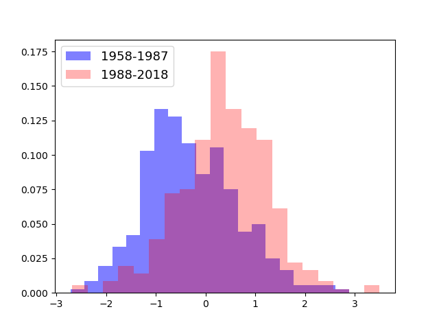

HISTOGRAM
============================
[[_TOC_]]

Fri, 25 Jun 2021 17:11:39 +0900
p5820.bio.mie-u.ac.jp
/work03/am/2021.AGO/01.00.00.HAMASHIMA/03.02.00.MON.ANO

```bash
$ srcdump.sh 01.08.00.PL.HISTO.MON.CLM.1960vs1990.py
```

### HOW TO RUN

am@p5820
/work03/am/2021.AGO/01.00.00.HAMASHIMA/03.02.00.MON.ANO
2021-06-25_17-11

```bash
$ python3 01.08.00.PL.HISTO.MON.CLM.1960vs1990.py
```

```bash
$ ll 01.08.00.PL.HISTO.MON.CLM.1960vs1990.py.png
```

-rw-r--r--. 1 am 16K 2021-06-25 17:12 01.08.00.PL.HISTO.MON.CLM.1960vs1990.py.png




### INFO
**Machine info**
processor	: 7
model name	: Intel(R) Xeon(R) W-2123 CPU @ 3.60GHz
MemTotal:       32445044 kB

### SOURCE FILES
- 01.08.00.PL.HISTO.MON.CLM.1960vs1990.py
#### 01.08.00.PL.HISTO.MON.CLM.1960vs1990.py
```python
import numpy as np
import pandas as pd
import matplotlib.pyplot as plt
import matplotlib
matplotlib.use('Agg')
import os

df = pd.read_csv('HAMASHIMA.T.MON.ANO.TXT', dtype='float')
df.replace([-999.], np.nan, inplace=True)

#print(df.T)

# https://www.python.ambitious-engineer.com/archives/2106

data = np.array(df['T'])

data2=data[1067-12*60:1067-12*30]
data3=data[1067-12*30:1067]

#print(data2)

fig = plt.figure()

ax = fig.add_subplot(1, 1, 1)

weights2 = np.ones(len(data2))/float(len(data2))
weights3 = np.ones(len(data3))/float(len(data3))

ax.hist(data2,bins=20,color="blue",alpha=0.5,weights=weights2,histtype='barstacked',label="1958-1987")
ax.hist(data3,bins=20,color="red" ,alpha=0.3,weights=weights2,histtype='barstacked',label="1988-2018")

plt.legend(loc="upper left", fontsize=13)

FIG=os.path.basename(__file__)+".png"

fig.savefig(FIG)

```


## REFERENCES

### 規格化

```python
weights = np.ones(len(data))/float(len(data))
plt.hist( data, weights=weights )
```

https://jb102.blogspot.com/2017/10/22-histogram.html


### Matplotlibのヒストグラムで複数系列のデータを重ねて表示

```python
taset1=np.random.normal(30, 8, 100)    # (1)データの格納(男性)
dataset2=np.random.normal(25, 10, 100) # (2)データの格納(女性)


plt.hist(dataset1, alpha=0.5, bins=20, label="Man") # (3) ヒストグラムの描画(男性) 
plt.hist(dataset2, alpha=0.3, bins=20, label="Woman", 
                   color='r')                       # (4) ヒストグラムの描画(女性)
plt.legend(loc="upper left", fontsize=13) # (5)凡例表示
```

https://ai-inter1.com/python-histogram/


### Python Matplotlib fails with "QXcbConnection: Could not connect to display"

If you run matplotlib in a jobscript where you just want to create files of your plots, you have to tell matplotlib to use a non-interactive backend. See [matplotlib's documentation](https://matplotlib.org/tutorials/introductory/usage.html#backends) how to do that and which backends are available. Here is how to select the Agg backend (raster graphics png) inside your script. Add to the top of your imports

```python
import matplotlib
matplotlib.use('Agg')
```

https://www.dkrz.de/up/help/faq/mistral/python-matplotlib-fails-with-qxcbconnection-could-not-connect-to-display
